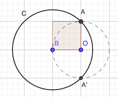

# Calendrier Mathématique Août 2020

## Lundi 3 Août

## Mardi 4 Août

En développant:

- ab + ac = 152
- bc + ba = 162
- ca + cb = 170

Notons x = ab, y = bc et z = ca. Les équations peuvent s'écrire:

- x + z = 152
- y + x = 162
- z + y = 170

Ce qui se résout en: x = 72, y = 90, z = 80

xyz = ab × bc × ca = (abc)² = 72 × 90 × 80 = 518400 = 720²

Nota: la solution positive au système initial est: a = 8, b = 9, c = 10

> réponse: 720

## Mercredi 5 Août

## Jeudi 6 Août

Soient r₁ et r₂ les rayons des deux cercles en centimètres.

A₁ - A₂ = π (r₁² - r₂²) = 72 π

r₁ + r₂ = 1800

(r₁ + r₂)(r₁ - r₂) = 72 ⇒ (r₁ - r₂) = 72 / 1800 = 1 / 25

2r₁ = 1800 + 1 / 25

On en déduit r₁ - 45001 / 50 et r₂ = 45001 / 50 = 1 / 25 = 44999 / 50

> réponse: 44999 / 50 et 45001 / 50

## Vendredi 7 Août

Comme 100 = 9 + 9 + 82, le plus petit nombre "centenaire" possible est 82. Il faut tester ensuite...

Le [programme](07.py) Python le fait pour nous.

```python
#!/usr/bin/env python3

nb = 0
for a in range(80, 100):
    for b in range(a, 100):
        n1 = a + (b // 10) + (b % 10)
        n2 = b + (a // 10) + (a % 10)
        if n1 == n2 == 100:
            print(a, b)
            nb += 1
print("réponse:", nb)
```

Il y a donc cinq "paires centenaires": (83, 89) (84, 88) (85, 87) (86, 86) (90, 91)

> réponse: 5

## Lundi 10 Août

Si Jean choisit le dé 4-0:

- 0 est toujours perdant (i.e. Léa gagne)
- 4 est perdant 5 fois sur 18 tirages possibles

2/6 + 4/6 × 5/18 = 14/27

Si Jean choisit le dé 3:

- 3 est perdant 4+2+3 = 9/18 = 1/2

Si Jean choisit le dé 6-2:

- 2 est perdant 4+6+3: 4/6 × 13/18 = 13/27
- 6 est toujours gagnant

Si Jean choisit le dé 5-1:

- 1 est perdant 4+6+6 fois: 3/6 × 16/18
- 5 est perdant 2 fois: 3/6 × 2/18

3/6 × 2/18 + 3/6 × 16/18 = 1/2

Soit au total:

1/4 × (14/27 + 1/2 + 13/27 + 1/2) = 1/4 × 2 = 1/2

Calcul de tous les tirages possibles par [programme](10.py).

```python
#!/usr/bin/env python3

from fractions import Fraction

des = [
    [0, 0, 4, 4, 4, 4],
    [3, 3, 3, 3, 3, 3],
    [2, 2, 2, 2, 6, 6],
    [1, 1, 1, 5, 5, 5],
]

total_nb = 0
total_lea_gagne = 0

# Jean choisit un dé
for de_jean in range(4):

    des_lea = set(range(4))
    des_lea.remove(de_jean)

    nb = 0
    lea_gagne = 0

    # Léa choisit un dé parmi les trois restants
    for de_lea in des_lea:

        # Jean tire son dé
        for tirage_jean in des[de_jean]:

            # Léa tire son dé
            for tirage_lea in des[de_lea]:
                nb += 1

                # Léa gagne si son tirage est supérieur à celui de Jean
                if tirage_lea > tirage_jean:
                    lea_gagne += 1

    f = Fraction(lea_gagne, nb)
    print(f"de_jean: {des[de_jean]} lea_gagne: {lea_gagne}/{nb} = {f}")

    total_lea_gagne += lea_gagne
    total_nb += nb

f = Fraction(total_lea_gagne, total_nb)
print(f"total_lea_gagne: {total_lea_gagne}/{total_nb} = {f}")
```

> réponse: Léa a une chance sur deux de gagner: p = 1/2

## Mardi 11 Août

Soit d le chiffre des dizaines de n et u celui des unités.

Ils sont solution de l'équation:

d × u + d + u = 10 × d + u

d × u + d = 10 × d

u + 1 = 10  (car d ≠ 0)

Soit, u = 9 et d quelconque.

Autrement dit, tous les nombres qui se terminent par 9 entre 10 et 90.

> réponse: 8

## Mercredi 12 Août

## Jeudi 13 Août


Il faut donc que 𝑛²+7 divise 32.

- 𝑛=1: 𝑛²+7=8 ✅
- 𝑛=2: 𝑛²+7=11 et 11 ne divise pas 32 ❌
- 𝑛=3: 𝑛²+7=16 convient ✅
- 𝑛=4: 𝑛²+7=23 non ❌
- 𝑛=5: 𝑛²+7=32 ok ✅

> réponse: 𝑛 = ±1 ±3 ±5

## Vendredi 14 Août



Le grand cercle de centre B a pour rayon BA avec AB diagonale du carré de côté r = OB = OA.

L'aire 𝒜 recherchée est l'aire du cercle de centre B de rayon r√2 diminuée de la moitié du cercle de centre O de rayon r et du [segment](https://fr.wikipedia.org/wiki/Segment_circulaire) AA'E du grand cercle.

Le segment AA'E a pour aire 𝒶 celle du [secteur](https://fr.wikipedia.org/wiki/Secteur_circulaire)) ABA' moins le triangle ABA'.

𝒶 = π (r√2)² / 4 - r × 2r / 2
   = r² × (π / 2 - 1)

𝒜 = π (r√2)² - π (r²) / 2 - 𝒶
   = r² × (2π - π / 2 - π / 2 + 1)
   = r² × (π + 1)

> réponse: r² × (π + 1)

## Lundi 17 Août

Les candidats de carré d'entiers sont 1, 4, 9 et 16. Soit:

- pour 1: 1-0 ⇒ 1 nombre (10)
- pour 4: 2-2 1-3 4-0 ⇒ 4 nombres (22 13 31 40)
- pour 9: 1-8 2-7 3-6 4-5 9-0 ⇒ 9 nombres (18 27 36 45 81 72 63 54 90)
- pour 16: 7-9 8-8 ⇒ 3 nombres (79 97 88)

[Programme](17.py) Python de vérification.

```python
#!/usr/bin/env python3

carres = list(n * n for n in range(5))
nb = 0
for n in range(10, 100):
    d, u = divmod(n, 10)
    if d + u in carres:
        print(n)
        nb += 1
print("réponse:", nb)
```

> réponse: 17

## Mardi 18 Août

## Mercredi 19 Août

Pour ,  vaut:

-  ✅
-  ✅

Pour : 

Or, toutes les puissances de 16 se terminent par une puissance du chiffre de l'unité, à savoir 6:


Et plus généralement:


 Et comme  se termine aussi par 6, c'est invariablement 6 à la fin. Ajouté 9, le nombre se terminera toujours par 5, et est donc divisible par 5.

> réponse: n = 0 ou n = 1

## Jeudi 20 Août

365 mod 52 = 1 : on "avance" d'un jour de semaine par année non bissextile, et de deux sinon.

- 2021 n'est pas bissextile, vendredi 20 août 2021
- 2022 samedi 20 août 2022
- 2023 dimanche 20 août 2023
- 2024 est bissextile mardi 20 août 2024
- 2025 mercredi 20 août 2025
- 2026 jeudi 20 août 2026

Vérification avec [programme](20.py) en Python.

```python
#!/usr/bin/env python3

from datetime import datetime

annee = 2020
ref = datetime(2020, 8, 20).weekday()
while True:
    annee += 1
    d = datetime(annee, 8, 20)
    print(f"{d.year} : {d.strftime('%A')}")
    if d.weekday() == ref:
        break
```

> réponse: 2026

## Vendredi 21 Août

Le petit rectangle a un rapport largeur/hauteur égal à 2 puisqu'il "contient" deux cercles côte à côte. Calculons ses dimensions dont on déduira le diamètre des cercles (égal à la hauteur du petit rectangle) et ainsi le périmètre du grand rectangle.

2 (l + h) = 2 × (2h + h) = 6h = 60 cm

D'où h = 10 cm et 𝑃 = 2 × (3h + 2h) = 10h = 100 cm

> réponse: 100 cm

## Lundi 24 Août

## Mardi 25 Août

## Mercredi 26 Août

## Jeudi 27 Août

## Vendredi 28 Août

## Lundi 31 Août
