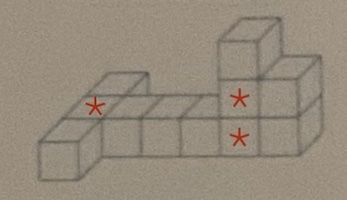
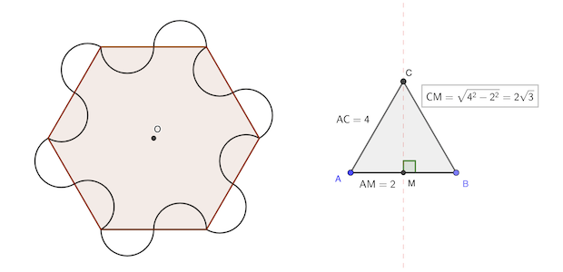

# Calendrier Mathématique Avril 2020

[Solutions 2020](../README.md) - [Homepage](../../README.md)

## Mercredi 1 Avril

Il y a trois segments qui partent de chaque point, soit 3 × 8 = 24 en tout. Mais il y a deux segments entre chaque point (qui se superposent). Donc il faut prendre la moitié de 24.

> réponse: 12

## Jeudi 2 Avril

Léo a mis 3 h pour courir les 24 km (1h pour 12 km à 12 km/h, et 2 h pour 12 km à 6 km/h).

Claudine court à 24 / 3 = 8 km/h.

> réponse: 8 km/h

## Vendredi 3 Avril

5x + 3y + 3x + 20 + 10y + 30 = 180

8x + 13y = 130

130 - 13y = 13 (10 - y) doit être divisible par 8. La seule possibilité est y = 2.

On en déduit que 8x = 104 et x = 13.

> réponse: x + y = 13 + 2 = 15

## Lundi 6 Avril

Même problème que [29 Avril 2021](../../2021/avril/README.md#jeudi-29-avril).

> réponse: 81

## Mardi 7 Avril

Six hommes boivent 4 fois plus qu'un homme et demi.

Six bières font 4 fois plus qu'une bière et demi.

4 × 4 = 16

> réponse: 16

## Mercredi 8 Avril

x² = 1 et une solution.

x⁶ - 16 x⁴ + 16 x² - 1 = (x²-1) (x⁴ - 15x² + 1)

Les six solutions de l'équation polynomiale sont donc:

- ± 1
- ± √[ (15 ± √221) / 2 ]

La somme des puissances 6 est:

(±1)⁶ + (±√((15 ± √221) / 2))⁶
= 2 × [ 1 + ((15 - √221) / 2)^3 + ((15 + √221) / 2)^3 ]
= 2 × [ 1 + 3330 ]

> réponse: 6662

## Jeudi 9 Avril



> réponse: 3

## Vendredi 10 Avril

1000¹⁰⁰ = (10¹⁰⁰)³ =  𝚐𝚘𝚐𝚘𝚕³

> réponse: 𝚐𝚘𝚐𝚘𝚕³

## Lundi 13 Avril

Il faut trouver les les chiffres de 1 à 9 qui, additionnés, donnent 18 ou 27 pour respecter le critère de divisibilité par 9. 9 est exclu car 1+2+3+4=10 et idem 36: 9+8+7+6=35 (la plus petite et la plus grande somme de chiffres réalisable).

Cherchons pour commencer les nombres avec chiffres décroissants:

Pour 27, il faut absolument un 9 car 8+7+6+5 vaut 26:

- = 9+8+7+3 = 9+8+6+4 = 9+7+6+5

Pour 18, on peut commencer par 9 à 6:

- = 9+6+2+1 = 9+5+3+1 = 9+4+3+2
- = 8+7+2+1 = 8+6+3+1 = 8+5+4+1 = 8+5+3+2
- = 7+6+4+1 = 7+6+3+2 = 7+5+4+2
- = 6+5+4+3

Soit 3 + 3 + 4 + 3 + 1 = 14 possibilités, qu'il faut multiplier par le nombre de permutations des quatre chiffres: 4! = 24. Ce qui donne 24 × 14 = 336.

[Programme](13.py) Python pour vérifier qu'il ne manque rien.

```python
#!/usr/bin/env python3

uniq = set()
nb = 0
for n in range(1000, 10000):

    # n multiple de 9
    if n % 9 != 0:
        continue

    s = set(str(n))

    # pas le chiffre 0
    if "0" in s:
        continue

    # quatre chiffres différents
    if len(s) != 4:
        continue

    uniq.add("".join(sorted(s, reverse=True)))
    nb += 1

print(f"uniques ({len(uniq)}):", " ".join(sorted(uniq, reverse=True)))
print("réponse:", nb)
```

```python
#!/usr/bin/env python3

uniq = set()
nb = 0
for n in range(1000, 10000):

    # n multiple de 9
    if n % 9 != 0:
        continue

    s = set(str(n))

    # pas le chiffre 0
    if "0" in s:
        continue

    # quatre chiffres différents
    if len(s) != 4:
        continue

    uniq.add("".join(sorted(s, reverse=True)))
    nb += 1

print(f"uniques ({len(uniq)}):", " ".join(sorted(uniq, reverse=True)))
print("réponse:", nb)
```

> réponse: 336

## Mardi 14 Avril

Il y a 3³ = 27 tirages possibles.

- 3-3-3   est ko : 1 tirage
- 3-3-2   est ko : 3 tirages

```python
sum(1 for a in range(1,4) for b in range(1,4) for c in range(1,4) if a+b+c<8)
```

> réponse: 23 / 27

## Mercredi 15 Avril

L'aire recherchée est égale à l'aire de trois secteurs de 60° moins deux aires du triangle équilatéral de côté un rayon.

L'aire des trois secteurs est la demi aire du cerle : 𝒂 = π 2² / 2 = 2 π cm²

L'aire du triangle équilatéral de côté 2 cm est : 𝒃 = 2 × √3 / 2 = √3 cm²

> réponse: 2π - 2√3 cm²

## Jeudi 16 Avril

On trouve les coefficients de multiplication entre les lignes au fur et à mesure et on complète le tableau

|  ×  |       |       |       |       |       |
|-----|-------|-------|-------|-------|-------|
|     | **12**|   20  |   28  |   36  |   44  |
|  2  |   24  | **40**|   56  |   72  |   88  |
| 3/2 |   36  |   60  | **84**|  108  |  132  |
| 4/3 |   48  |   80  |  112  |**144**|  176  |
| 5/4 |   60  |  100  |  140  |  180  |**220**|

12 + 40 + 84 + 144 + 220 = 500

> réponse: 500

## Vendredi 17 Avril

Soit p1 (resp. p5, p10) le nombre de pièces de 1 centime (resp. 5 centimes, 10 centimes).

- p1 + p5 + p10 = 10
- p5 + p10 = 7
- p1 + p5 = 8

On résout le système:

- p1 + p5 + 7 - p5 = 10 ⇒ p1 = 3
- p5 = 5
- p10 = 2

> réponse: 5 pièces de 5 centimes

## Lundi 20 Avril

Le nombre doit être pair, donc se terminer au mieux par un 8. 5678 est le plus grand nombre qui respecte les conditions de l'énoncé, à la divisibilité par 3 près.

Mais 5678 n'est pas divisible par 3, il faut passer à 4578, 4568 ou 4678. C'est 4578 le gagnant.

> réponse: 5

## Mardi 21 Avril

On teste avec les chiffres de l'unité. On a 3 - 5 - 7  + 9 = 0.

123 - 45 - 67 + 89 = 100

> réponse: -1

## Mercredi 22 Avril

On traduit l'énoncé en équation:

- 1 / 2 = jaune
- (1 - 1 / 2) ×  1/ 3 = 1 / 6 rouge
- (1 -1 / 2 -1 / 6) × 1 / 4 = 1 / 12 rose

La proportion de tulipes blanches est le complément à 1:

1 - 1 / 2 - 1 / 6 - 1 / 12 = 1 / 4 blanche

> réponse: 1 / 4

## Jeudi 23 Avril

L'aire AMB est 1 / 4 aire ABCD puisque AMNB est la moitié de ABCD.

Du fait de la symétrie, MPQD est BPQN ont la même aire.

D'où aire MPQD = (aire ABCD - 2 aire AMB) / 2 = 1 / 4 aire ABCD

> réponse: 1 / 4

## Vendredi 24 Avril

Un quart de brique pèse trois quarts de kilogramme. Donc une brique pèse 3 kg.

> réponse: 3 kg

## Lundi 27 Avril

Soit f et g les fonctions qui donnent la hauteur des bougies en fonction du temps en heures:

- f(t) = H × (1 - t / 6)
- g(t) = H × (1 - t / 8)

On doit trouver t tel que:

f(t) = 1/2 g(t)

⇒ 2(1 - t / 6) = (1 - t / 8)

⇒ t / 3 - t / 8 = 1

D'où t = 24 / 5 = 4 + 4 / 5

4 / 5 d'heure correspond à 4 × (60 / 5) = 48 min

18h + 4h48 = 22h48

> réponse: 22h48

## Mardi 28 Avril

De l'énoncé, on déduit que:

- Alexandre + Benoit = train
- André + X = avion

Donc Charles + Y = voiture (pas avion et train complet)

> réponse: Charles = voiture

## Mercredi 29 Avril

valeur 1: 56 × 0.34 × 0.12 = 56 × 34 × 12 / 10000

valeur 2: 12 × 0.34 × 0.56 = 12 × 34 × 56 / 10000

> réponse: valeurs égales

## Jeudi 30 Avril



L'aire de la figure est aussi l'aire de l'hexagone de côté 2 cm, en "rabattant" les demi-cercles extérieurs à l'intérieur.

L'aire du triangle équilatéral de 4 cm de côté vaut: 4 × 2√3 / 2 = 4 √3 cm²

Il y a six triangles équilatéraux pour former l'hexagone. D'où l'aire: 6 × 4 √3 = 24 √3

> réponse: 24 √3 cm²
