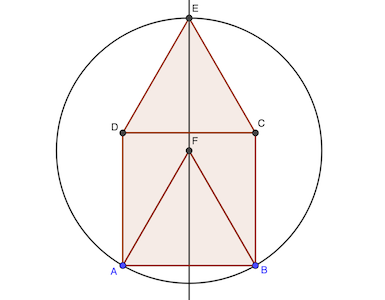

# Calendrier Mathématique Décembre 2020

[Solutions 2020](../README.md) - [Homepage](../../README.md)

## Mardi 1 Décembre

Pour calculer l'aire de l'octogone, il faut déterminer la longueur des côtés des triangles isocèles rectangles.

Sachant que le carré central fait 4 cm², ses côtés font 2 cm. Les rectangles du bord ont pour dimension (2, a) et les triangles 2 cm en hypoténuse et a pour les deux autres côtés.

Pythagore: a² + a² = 2² ⇒ a = √2

L'aire de l'octogone est donc la somme de:

- 4 (carré central)
- 4 × √2 × 2 (rectangles périphériques)
- 4 × √2 × √2 / 2 (triangles isocèles rectangles)

A = 4 + 8 √2 + 4 = 8 + 8 √2

> réponse: 8 + 8 √2 cm²

## Mercredi 2 Décembre

Regroupons et calculons les facteurs deux par deux (pour n pair ≥ 2) :

Il y a un nombre impair de facteurs, le dernier étant . Comme le produit des précédents vaut 1, le résultat est celui-ci.

> réponse: 1001 / 1000

## Jeudi 3 Décembre

En remplaçant:

> réponse: 1

## Vendredi 4 Décembre

Il y a 21 chances sur 25 de prendre une première calculette non défectueuse. Puis 20 chances sur 24 d'en prendre une deuxième. Etc.

> réponse: 969 / 2530

## Lundi 7 Décembre

Ce sont certains nombres multiples de 3 × 5 × 7 = 105 (pas ceux de 2 à cause de des conditions de l'énoncé).

105 × 3, 5, 7, 9. A partir, de 11 c'est trop grand.

> réponse: 105, 315, 525, 735, 945

## Mardi 8 Décembre

Problème similaire au 13 novembre.

Il y a 3⁴ = 81 nombres.

27 × (3 + 5 + 7) × 1111 = 449955

> réponse: 449955

## Mercredi 9 Décembre

Le point F centre du cercle doit être tel que FA = FB = FE et F sur la médiatrice du segment CD.

En construisant le losange ADEF, on a bien FA = FE = DE = AD.

Le rayon du cercle est donc 1 cm.

> réponse: 1 cm

## Jeudi 10 Décembre

En utilisant (2), (3) puis (4):

Une autre manière de faire (mais qui revient _in fine_ au même) est de fixer arbitrairement une valeur d'une inconnue puisque le système de deux équations à trois inconnues admet une infinie de solutions.

Soit . On a alors:

Et donc:

> réponse: clou + vis + cheville = 60 g

## Vendredi 11 Décembre

Soit . L'équation devient: .

La racine double du polynome du deuxième degré est .

> réponse: a + b = -1

## Lundi 14 Décembre

97 + y² = x²

x² - y² = (x + y)(x - y) = 97 × 1

97 est premier. Donc la seule possibilité est x + y = 97 et x - y = 1. Soit x = 49 et y = 48.

D'où x² + y² = 4705

> réponse: 4705

## Mardi 15 Décembre

On a:

(100 + x - y) + (50 + x +z) + (120 -x) + (100 + x + y) + (80 + x - z) = 3x + 450 = 180 (5 - 2) / 5 = 540° (modulo 360)

Car la somme des angles internes d'un polygone est π (n-2).

Donc x = (540 - 450) / 3 = 39°

> réponse: x = 30°

## Mercredi 16 Décembre

Eve enlève toute une pile puis enlève le même nombre de jetons que Bob dans l'autre pile. Bob perdra.

> réponse: Eve

## Jeudi 17 Décembre

Comme 175 = 5 × 5 × 7, les seuls nombres à trois chiffres non nuls donc le produit est multiple de 175 sont ceux avec 557.

Il y a 9 nombres avec deux 0 (100, 200, etc.)

Il y a 9 × 9 nombres avec un 0 chiffre des dizaines, et autant avec un 0 en unité.

Soit 3 + 9 + 81 × 2 = 174

> réponse: 557 575 755 et les nombres avec un ou deux 0: 174 nombres

## Vendredi 18 Décembre

Jeanne a une probabilité de gagner de j = 1 / 2

Karim a p = k et Laura p = l avec k + l = 1 / 2 et k = 2 l. Soit k = 1 / 3 et l = 1 / 6.

La probabilité que Jeanne gagne trois manches puis Karim deux puis Laura un est p = j³ × k² × l = 1 / 432

Dans les 6 parties, Jeanne a  = 20 combinaisons d'en gagner 3. Karim a  possibilités pour gagner 2 des 3 restantes.

Donc p = 20 × 3 × 1 / 432 = 5 / 36

> réponse: 5 / 36

## Lundi 21 Décembre

Les deux triangles intérieurs de base les côtés inférieu et supérieur ont des aires identiques.

Aire triangle = 3 + 6 + quadrilatère central = 5 + x + quadrilatère central

D'où x = 3 + 6 - 5 = 2

> réponse: x = 2

## Mardi 22 Décembre

## Mercredi 23 Décembre

Pythagore donne le résultat immédiatement: AE = √((20 - 15)² + 20²) = √425 = 5 √17

> réponse: 5 √17 cm

## Jeudi 24 Décembre

Il y a 4 × 5 = 20 nombres pair-impair (le zéro est exclu)

Il y a 5 × 5 = 25 nombres impair-pair

> réponse: 55

## Vendredi 25 Décembre

20202020 = 10001 × 2020

La moyenne est donc 20202020 / 2020 = 10001

> réponse: 10001

## Lundi 28 Décembre

p = 13 convient.

p ne peut être multiple de 3 (ni de 2 d'ailleurs). Il s'écrit donc 3k + 1 ou 3k + 2. p-10 et p+10 valent alors:

Donc la seule solution est p = 13.

> réponse: p = 13 (3, 13, 23 premiers)

## Mardi 29 Décembre

Or, .

Donc: 

Par ailleurs, on peut vérifier que cela correspond à la décomposition en facteurs premiers.

> réponse: 503 et 248509

## Mercredi 30 Décembre

Tous les nombres premiers 2 3 5 7 11 13 17 19 conviennent par définition.

1 aussi convient à l'énoncé.

> réponse: 9

## Jeudi 31 Décembre

Les points délimitent des triangles équilatéraux de côté 4 cm. Ainsi il y a un hexagone régulier inscrit dans le cercle, dont le rayon vaut donc le côté de l'hexagone, à savoir 4 cm.

> réponse: 4 cm
