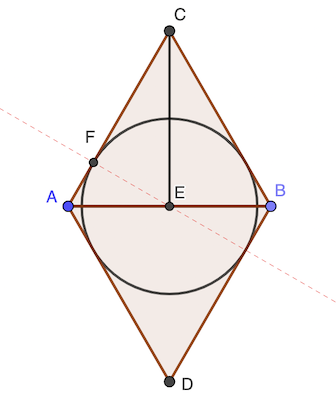
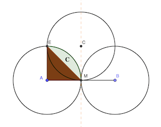

# Calendrier Mathématique Février 2020

## Lundi 3 Février

## Mardi 4 Février

L'hexagone est rempli de:

- 7 petits hexagones, eux-mêmes équivalents à 6 petits triangles équivaléraux, soit 42
- 12 petits triangles équilatéraux

L'aire coloriée est constituée de:

- 6 petits triangles
- 1 hexagone, soit 6 petits triangles

La proportion est donc: (6 + 6) / (42 + 12) = 2 / 9

> réponse: 2 / 9

## Mercredi 5 Février

[Programme](05.py) Python.

```python
#!/usr/bin/env python3


def rev(n):
    """ Retourne le nombre n écrit à l'envers dans sa représentaiton décimale. """
    u = 0
    while n != 0:
        n, r = divmod(n, 10)
        u = u * 10 + r
    return u


print("réponse:", sum(1 for n in range(100, 1000) if rev(n) > n))
```

> réponse: 360

## Jeudi 6 Février

- susie < marie
- laurie < lucie
- noémie = rosie
- sophie < susie
- laurie = marie
- lucie < noémie

- sophie < susie < marie = laurie < lucie < noémie = rosie

> réponse: Sophie

## Vendredi 7 Février

[Programme](07.py) Python.

```python
#!/usr/bin/env python3

s = 0
for n in range(10, 100):
    d, u = divmod(n, 10)
    if n + (d + u) ** 2 == u * 10 + d:
        print(n)
        s += n

print("réponse:", s)
```

> réponse: 27

## Lundi 10 Février

La face qui touche les dés 2 et 3 est 1 puisque les 5 autres nombres sont visibles.

Donc la face entre les dés 1 et 2 est 6. Et par conséquant la face cherchée est 1.

> réponse: 1

## Mardi 11 Février

## Mercredi 12 Février

## Jeudi 13 Février



Le centre du cercle est sur la droite AB et le point F est tel que EF est la hauteur issue de E du triangle ACE.

EF × AC = AE × CE

EF × 1 = ½ × √(1 - ½²) = √3 / 4

> réponse: √3 / 4 cm

## Vendredi 14 Février

√(x - 9) - √(x - 16) = 1

élevons au carré: 2x - 25 - 2 √((x - 9) (x - 16)) = 1

simplifions: x - 13 = √((x - 9) (x - 16))

élevons encore au carré: x² -  26x + 169 = x² - 25x + 144

simplifions: x = 169 - 144

d'où: x = 25

> réponse: x = 25

## Lundi 17 Février

## Mardi 18 Février

## Mercredi 19 Février



L'aire du secteur de 90° AME est π r² / 4 = π / 4. L'aire du triangle AME est 1 / 2. L'aire du [segment circulaire](https://fr.wikipedia.org/wiki/Segment_circulaire) 𝐂 vert est donc π / 4 - 1 / 2.

L'aire coloriée est donc l'aire du cercle moins quatre fois l'aire du segment circulaire. Soit:

π - 4 × (π / 4 - 1 / 2) = 2

> réponse: 2 cm²

## Jeudi 20 Février

1 + 3 + 5 + … + (2n + 1) = n² = 44100

D'où n = 210. Il y aura 210 récompenses et la plus forte sera une pile de 421 pièces.

> réponse: 210 officiers

## Vendredi 21 Février

Huit tirages, parce qu'il peut tirer les trois jaunes et quatre bleus en premier. Le tirage suivant sera forcément d'une troisième couleur.

> réponse: huit

## Lundi 24 Février

Le triangle AMD est exactement le quart du carré.

> réponse: 16 m²

## Mardi 25 Février

2 et 3 disent la même chose, comme il y a deux inscriptions vraies ça ne peut être que celles-là. Donc 1 est fausse. Et comme le trésor n'est pas dans 2 ni dans 1, il est dans 3

> réponse: coffre 3

## Mercredi 26 Février

6 kg de pomme coûtent 6 × 3.3 = 19.8 €. Si on rajoute X kg de poire, son mélange coûtera au kg (19.8 + X × 2.5) / (6 + X).

(19.8 + X × 2.5) / (6 + X) = 3.1
    ⇒ 19.8 + 2.5 X = 3.1 X + 18.6
    ⇒ 1.2 = 0.6 X
    ⇒ X = 2

Il doit ajouter 2 kg de poire aux 6 kg de pommme pour faire des paniers à 3.1 kg / €.

> réponse: 2 kg

## Jeudi 27 Février

- 50 mois = 4 ans et 2 mois, soit 4 ans et 8 semaines
- 50 semaines
- 50 jours = 7 semaines et 1 jour

Anne a donc (à quelques jours près) 50 ans + 4 ans + (8 + 50 + 7) semaines + 1 jour, soit 54 + 65 semaines et 1 jour, ou encore 55 ans et 13 semaines. Son prochain anniversaire est celui des 56 ans.

> réponse: 56 ans

## Vendredi 28 Février

Soit O le centre du pentagone.

L'angle DOE vaut 360 / 5 = 72°. Comme DOE est un triangle isocèle en O, les angles DEO et ODE valent tous les deux (180 - 72) / 2 = 54°.

La somme des angles en E vaut 360° : AEO + OED + DEG = 360 - AEG.

D'où: AEG = 360 - 54 - 54 - 90 = 162°

Comme AEG est isocèle en A (AE = EG), on a GAE = (180 - AEG) / 2 = (180 - 162) / 2 = 9°

> réponse: 9°
