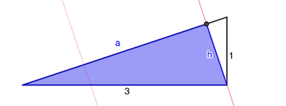

# Calendrier Mathématique Janvier 2020

## Mercredi 1 Janvier

La montre du passant indique 10h12 (« dans 20 minutes il sera 10h32 »).

En réalité il est 10h07 (« elle avance de 5 minutes »).

Il y a 10 minutes, il était 9h57.

> réponse: 9h57

## Jeudi 2 Janvier

Pour a ∈ [1, 9] et b ∈ [0, 9], il faut que:

- 1.75 × (a × 10 + b) = b × 10 + a
- (17.5 - 1)) a = (10 - 1.75) b
- 16.5 a = 8.25 b
- 2 a = b

Donc a peut prendre comme valeur 1,2,3,4 et b vaudra respectivement 2,4,6,8.

En Python:

```python
list(a * 10 + b for a in range(1, 10) for b in range(10) if (a * 10 + b) * 1.75 == (b * 10 + a))
```

> réponse: 12 24 36 48

## Vendredi 3 Janvier

On remplit progressivement le tableau (7, 9, 13, etc.).

```text
         46
      24    22
   11    13     9
 4     7     6     3
```

> réponse: 46

## Lundi 6 Janvier

L'empilement 1 a quatre cubes, il y en a donc un caché derrière et chaque cube pèse 50 g.

L'empilement 2 doit avoir quatorze cubes pour peser 700 g. On en voit onze, il en manque donc trois.

> réponse: 4 ⚠️

⚠️ Le livret dit 3. Mais il y a un cube caché derrière l'empilement 1 !

## Mardi 7 Janvier

n² + 5n + 2 = (n² + 1) + (5n + 1)

Ainsi, si n² + 1 divise n² + 5n + 2, alors n² + 1 doit également diviser 5n + 1.

Ce qui implique notamment: n² + 1 ≤ 5n + 1 soit n ≤ 5

- n = 1 : n² + 1 = 2 divise n² + 5n + 2 = 8 ✅
- n = 2 : 5 ne divise pas 16 ❌
- n = 3 : 10 ne divise pas 26 ❌
- n = 4 : 17 ne divise pas 38 ❌
- n = 5 : 26 divise 52 ✅

> réponse: 1 et 5

## Mercredi 8 Janvier

Pour rentabiliser l'abonnement, il faut que l'économie par cours (7.50€) soit couverte par les 42€.

42 / 7.50 = 5.6

Donc au minimum six cours.

> réponse: six

## Jeudi 9 Janvier



On va calculer la partie bleue du triangle rectangle ci-dessus. L'aire recherchée sera 4 fois cette valeur.

Hypothénuse: √(1² + 3²) = √10

Aire triangle complet:

- côté × côté / 2 : 1 × 3 / 2 = 3 / 2
- hypothénuse × hauteur / 2 = √10 × h / 2 = 3 / 2

Donc la hauteur (et un des côtés du triangle bleu) est h = 3 / √10

On calcule l'autre côté du triangle bleu: a = √(3² - h²) = √(9 - 9 / 10) = 9 / √10

D'où l'aire du triangle bleu: 9 / √10 × 3 / √10 / 2 = 27 / 20. L'aire colorée est 27 / 20 × 4 = 27 / 5

L'aire du carré étant 3 × 3 = 9, le pourcentage coloré est:

27 / 5 / 9 × 100 = 3 / 5 × 100 = 60%

> réponse: 60%

## Vendredi 10 Janvier

- soir 1: Anna 20 pages
- soir 2 à 11 (200 pages à lire): Anna 7 pages, Emma 7 pages, Léa 6 pages
- soir 12 (il reste 11 pages à lire): Anna 4, Emma 4, Léa 3

Anna a lu: 20 + 7 × 10 + 4 = 91 pages

> réponse: 91

## Lundi 13 Janvier

La suite est constituée de nombres impairs. Soit S le nombre d'élements:

S = 1 + 3 + 5 + 7 + … + n = ((n + 1) / 2)²

On cherche la première valeur de n telle que S ≥ 100. Résolvons l'inéquation:

((n + 1) / 2)² ≥ 100

(n + 1) / 2 ≥ 10

n ≥ 10 × 2 - 1 = 19

Vérification en Python:

```python
n = 0
i = 1
while n < 100:
    for _ in range(i):
        n += 1
        if n == 100:
            print(i)
            break
    i += 2
```

> réponse: 19

## Mardi 14 Janvier

Le triangle MNC représente la moitié d'un quart de rectangle, soit 1 / 8. La surface coloriée est donc 7 / 8 = 87.5%.

> réponse: 87.5%

## Mercredi 15 Janvier

Pour la première case, on a le choix entre trois couleurs. Pour les cases suivantes, on le choix entre deux couleurs. Soit:

3 × 2 × 2 × 2 × 2 = 48

> réponse: 48

## Jeudi 16 Janvier

Soit ab l'âge de Victor. On a: ababab = ab × 10101.

Or, 10101 = 3 × 7 × 13 × 37

La femme a 37 ans, les filles 13, 7, 3, 1. Victor peut avoir 33, 44, 55, etc.

> réponse: 13 ans

## Vendredi 17 Janvier

Pour que p + q + r soit pair, il faut qu'un des nombres premiers soit pair, c'est-à-dire 2 le seul premier pair. Notons r ce nombre (p q r ont des rôles similaires dans l'équation).

pqr - 2(pq + qr + rp) + 4(p + q + r)
 = 2pq - 2(pq + 2p + 2q) + 4(p + q + 2)
 = 2pq - 2pq - 4p - 4q + 4p + 4q + 8
 = 8

> réponse: 8

## Lundi 20 Janvier

## Mardi 21 Janvier

## Mercredi 22 Janvier

## Jeudi 23 Janvier

## Vendredi 24 Janvier

## Lundi 27 Janvier

## Mardi 28 Janvier

## Mercredi 29 Janvier

## Jeudi 30 Janvier

## Vendredi 31 Janvier
