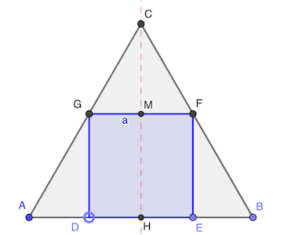
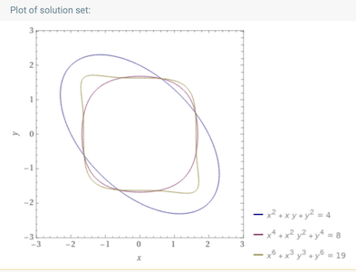

# Calendrier Mathématique Juillet 2020

[Solutions 2020](../README.md) - [Homepage](../../README.md)

## Mercredi 1 Juillet

Il faut arriver à 9 + 9 + 5 + 1 = 24 soit 6 jetons par pile

|             |tas 1|tas 2| tas 3 | tas 4 |
|-------------|-----|-----|-------|-------|
| Départ      | 9   | 9   |   5   |   1   |
| Mouvement 1 | 8 > | 8 > |   4 > | > 4   |
| Mouvement 2 | 7 > | 7 > |   3 > | > 7   |
| Mouvement 3 | 6 > | 6 > | > 3   |   7 > |

> réponse: oui

## Jeudi 2 Juillet

## Vendredi 3 Juillet

IJKL couvre le quart de ABCD, puisque IL = 1/2 AD etc.

> réponse: 4

## Lundi 6 Juillet

La nième ligne commence par n(n - 1) + 1.

Ainsi la 21ème ligne commence par 421 et la 20ème finit par 419 donc.

∑ n (impairs ≤ 419) = ∑ n (n ≤ 419) - 2∑n (n ≤ 214) = 419 × 420 / 2 + 2 × 209 × 210 / 2 = 44100

> réponse: 44100

## Mardi 7 Juillet

## Mercredi 8 Juillet

ACE est un triangle équilatéral.

ABC doit être un triangle rectangle d'hypothénuse √85. Les deux autres côtés mesurent donc 2 et 9 car 2² + 9² = 85.

CDE doit être aussi un triangle rectangle d'hypothénuse √85. L'autre possibilité est 6² + 7² = 85.

Il faut minimiser AFE. Comme 9 < √85 < 10 et que AF et FE doivent être entiers, la plus petite distance est 10 (1+9, 2+8, etc). Mais 2,6,7,9 sont déjà utilisés. Il faut choisir 8+3=11 au minimum.

Le périmètre est donc 11 + 13 + 11 = 35

> réponse: 35

## Jeudi 9 Juillet

a × b = a + b

(a - 1) × (b - 1) = a × b - a - b + 1 = 1

L'équation (a - 1) × (b - 1) = 1 admet deux solutions entières: (0, 0) et (2, 2)

> réponse: (0, 0) et (2, 2)

## Vendredi 10 Juillet

Soit s(a) = a (a + 1) / 2 la somme des entiers de 1 à a

f(a,b) = s(b) - s(a - 1)

f(133, 533) = 533 × 534 / 2 - 132 × 133 / 2 = 133533

> réponse: 133533

## Lundi 13 Juillet

## Mardi 14 Juillet

## Mercredi 15 Juillet

2a⁴ - 4ab + b² + 2 = 0

2a⁴ - 4a² + 4a² - 4ab + b² + 2 = 0

2a⁴ - 4a² + (2a - b)² + 2 = 0

Il faut que a soit au moins solution de l'inéquation suivante pour que celle ci-dessus ait une chance d'être vérifiée puisque le seul terme négatif est -4a².

2a⁴ - 4a² + 2 ≤ 0

a² = 1

- a² = 1 ⇒ 2 ± 4b + b² + 2 = 0 ⇒ (± b - 2)² = 0 ⇒ b = ± 2

> réponse: les solutions sont (-1, -2) (1, 2)

## Jeudi 16 Juillet

2 -A→ 1 / 2 -B→ 1 -A→ 1 -B→ 2

La séquence ABAB est invariante pour l'entrée. 2020 = 505 × 4, donc le résultat est 2.

> réponse: 2

## Vendredi 17 Juillet

## Lundi 20 Juillet

aire ABC = 1 / 2 m²

aire CDE = 3 / 4 × 1 / 2 = 3 / 8 = CD² / 2

d'où CD = √3 / 2

> réponse: √3 / 2 cm

## Mardi 21 Juillet

Il faut trouver le multiple du [ppcm](https://fr.wikipedia.org/wiki/Plus_petit_commun_multiple) de (2, 3, 4, 5, 6) + 1 qui soit un multiple de 7.

ppcm = 3 × 4 × 5 = 30

En tâtonnant, on trouve 301.

Vérification en Python:

```python
for i in (2, 3, 4, 5, 6, 7): print(i, "->", 301 % i)
```

> réponse: 301

## Mercredi 22 Juillet

Les candidats sont nécessairement un carré, soit 1, 4, 9, 16, etc.

1 et 9 conviennent car:

- 1 a un diviseur (1) et 1 = 1²
- 9 a trois diviseurs (1 3 9) et 9 = 3²

Si n² avec n premier, il a trois diviseurs. Seul 9 convient.

Si n² avec n puissance d'un premier, il a (1 + k) diviseurs. (1 + k) = p^k. Seul k = 0 convient.

Sinon n² est a plusieurs facteurs premiers, et son nombre de diviseurs est ∏(1 + k) et ça revient au problème précédent.

[Programme](22.py) Python de recherche.

```python
#!/usr/bin/env python3

import math


def divisors(n):
    divs = [1, n]
    for i in range(2, int(math.sqrt(n)) + 1):
        q, r = divmod(n, i)
        if r == 0:
            divs.extend([i, q])
    return list(sorted(set(divs)))


for n in range(1, 101):
    if n == len(divisors(n)) ** 2:
        print(n)
```

> réponse: deux nombres (1 et 9)

## Jeudi 23 Juillet

k = 120 / (4 + 7 + 9) = 6

> réponse: Mélissa reçoit 42 cerises

## Vendredi 24 Juillet

a × b = 8

p = 2 (a + b) = 2 (a + 8 / a)

p' = 2 - 16 / a²

Le minimum est atteint pour 2 - 16 / a² = 0 soit a = 2 √2, ce qui correspond au carré.

La diagonale du carré fait 2√2 × √2 = 4

> réponse: 4 m

## Lundi 27 Juillet

On a d > 0 donc 1 / d < 1. Puis c + 1 / d > 1, donc  1 / (c + 1 / d) < 1, et ainsi de suite.

42 / 11 = a + 1 / x avec x > 1. Donc a = ⌊42 / 11⌋ = 3.

42 / 11 - 3 = 9 / 11. Donc 11 / 9 = b + 1 / y. D'où b = 1.

On peut calculer c: 11 / 9 - 1 = 2 / 9. D'où c = ⌊9 / 2⌋ = 4.

Et enfin, d = 1 / (9 / 2 - 4) = 2

Vérification avec [PARI/GP](https://pari.math.u-bordeaux.fr), [SageCell](https://sagecell.sagemath.org), etc.

```text
a=3; b=1; c=4; d=2
1/(a+1/(b+1/(c+1/d))) - 11/42
```

> réponse: a + b + c + d = 3 + 1 + 4 + 2 = 10

## Mardi 28 Juillet



Comme CFG est nécessairement équilatéral, FG = CG = CF = a.

GCM est rectangle en M et GM = 1 / 2 a. D'où CM = a √3 / 2

CH = CM + HM = a (1 + √3 / 2)

CH = √3 / 2 AB = √3 / 2

D'où a = √3 / (2 + √3)

> réponse: √3 / (2 + √3) m

## Mercredi 29 Juillet

La somme des trois plus petits est (n-1) + n + (n + 1) = 3n. Donc n = 11.

Les nombres sont: 10 11 12 13 14 15 16.

La somme des trois plus grands est donc 45.

> réponse: 45

## Jeudi 30 Juillet

## Vendredi 31 Juillet

① x² + xy + y² = (x + y)² - xy  = 4

② x⁴ + (xy)² + y⁴ = (x² + y²)² - (xy)²  = (4 - xy)² - (xy)² = 8

16 - 8xy = 8

xy = 1

③ x⁶ + (xy)³ + y⁶

Utilisons [WolframAlpha](https://www.wolframalpha.com) pour le calcul symbolique:

① × ② - ③ = 4 × 8 - ③ = xy (x⁴ + y⁴) + 2 (xy)² (x² + y²)

= xy (8 - (xy)²) + 2 (xy)² (4 - xy)

= 1 × (8 - 1)    + 2 × 1 × (4 - 1) = 7 + 6 = 13

D'où: ③ = 4 × 8 - 13 = 19

[](https://www.wolframalpha.com/input/?i=x²%2Bxy%2By²%3D4%2C+x⁴%2B%28xy%29²%2By⁴%3D8%2Cx⁶%2B%28xy%29³%2By⁶%3D19)

> réponse: 19
