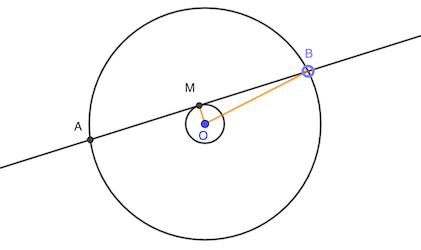
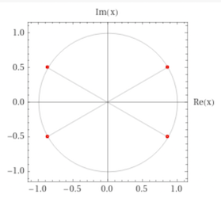
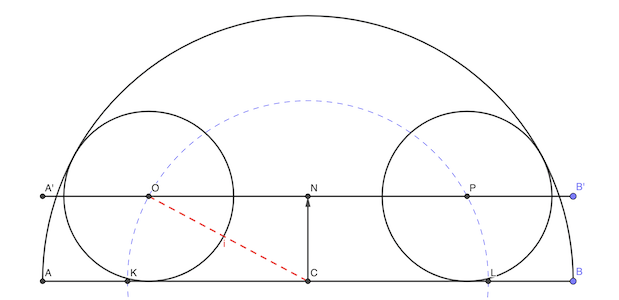
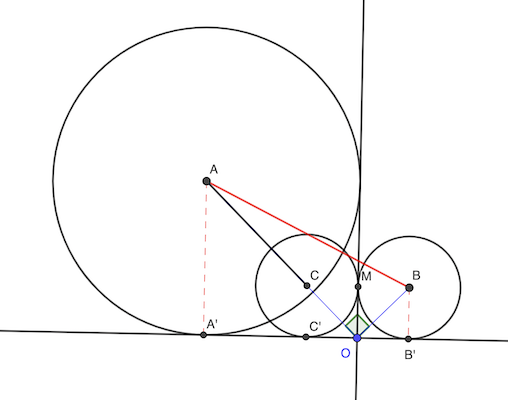

# Calendrier Mathématique Juin 2020

[Solutions 2020](../README.md) - [Homepage](../../README.md)

## Lundi 1 Juin

- x² = 11 - 2yz
- y² = 12 - 2xz
- z² = 13 - 2xy

x² + y² + z² + 2yz + 2xz + 2xy = (x + y + z)² = 11 + 12 + 13 = 36

D'où x + y + z = 36 (solutions positives)

> réponse: 36

## Mardi 2 Juin

Soient x, y deux entiers naturels positifs tels que:

- n - 52 = x²
- n + 52 = y²

D'où: y² - x² = (y - x)(y + x) = 52 - (-52) = 104 = 2 × 2 × 2 × 13

Les couples possibles pour (y - x, y + x) sont: (1, 104) (2, 52) (4, 26) (8, 13).

- y - x = 1 et y + x = 104: impossible car 2y = 105 et y est entier ❌
- y - x = 8 et y + x = 13: impossible même raison ❌
- y - x = 2 et y + x = 52: y = 27 et x = 25 ✅
- y - x = 4 et y + x = 26: y = 15 et x = 11 ✅

Comme 2n = x² + y², les valeurs possibles de n sont: (25² + 27²) / 2 = 677 et (11² + 15²) / 2 = 173

> réponse: 173 et 677

## Mercredi 3 Juin

Le plus long segment doit être tangeant au cercle de rayon 1 cm. En effet, la plus longue distance inscrite dans un cercle est le diamètre, tout segment ne passant pas le centre sera plus petit. Et le plus grand qu'on puisse trouver en fixant un point sur le cercle le plus proche du centre est tangeant au petit cercle.

Il faut calculer AB: AB = 2 MB = 2 √(6² - 1²) = 2 √35

> réponse: 2 √35 cm

## Jeudi 4 Juin

La rangée k débute par k (k - 1) + 1.

Cherchons le plus grand k positif tel que k (k - 1) + 1 ≤ 1001.

k (k - 1) = 1000

k = (1 + √4001) / 2 ≅ 32.13

Donc la rangée 32 contient les impairs de 991 à 1053, dont 1001.

> réponse: 32

## Vendredi 5 Juin

Il y a 16 femmes pour 8 hommes. Si la disposition est FHF répété 8n fois, chaque femme est assise à côté d'une homme et d'une femme. Donc aucune ne ment.

> réponse: 0

## Lundi 8 Juin

3360 est multiple de 3 et de 10. Il faut donc au minimum 2, 3 et 5 comme facteurs premiers.

Si on prend 6 et 5, il reste 112, soit 4 × 4 × 7.

Si on prend 3 et 5 et 4, il reste 56 mais on est bloqué parce 56 = 8 × 7 et on ne peut pas faire 8.

Donc 3360 = 4 × 4 × 5 × 6 × 7 et on ne peut pas faire mieux.

> réponse: 5

## Mardi 9 Juin

Utilisons la trigonométrie:

- DH = AD × sin 60° = √3 / 2
- AE = 4 - 1 = 3

Donc aire ADE = DH × AE / 2 = 3 √3 / 4

Aire ABC = 2 × √(4² - 2²) = 4 √3

Donc aire DEF = 4 √3 - 3 × 3 √3 / 4 = 7 √3 / 4

> réponse: 7 √3 / 4 cm²

## Mercredi 10 Juin

Pour que la somme soit paire, compte du fait que les dés 2 et 3 sont pair et impair, il faut que le dé 1 sorte un nombre impair. Soit une proba de 2 / 3.

> réponse: 2 / 3

## Jeudi 11 Juin

x ≠ 3

∣(x - 2) (x - 3)∣ - 4 ∣x - 3| = 1

Si x < 2, x - 2 < 0 et x - 3 < 0

x² - 5x + 6 + 4x - 12 = 1

⇒ x² - x - 7 = 0 ⇒ une solution (1 - √29) / 2

Si 2 ≤ x < 3:

-x² + 5x - 6 + 4x - 12 = 1

⇒ -x² + 9x - 19 = 0 ⇒ pas de racine entre 2 et 3

Si x > 3:

x² - 5x + 6 - 4x + 12 = 1

⇒ x² - 9x + 17 = 0 ⇒ une solution > 3

> réponse: deux solutions: (1 - √29) / 2 et (9 + √13) / 2

## Vendredi 12 Juin

Il y a douze nombres qui commencent par 1 ou 2.

Le plus petit qui commence par 3 est 3124, puis 3142.

3142 est donc à la quatorzième place.

> réponse: 14

## Lundi 15 Juin

## Mardi 16 Juin

a³ + b³ = (a + b)³ - 3a²b - 3ab²

r³ + 1 / r³ = (r + 1 / r)³ - 3 r² / r - 3 r / r² = (√3)³ - 3 (r + 1 / r) = 3 √3 - 3 √3 = 0

Nota: r est un nombre complexe. Il y a quatre solutions à l'équation: r = (± √3 ± 𝑖) / 2

> réponse: 0

## Mercredi 17 Juin

2³ × 5⁴ × 10⁵ = 5 × 10³ × 10⁵ = 5 × 10⁸ = 500 000 000

> réponse: 9 chiffres

## Jeudi 18 Juin

## Vendredi 19 Juin

Les deux petits cercles sont sur le cercle de rayon 25 - 8 = 17 cm et de centre C.

Les centres des petits cercles sont sur une droite à distance 8 cm du diamètre du grand cercle.

On a: OC = 17 et NC = 8. D'où ON = √(17² - 8²) = √225 = 25

OP = 30 cm

> réponse: 30 cm

## Lundi 22 Juin

Il faut chercher k tel que: k² - 8 = 4 - 4k

k² + 4k - 12 = k² + 4k + 4 - 16 = (k + 2)² - 4² = (k + 2 - 4)(k + 2 + 4) = 0

> réponse: k = 2 ou -6

## Mardi 23 Juin

## Mercredi 24 Juin

Si les cercles se chevauchent:

AC = √2 AA - √2 CC' = 2 √2

Si les cercles ne se chevauchent pas:

AB = √[ (3√2)² + (√2)² ] = √(18 + 2) = 2 √5

> réponse: 2 √2 cm (ou 2 √5 cm si pas chevauchement)

## Jeudi 25 Juin

## Vendredi 26 Juin

Soit X le nombre dans la case qui croise.

La somme doit être (1 + 4 + 7 + 10 + 13 + X) /2 = (35 + X) / 2

X doit être impair.

Si X = 13, il faut faire 24.  13+10+1 = 24 et 13+7+4 = 24

> réponse: 24

## Lundi 29 Juin

Soit x le nombre de carreaux que possède Julien.

n² = x - 92

(n + 2)² = x + 100

4n + 4 = 100 + 92 ⇒ n = 47

D'où x = 2301

> réponse: x = 2301

## Mardi 30 Juin
