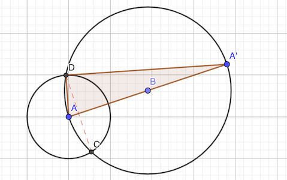
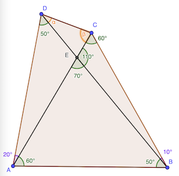

# Calendrier Mathématique Mai 2020

## Vendredi 1 Mai

La mise en équation donne: 4 / 5 n + 4 / 5 = n

Soit n - 4 / 5 n = 4 / 5

D'où n = 4

> réponse: quatre chats

## Lundi 4 Mai

Soit a,b,c les dimensions de la cage. On a:

- x = ab ①
- y / 5 = ac  ⇔  y = 5ac ②
- 5xy = bc ③

En remplaçant dans ③ x et y tels que donnés par ① et ②:

5 ab × 5 ac = bc

D'où a = 1 / 5

Le volume de la cage est abc.

abc = bc / 5 = xy

> réponse: xy

## Mardi 5 Mai

Recherche avec [programme](05.py) Python.

```python
#!/usr/bin/env python3

import math


def divisors(n):
    divs = [1, n]
    for i in range(2, int(math.sqrt(n)) + 1):
        q, r = divmod(n, i)
        if r == 0:
            divs.extend([i, q])
    return list(sorted(divs))


n = 2
while True:
    u = [0] * 10
    nu = 0
    for d in divisors(n):

        if u[d % 10] == 0:
            u[d % 10] = 1
            nu += 1

        if nu == 10:
            print(n, divisors(n))
            exit()

    n += 1
```

> réponse: 270

## Mercredi 6 Mai

En triant selon l'énoncé, on obtient:

marie < sylvie < sophie < ana < elsa < pauline

Marie a 15€, Sylvie 30€, Sophie 45€, etc.

> réponse: Sophie 45€

## Jeudi 7 Mai



ADA' et ACA' sont deux triangles rectangles dont deux côtés ont pour longueur 1 et 4 (hypoténuse), d'où le troisième côté AA' = √(4² - 1) = √15

La distance DC recherchée est le double de la hauteur 𝒉 des triangles. On peut écrire (calcul de l'aire de deux façons différentes):

AD × DA' = 𝒉 × AA'

Soit DC = 2 𝒉    = AD × DA' / AA' × 2 = 1 × V15 / 4 × 2 = V15 / 2

> réponse: V15 / 2 cm

## Vendredi 8 Mai

Mise en équation (V volume de la piscine, Tᵢ le débit par jour du tuyau 𝑖):

- V = (T₁ + T₂) × 3
- V = (T₂ + T₃) × 4
- V = (T₁ + T₃) × 6

4V + 3V + 2V = 9V = 12 (T₁ + T₂) + 12 (T₂ + T₃) + 12 (T₁ + T₃) = 24 (T₁ + T₂ + T₃)

D'où V = 8 / 3 (T₁ + T₂ + T₃)

> réponse: 64h ou 2 jours et 16h

## Lundi 11 Mai

On pose la division 469 / 1998:

- 469 * 10 / 1998 = 2 + 694 / 1998
- 694 * 10 / 1998 = 3 + 946 / 1998
- 946 * 10 / 1998 = 4 + 1468 / 1998
- 1468 * 10 / 1998 = 7 + 694 / 1998

On retrouve le reste 694 donc les décimales 347 vont se répéter à l'infini.

469 / 1998 = 0.2347347347…

Le premier chiffre est 2, les 3k+2 des 3, 3k+3 des 4 et 3k+4 des 7.

Comme 2020 = 672 * 3 + 4, le 2020e chiffre est un 7.

> réponse: 7

## Mardi 12 Mai

- N = n²
- N + 3333 = m²
- n² + 3333 = m²
- (m - n)(m + n) = 3333 = 3 × 11 × 101

m - n = 3 et m + n = 1111 ⇒ 2n = 1114 ⇒ n = 554 ❌  n doit être inférieur à 100 pour que n² soit inférieur à 10000

m - n = 33 et m + n = 101 ⇒ 2n = 68 ⇒ n = 34, n² = 1156 ✅

> réponse: 34

## Mercredi 13 Mai



Du fait des angles:

- le triangle ABC est équilatéral, donc AB = AC = BC
- le triangle ABD est isocèle en A, donc AB = AD

Ainsi ACD est également isocèle car AC = AD.

20° + 2 β = 180°

D'où β = 80°

> réponse: 80°

## Jeudi 14 Mai

On factorise l'équation:

a³ + b³ - 2a²b - 2ab² = 0

a³ + b³ - 2a²b - 2ab² + 5 a²b + 5 ab² = 5 (a²b + ab²)

(a + b)³ = 5ab (a + b)

On peut simplifier puisque a et b sont strictement positifs, donc a + b non nul.

(a + b)² = 5ab

a² + b² + 2ab = 5ab

D'où:

a² + b² = 3ab ①

En disisant par b² puis a², on a les équations suivantes:

- a² / b² + 1 = 3 a / b
- 1 + b² / a² = 3 b / a

Additionnées, cela donne:

a² / b² + b² / a² = 3 a / b + 3 b / a - 2 = 3 (a² + b²) / ab - 2

Or, on sait que (a² + b²) / ab = 3 ①

Donc: a² / b² + b² / a² = 3 × 3 - 2 = 7

> réponse: a² / b² + b² / a² = 7

## Vendredi 15 Mai

Pour 3a + b +c, il suffit b + c soit multiple de 3.

Supposons d'abord que b < c

- 0-3 0-6 0-9
- 1-2 1-5 1-8
- 2-4 2-7
- 3-6 3-9
- 4-5 4-8
- 5-7
- 6-9
- 7-8

Ce qui donne 15 possibilités. Soit 30 en considérant b > c. Il faut rajouter les 4 cas où b = c: 0-0 3-3 et 6-6 9-9.

Soit 34 possibilités, qu'il faut multiplier par 9, le nombre de valeurs que peut prendre a.

> réponse: 306

## Lundi 18 Mai

Le petit carré central ne bouge pas: s'il est blanc il restera blanc. Il faut donc qu'il soit noir dès le début. Probabilité = 1 / 2.

Pour qu'un petit carré sur le bord ne devienne pas noir il faut que son antécédent dans la rotation soit également blanc.

| BBNN | BBBN | BBBB | NBBN | NBBB | NNBB | BNNB | BBNB | BNBB |
|------|------|------|------|------|------|------|------|------|
|  `·B·` |  `·B·` |  `·B·` |  `·N·` |  `·N·` |  `·N·` |  `·B·` |  `·B·` |  `·B·` |
|  `N·B` |  `N·B` |  `B·B` |  `N·B` |  `B·B` |  `B·N` |  `B·N` |  `B·B` |  `B·N` |
|  `·N·` |  `·B·` |  `·B·` |  `·B·` |  `·B·` |  `·B·` |  `·N·` |  `·N·` |  `·B·` |

Sur les 2⁴ = 16 possibles, Il y a donc 9 dispositions dans lequelles deux blancs au moins sont successifs.

Il y a donc 7 dispositions convenables.

Cela vaut pour les petits carrés au milieu et pour ceux aux sommets.

En tout il y a: 1 / 2 × 7 / 16 × 7 / 16 = 49 / 512

> réponse: 49 / 512

## Mardi 19 Mai

Les droites confondues sont celles qui ont une même pente, i.e. s'il existe k entier > 1 tel que xk = y ou yk = x, ou autrement dit si x et y ne sont pas premiers entre eux.

Comptage avec [programme](19.py) Python.

```python
#!/usr/bin/env python3

from fractions import Fraction
from math import gcd

n = 0
u = set()
for x in range(1, 11):
    for y in range(1, 11):

        # détermination: x et y premiers entre eux
        if gcd(x, y) == 1:
            n += 1

        # détermination: pente unique
        a = Fraction(y, x)
        u.add(a)

print("réponse:", n, len(u))
```

> réponse: 63

## Mercredi 20 Mai

Soit C le nombre placé dans le rond central. En additionnant les sommes des 5 droites, on a:

5 × 18 = 1 + 2 + … + 11 + 5 × C - C

Soit, 90 = 66 + 4 × C

D'où C = 6

> réponse: 1-6-11 2-6-10 3-6-9 4-6-8 5-6-7

## Jeudi 21 Mai

𝑥 ne peut être entier puisque 17 n'est pas un carré. Le carré strictement inférieur est 16. Donc

𝑥 = (17 - 16) / √16 + √16 = 4.25

> réponse: 𝑥 = 4.25

## Vendredi 22 Mai

🤪 Il manque une précision dans l'énoncé: le *triangle est supposé équilatéral* ! 🤪

Le rapport est alors 4 / 3.

Si le triangle était quelconque, il y a une infinité de réponses…

> réponse: 4 / 3 ⚠️

## Lundi 25 Mai

Comptage avec [programme](25.py) Python.

```python
#!/usr/bin/env python3

from itertools import product

n = sum(1 for a, b, c in product(range(0, 10), repeat=3) if a + b + c == 10)

print("réponse:", n)
```

> réponse: 63

## Mardi 26 Mai

Les carrés entre 11 et 109 sont: 16 25 36 49 64 81 100

> réponse: 7

## Mercredi 27 Mai

Soit n l'agent de Nico et l celui de Léa.

n + l = 80

Echange 1:

- n' = n - l
- l' = 2 l

Echange 2:

- n" = (n - l) * 2
- l" = 2l - (n - l)

Echange 3:

- n"' = (n - l) * 2 - [ 2l - (n - l) ] = 0
- l"' = (n - l) + (n - l) * 2 = 80

2n - 2l - 2l + n - l = 3n - 5l = 0

Soit 3n = 5l.

n + 3 / 5 n = 8 / 5 n = 80

Nico avait 50€

> réponse: 50€

## Jeudi 28 Mai

On trace la hauteur AH de ABC. Soit H' l'intersection avec B'C'. AH' est aussi hauteur de AB'C' (car ⟂).

La hauteur AH de ABC est 3 × 4 / √(3² + 4²) = 12 / 5 (aire du triangle).

Le théorème de Thalès donne:

AB' / AB = AH' / AH = AC' / AC

Soit AB' = 3 × (12 / 5 - 1) / (12 / 5) = 7 / 4

et AC' = 4 × (12 / 5 - 1) / (12 / 5) = 7 / 3

L'aire de AB'C' est donc: 7 / 4 × 7 / 3 / 2 = 49 / 24 m²

> réponse: 49 / 24 m²

## Vendredi 29 Mai

Il faut chercher les entiers a < 1000 qui vérifient:

1000 a + 154 = 154 k ⇔ 500 a = 77 (k - 1) avec k ∈ 𝐍

Comme 500 et 77 sont premiers entre eux, ce sont donc tous les multiples de 77 entre 100 et 1000.

Il y en a ⌊ 900 / 77 ⌋ = 11

Vérification en Python:

```python
sum(1 for n in range(100000, 1000000) if n % 154 == 0 and n % 1000 == 154)
```

> réponse: 12
