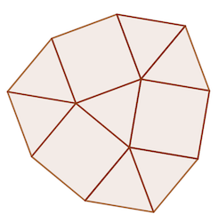
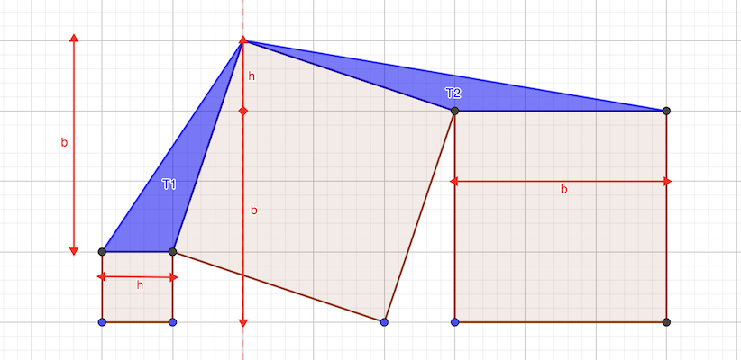

# Calendrier Mathématique Mars 2020

[Solutions 2020](../README.md) - [Homepage](../../README.md)

## Lundi 2 Mars

On écrit les équations de l'énoncé:

- pomme + poire = 24
- pomme = poire - 6

Ce qui donne: 2 poire = 24 + 6, poire = 15. Et pomme = 9.

> réponse: 5 / 3

## Mardi 3 Mars

```text
0   1   2   3   4   5   6   6   8   9
C           A   D           B       E
```

> réponse: C A D B E

## Mercredi 4 Mars

cos 45° = √2 / 2

Donc l'aire du segment coloré est l'aire d'un quart de cercle moins l'aire du triangle isocèle rectangle de côté 1.

Soit: π / 4 - 1 / 2

> réponse: π / 4 - 1 / 2 cm²

## Jeudi 5 Mars

a × b × c = 3 × (a + b + c)

Supposons 0 < a ≤ b ≤ c

a × b = 3 × (a / c + b / c + 1) ≤ 3 × (1 + 1 + 1) = 9 ⇔ a × b ≤ 9

car a / c ≤ 1 et b / c ≤ 1.

Exprimons c en fonction de a,b:

abc - 3c = 3(a+b) ⇒ c = 3 (a + b) / (a b - 3)

```python
for a in range(1,10):
    for b in range(1,10):
        if a * b <= 9 and a <= b:
            if a * b != 3:
                c = 3 * (a + b) / (a * b - 3)
                if b <= c and int(c) == c:
                    print(a,b,c)
```

Les solutions sont:

1. 1 4 15
2. 1 5 9
3. 1 6 7
4. 2 2 12
5. 2 3 5
6. 3 3 3

> réponse: 6 triplets

## Vendredi 6 Mars

> réponse: 2 heures et 1 minute

## Lundi 9 Mars

Posons n = 10 a + u, et donc: m = a.

n - m = 10 a - a + u = 9 a + u

9 a + u = 2020 avec 0 ≤ u ≤ 9

Donc a est tel que 2011 ≤ 9 a ≤ 2020

La seule solution possible est a = 224 et u = 4

> réponse: 2244

## Mardi 10 Mars

Par le théorème de Thalès, on peut dire XY / BC = 7 / 8. Donc XY = 7 / 8 × 40 = 35

> réponse: 35 cm

## Mercredi 11 Mars

Nombre de parties gagnées: .49 * 500 = 245

On doit résoudre 2 × (245 + x) = (500 + x) pour atteindre 50%.

x = 500 - 490 = 10

> réponse: 10

## Jeudi 12 Mars

Départ: jean → fabien → michel

A la fin:

- michel → fabien (nombre de dépassements impair)
- jean → fabien (nb pair)
- michel → jean

> réponse: L'ordre d'arrivée est donc: Fabien puis Jean puis Michel

## Vendredi 13 Mars

[Programme](13.py) Python

```python
#!/usr/bin/env python3

from itertools import permutations

primes = [11, 13, 17, 19, 23, 29, 31, 37, 41]

puiss2 = [2, 4, 8, 16, 32]

for line in permutations(primes):

    for i in range(len(line) - 1):
        if abs(line[i + 1] - line[i]) not in puiss2:
            break
    else:
        print(line)
```

```python
#!/usr/bin/env python3

from itertools import permutations

primes = [11, 13, 17, 19, 23, 29, 31, 37, 41]

puiss2 = [2, 4, 8, 16, 32]

for line in permutations(primes):

    for i in range(len(line) - 1):
        if abs(line[i + 1] - line[i]) not in puiss2:
            break
    else:
        print(line)
```

> réponse: 4

## Lundi 16 Mars

- premier indice: 2___6
- deuxième indice: 20__6
- troisième indice: 20486

> réponse: 20496

## Mardi 17 Mars



> réponse: (cf. schéma)

## Mercredi 18 Mars

> réponse: 790 kg

## Jeudi 19 Mars

BST est un triangle équilatéral de côté √(2² + 2²) = 2√2

La hauteur de ce triangle vaut : h² = (2√2)² - (2√2 / 2)² = 8 - 2 = 6  d'où h = √6

AB = √2 + √6

> réponse: √2 + √6 cm

## Vendredi 20 Mars

Le 101e est forcément un ♡ puisqu'un sur deux. Le 100 est le symbôle avant le ♡ en quatrième position.

> réponse: ♧ ♡

## Lundi 23 Mars

Le système a trois équations à quatre inconnues, il y a une infinie de solutions (x1,x2,x3,x4).

Pour que x1+x2+x+3+x4 soit constant, il faut que le système avec cette quatrième équation ait aussi une infinie de solutions, Cela se vérifie avec le déterminant de la matrice égal à zéro.

On fixe donc x4 = 0 et on résout le système. On trouve (x1, x2, x3) = [ 8.75 -7. 2.25 ]

D'où la somme x1 + x2 + x3 + x4 = 4

Calcul avec [SageMath](https://sagecell.sagemath.org):

```python
M = Matrix([[1, 4, 9], [4, 9, 16], [9, 16, 25]])
V = vector([1, 8, 23])
sum(M**-1 * V)
```

[Programme](23.py) Python avec [NumPy](https://numpy.org).

```python
#!/usr/bin/env python3

# résolution du système d'équations linéaires

import numpy as np

# import random

# la matrice du système à 4 équations
M = np.array([[1, 4, 9, 16], [4, 9, 16, 25], [9, 16, 25, 36], [1, 1, 1, 1]])
print(M)
print(np.linalg.det(M))

# la matrice du système à 3 équations
M = np.array([[1, 4, 9], [4, 9, 16], [9, 16, 25]])
print(M)

# son inverse
Minv = np.linalg.inv(M)
print(Minv)

# vecteur résultat
v = np.array([1, 8, 23])

# colonne des x4, aléatoire
x4 = 0  # random.uniform(-100, 100)
vx4 = np.array([16 * x4, 25 * x4, 36 * x4])

r = np.matmul(Minv, v - vx4)

print(r)
print(np.sum(r) + x4)
```

```python
#!/usr/bin/env python3

# résolution du système d'équations linéaires

import numpy as np

# import random

# la matrice du système à 4 équations
M = np.array([[1, 4, 9, 16], [4, 9, 16, 25], [9, 16, 25, 36], [1, 1, 1, 1]])
print(M)
print(np.linalg.det(M))

# la matrice du système à 3 équations
M = np.array([[1, 4, 9], [4, 9, 16], [9, 16, 25]])
print(M)

# son inverse
Minv = np.linalg.inv(M)
print(Minv)

# vecteur résultat
v = np.array([1, 8, 23])

# colonne des x4, aléatoire
x4 = 0  # random.uniform(-100, 100)
vx4 = np.array([16 * x4, 25 * x4, 36 * x4])

r = np.matmul(Minv, v - vx4)

print(r)
print(np.sum(r) + x4)
```

> résultat: 4

## Mardi 24 Mars

Chaque nombre de la suite est de la forme ((n-1) + n + (n+1)) / 3 = n, pour n entre 2 et 999.

∑ n = 999 * 1000 / 2 - 1 = 499499

Il ya 998 nombres, la moyenne est donc: 499499 / 998 = 1001 / 2

> réponse: 1001 / 2

## Mercredi 25 Mars



Le sommet du carré central est surélevé de h. En effet les triangles rectangles constitués par les parties haute et basse de ce carrré sont de même dimensions.

aire T1 = h × b / 2

aire T2 = b × h / 2

> réponse: oui

## Jeudi 26 Mars

Pour deux niveau, il faut 5 briques. Pour 50 fois plus, il faut 250 briques.

> réponse: 250 briques

## Vendredi 27 Mars

Il y a en fait douze nombres à tester: 10 à 21, puisque 22^3 = 10648 > 9999.

[Programme](27.py) en Python pour le faire.

```python
#!/usr/bin/env python3

i = 10
while True:
    n = i ** 3
    if n >= 10000:
        break

    a = n // 1000
    b = (n // 100) % 10
    c = (n // 10) % 10
    d = n % 10

    if n == (a + b + c + d) ** 3:
        print(n)

    i += 1
```

```python
#!/usr/bin/env python3

i = 10
while True:
    n = i ** 3
    if n >= 10000:
        break

    a = n // 1000
    b = (n // 100) % 10
    c = (n // 10) % 10
    d = n % 10

    if n == (a + b + c + d) ** 3:
        print(n)

    i += 1
```

> réponse: 4913 5832

## Lundi 30 Mars

On a PSQ + PQS = 90° et PSQ / PQS = 1 / 5.

D'où: PQS + 1/5 PQS = 90° ⇒  PQS = 90 × 5 / 6 = 75°

RSQ = PQS = 75°

> réponse: 75°

## Mardi 31 Mars

```text
1  3  5  7

2  4  6  8
```

- 3 choix pour la deuxième maison visitée
- 2 choix pour la troisème
- 2 choix pour la quatrième
- les maisons suivantes n'offrent plus de choix

> réponse: 12
