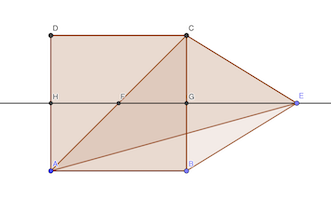

# Calendrier Mathématique Novembre 2020

[Solutions 2020](../README.md) - [Homepage](https://rene-d.github.io/calendrier-math/)

## Lundi 2 Novembre

> réponse: 8

## Mardi 3 Novembre

√2 + √3 - 1 - √6

= √2 + √3 - 1 - √2 √3

= a + b - ab - 1

= (1 - a)(b - 1)

= (1 - √2)(√3 - 1) < 0

> réponse: 1 + 1 / √6

## Mercredi 4 Novembre

$$
\begin{aligned}
x^3+y^3 = 40 \\
x^2y+xy^2=8
\end{aligned}
$$

Développons le polynome $(x+y)^3$:

$$
(x+y)^3=x^3+3x^2y+3xy^2+y^3=40+3\times8=64
$$

On peut calculer $xy$:

$$
x^2y+xy^2=xy(x+y)=xy\times\sqrt[3]{64}=4xy=8
$$

D'où: $xy=2$

> réponse: 2

## Jeudi 5 Novembre

Comme la droite DF est tangente au petite cercle, ∠DFB est droit.

L'angle ∠DEC est également droit puisque DC est un diamètre du cercle sur lequel est E.

Ainsi, les droite BF et CE sont parallèles.

Par le théorème de Thalès: DB / DC = DF / DE

Calculons les trois valeurs pour trouver DE:

- DB = 12 - 12 / 4 = 9
- DC = 12
- DF = √(9² - 3²) = √72 = 6 √2

D'où: DE = 6 √2 / 9 × 12 = 8 √2

> réponse: 8 √2 cm

## Vendredi 6 Novembre

1 2 3 4 5 6 7 8 9

8 doit être le chiffre des dizaines pour que le nombre qu'il compose soit premier. On a le choix entre  83 et 89. De même pour 6 et 4 avec respectivement comme choix 61 67 et 41 43 47.

Il y a donc au maximum 2 × 2 × 3 = 12 solutions. Il y en a en fait maoins car des chiffres sont en commun entre les nombres.

| choix pour 8 6 4 | chiffres restants | somme |
| -----------------|-------------------|-------|
| 83 61 47 |  9 5 2 ❌ | 207 |
| 83 67 41 |  9 5 2 ❌ | 207 |
| 89 61 43 |  5 7 2 ✅ | 207 |
| 89 61 47 |  3 5 2 ✅ | 207 |
| 89 67 41 |  3 5 2 ✅ | 207 |
| 89 67 43 |  5 1 2 ❌ | 207 |

Toutes ces solutions ne sont pas valides (9 et 1 non premiers). Mais on ne pourra pas les combiner pour faire une somme inférieure à 207.

207 est donc la somme minimale à trouver.

> réponse: 207

## Lundi 9 Novembre

On prend les nombres dans l'ordre et on élimine. 1 élimine les nombres que se terminent par 4 et 9, 2 élimine 3 et 8, etc. 5 élimine 0 et les autres nombres qui se terminent par 5.

Il reste: 1 2 5 6 7 11 12 16 17 21 22 26 27

On pourrait remplacer 1, 11, 21 par 4, 14, 24. Etc.

> réponse: 13

## Mardi 10 Novembre

Si on place E à l'opposé de A, le triangle AEC est rectangle en C et on a ∠AEC = 90 - ∠BAC = 30°.

D'une manière générale, le [théorème de l'angle au centre](https://fr.wikipedia.org/wiki/Théorème_de_l%27angle_inscrit_et_de_l%27angle_au_centre) dit que l'angle ∠ABC est le double de l'angle ∠AEC.


> réponse: 30°

## Mercredi 11 Novembre

Pierre a quatre visites à faire. Si on fixe la position des visites à André et Bruno, celle des visites de Charles et Denis est déterminée (les deux places libres, puisque l'ordre est imposé). La réponse est donc ${4\choose 2}=6$.

Illustration de la solution en Python:

```python
from itertools import permutations
for z in permutations("ABCD"):
    if z.index("A") < z.index("B") and z.index("C") < z.index("D"):
        print("".join(z))
```

> réponse: 6

## Jeudi 12 Novembre

Comme 1 n'est pas solution de l'équation, on peut factoriser le terme de gauche:

1 + x + x² + x³ = (x⁴ - 1) / (x - 1)

L'équation devient alors:

(x⁴ - 1) / (x - 1) = x⁴ + x⁵

Or:

(x⁴ + x⁵) (x - 1) = x⁶ - x⁴

L'équation s'écrit alors:

x⁶ - x⁴ = x⁴ - 1

x⁴ (x² - 1) = (x² - 1) (x² + 1)

Pour x ≠ 1, x² = 1 est solution, d'où la première racine: x = -1.

Il faut trouver les autres. En simplifiant par x² - 1 devenu non nul à partir d'ici:

x⁴ = x² + 1

x² = (1 ± √5) / 2

On cherche les valeurs réelles (et non complexes). Donc les autres racines sont:

x = ± √((1 + √5) / 2)

> réponse: -1, -√((1 + √5) / 2), √((1 + √5) / 2)

## Vendredi 13 Novembre

Il y a 2⁴ nombres écrits avec des 3 et des 5 (deux possibilités par chiffre). Chaque chiffre de la moitié de ces nombres est un 3, l'autre moitié un 5. Donc la somme de chaque chiffre est (3 + 5) × 8 = 64.

La réponse est 64 + 640 + 6400 + 64000 = 64 × 1111 = 71104

> réponse: 71104

## Lundi 16 Novembre

| tour  | perdant | Adèle | Louis | Camille |
|-------|---------|-------|-------|---------|
| final |         |    27 |    27 |      27 |
|     3 | Camille |     9 |     9 |      63 |
|     2 |  Louis  |     3 |    57 |      21 |
|     1 |  Adèle  |    55 |    19 |       7 |

> réponse: 55 €

## Mardi 17 Novembre

12 = 1 × 2 × 2 × 3

Donc les produits de chiffres qui font 12 sont:

- 1 × 2 × 6 → 6 possibilités
- 2 × 2 × 3 → 3 possibilités
- 1 × 4 × 3 → 6 possibilités

> réponse: 15 nombres

## Mercredi 18 Novembre

Soir $r=CB=BC$ le rayon du cercle. Comme la droite AD est tangente en D au cercle, CD et AD sont perpendiculaires et Pythagore permet d'écrire:

$AD^2 + DC^2 = AC^2 = (AB + BC)^2$

$10^2 + r^2 = (7 + r)^2$

$100 = 49+14r$

$$
r = \frac {51} {14} cm
$$

> réponse: 51 / 14 cm

## Jeudi 19 Novembre

Tous les nombres pairs ont 2 en diviseur commun, et il y en a 10 entre 1 et 20.

> réponse: 10

## Vendredi 20 Novembre

> a ⭑ b = ab + 3

La première opération est: 1 ⭑ 1 = 4

Si b = 1: a ⭑ 1 = a + 3

Ainsi l'imbrication de l'opération ⭑ est la suite arithmétique uₙ₊₁ = uₙ + 3 avec u₁ = 1.

uₙ = 1 + 3n

2020 = 1 + 3n ⇔ n = 673

Il faut donc 673 opérations ⭑ pour arriver à 2020, et donc 673 + 1 = 674 nombres 1 (deux pour la première opération, et un de plus par opération suivante).

> réponse: 674

## Lundi 23 Novembre



Aire BEC = 90 - 8 × 8 = 26

Donc GE × GC = 26, soit GE = 13 / 2

Aire ACE = aire AFE + aire CFE

aire CFE = FE × CG / 2 = (4 + 13 / 2) × 4 / 2 = 21

aire AFE = FE × AH / 2 = FE × CG / 2 = aire CFE = 21

Donc l'aire recherchée est 21 + 21 = 42

> réponse: 42 cm²

## Mardi 24 Novembre

$(a^2+b^2)^2-(a^2-b^2)^2=144$

On peut factoriser en utilisant la formule $A^2-B^2=(A-B)(A+B)$.

$\left((a^2+b^2)-(a^2-b^2)\right)\left((a^2+b^2)+(a^2-b^2)\right)=144$

$\left(2b^2\right)\left(2a^2\right)=144$

$(ab)^2=36$

$a\times b=6$ car a et b sont positifs.

Les possibilités sont (1,6) (2,3).

$a^2+b^2$ peut donc valoir $1+6^2=37$ et $2^2+3^3=13$.

> réponse: 13

## Mercredi 25 Novembre

Reste division par 5 égal à 4 => ce sont les nombres x4 et y9.

Il faut que le reste de la division par 3 soit 1, donc x3 et y8 doivent être divisibles par 3.

Pour x, les possibilités sont 3 6 9 (somme des chiffres multiple de 3). Pour y, les possibilités sont: 1 4 7.

x4 ne peut pas être premier. Il reste 19 49 79. Il n'y a que 19 et 79 qui soient premiers.

> réponse: 19 et 79

## Jeudi 26 Novembre

Soit l'équation :

$$
x^3y+x+y=xy+2xy^2
$$

Elle peut s'écrire ainsi:

$$
x^3y+x+y-xy-2xy^2=0
$$

Ou encore de ces deux manières différentes:

$$
\begin{cases}
&x +y (x^3+1-x-2xy)=0 \\
&y + x (x^2y+1-y-2y^2)=0
\end{cases}
$$

On en déduit que $x$ divise $y$ et $y$ divise $x$ si $x$ et $y$ sont non nuls. Or, $x$ et $y$ sont entiers, donc $x = y$. Par ailleurs la solution $x = y = 0$ est valide.

L'équation devient, pour $x$ non nul:

$x^4+2x-x^2-2x^3=0$

$x^3-2x^2-x+2=0$

$(x^3-2x^2+x)-2x+2=0$

$x(x-1)^2=2(x-1)$

$x=1$ est une solution. Les autres doivent vérifier:

$x(x-1)=2$

Ce polynome a deux solutions, -1 et 2. Donc $x=2$ puisque $x$ doit être positif.

En conclusion, les seules solutions entières et positives à l'équation sont:

> réponse: x=0 y=0, x=1 y=1, x=2 y=2

## Vendredi 27 Novembre

La distance AC est égale à 2 √2 × √2 = 4 cm. Donc le rayon du cercle de centre vaut 4 - 2 √ 2. Ainsi la zone coloriée a pour aire:

(2 √2)² - π (4 - 2 √2)² / 4 - π (2 √2)² / 4 = 8 + 4 (√2 - 2) π

> réponse: 8 + 4 (√2 - 2) π cm²

## Lundi 30 Novembre

Affichage de la tresse en Python avec [programme](30.py). On remarque le cycle tous les six rangs.

```python
#!/usr/bin/env python3

rang = ("\033[91ma", "\033[92mb", "\033[93mc", "\033[94md")
for i in range(1, 21):
    a, b, c, d = rang
    if i % 2 == 1:
        rang = (b, c, a, d)
    else:
        rang = (a, d, b, c)
    print(f"\033[2m{i:2}\033[0m {' '.join(rang)} \033[0m")
```

> réponse: b d c a
