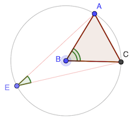

# Calendrier Mathématique Novembre 2020

[Solutions 2020](../README.md) - [Homepage](../../README.md)

## Lundi 2 Novembre

> réponse: 8

## Mardi 3 Novembre

√2 + √3 - 1 - √6

= √2 + √3 - 1 - √2 √3

= a + b - ab - 1

= (1 - a)(b - 1)

= (1 - √2)(√3 - 1) < 0

> réponse: 1 + 1 / √6

## Mercredi 4 Novembre

Développons le polynome :

On peut calculer :

D'où: 

> réponse: 2

## Jeudi 5 Novembre

Comme la droite DF est tangente au petite cercle, ∠DFB est droit.

L'angle ∠DEC est également droit puisque DC est un diamètre du cercle sur lequel est E.

Ainsi, les droite BF et CE sont parallèles.

Par le théorème de Thalès: DB / DC = DF / DE

Calculons les trois valeurs pour trouver DE:

- DB = 12 - 12 / 4 = 9
- DC = 12
- DF = √(9² - 3²) = √72 = 6 √2

D'où: DE = 6 √2 / 9 × 12 = 8 √2

> réponse: 8 √2 cm

## Vendredi 6 Novembre

## Lundi 9 Novembre

On prend les nombres dans l'ordre et on élimine. 1 élimine les nombres que se terminent par 4 et 9, 2 élimine 3 et 8, etc. 5 élimine 0 et les autres nombres qui se terminent par 5.

Il reste: 1 2 5 6 7 11 12 16 17 21 22 26 27

On pourrait remplacer 1, 11, 21 par 4, 14, 24. Etc.

> réponse: 13

## Mardi 10 Novembre

Si on place E à l'opposé de A, le triangle AEC est rectangle en C et on a ∠AEC = 90 - ∠BAC = 30°.

D'une manière générale, le [théorème de l'angle au centre](https://fr.wikipedia.org/wiki/Théorème_de_l%27angle_inscrit_et_de_l%27angle_au_centre) dit que l'angle ∠ABC est le double de l'angle ∠AEC.

> réponse: 30°

## Mercredi 11 Novembre

## Jeudi 12 Novembre

## Vendredi 13 Novembre

## Lundi 16 Novembre

## Mardi 17 Novembre

## Mercredi 18 Novembre

## Jeudi 19 Novembre

## Vendredi 20 Novembre

> a ⭑ b = ab + 3

La première opération est: 1 ⭑ 1 = 4

Si b = 1: a ⭑ 1 = a + 3

Ainsi l'imbrication de l'opération ⭑ est la suite arithmétique uₙ₊₁ = uₙ + 3 avec u₁ = 1.

uₙ = 1 + 3n

2020 = 1 + 3n ⇔ n = 673

Il faut donc 673 opérations ⭑ pour arriver à 2020, et donc 673 + 1 = 674 nombres 1 (deux pour la première opération, et un de plus par opération suivante).

> réponse: 674

## Lundi 23 Novembre

## Mardi 24 Novembre

## Mercredi 25 Novembre

## Jeudi 26 Novembre

## Vendredi 27 Novembre

## Lundi 30 Novembre
