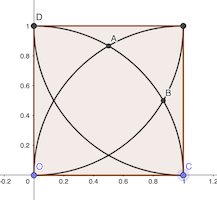

# Calendrier Mathématique Octobre 2020

[Solutions 2020](../README.md) - [Homepage](../../README.md)

## Jeudi 1 Octobre


On trace les triangles équilatéraux à l'intérieur des hexagones.

L'hexagone régulier est composé de six triangles équilatéraux de côté 1, tandis que l'autre hexagone en a 13.

> réponse: 13 / 6

## Vendredi 2 Octobre

Il y a au minimun un chiffre vert et 4 chiffres bleus (ou l'inverse), ce qui donne 4 sommes et dont 4 chiffres rouges. Il ne peut y avoir plus de chiffres rouges sinon il faudrait au moins 5+1=6 chiffres des autres couleurs pour former les additions, ce qui n'est pas possible.

Et comme il y a au moins cette solution, on peut affirmer que le nomrbe maximal de chiffres rouges est 4.

1+2=3 1+4=5 1+6=7 1+8=9

> réponse: 4

## Lundi 5 Octobre


### Recherche _bruteforce_

[Programme](05.py) Python de recherche exhaustive.

```python
#!/usr/bin/env python3

for x in range(1, 20):
    for y in range(1, 20):
        for z in range(1, 20):
            if x * y * z + x * y + 2 * y * z + x * z + x + 2 * y + 2 * z == 28:
                print(x, y, z, "réponse:", x + y + z)
```

```python
#!/usr/bin/env python3

for x in range(1, 20):
    for y in range(1, 20):
        for z in range(1, 20):
            if x * y * z + x * y + 2 * y * z + x * z + x + 2 * y + 2 * z == 28:
                print(x, y, z, "réponse:", x + y + z)
```

### Factorisation

xyz + xy + 2yz + xz + x + 2y + 2z = 28

x (yz + y + z + 1) + 2 (yz + y + z + 1) - 2 = 28

(x + 2) [y (z + 1) + (z + 1)] = 30

(x + 2) (y + 1) (z + 1) = 30

Comme x, y, z sont des entiers, les facteurs x + 2, y + 1, z + 1 doivent être des diviseurs de 30 = 2 × 3 × 5.

x + y + z = (2 + 3 + 5) - (2 + 1 + 1) = 10 - 4 = 6

2 + 3 + 5 est la somme des diviseurs, 2 + 1 + 1 est la somme des différences entre les diviseurs et le triplet (x, y ,z).

> réponse: 6

## Mardi 6 Octobre

Si 3 est le reste de la division par 5 de n, alors il existe un nombre k entier tel que:

n = 5k + 3

Or n est pair (puisque il reste 2 de sa division par 4). Donc k est impair (impair+impair=pair). Il existe donc k' tel que:

n = 5 (2k' + 1) + 3 = n = 10 k' + 8

> réponse: 8

## Mercredi 7 Octobre



Dans le repère orthonormé (Oxy), le point A a pour coordonnées (1/2, √3/2) tant que le point B (√3/2, 1/2). En effet la hauteur d'un triangle équilatéral de côté 1 est √3/2. Et OAC est équilatéral par construction, de même que OBD.

La distance d entre A et B est donc telle que:

d² = (1/2 - √3/2)² + (√3/2 - 1/2)² = 2 (1-√3/2) = 2 - √3

Soit d = √(2 - √3)

Commme OC = 10m, la longueur recherchée est :

> réponse: 10 √(2 - √3) m

## Jeudi 8 Octobre

La plus grande valeur est obtenue lorsqu'on maximise le numérateur et minimise le dénominateur. Ici c'est pour x = 20 et y = 40. La valeur est donc 400 / 80 = 5.

> réponse: 5

## Vendredi 9 Octobre

Il y a 3 + 6 + 4 = 13 boules dans l'urne.

Comme il y a 4 boules noires, Pauline a 4 / 13 × 3 / 12 = 1 / 13 de tirer deux boules noires.

De même, 3 / 13 * 2 / 12 = 1 / 26 de tirer deux boules blanches

Et 6 / 13 * 5 / 12 = 5 / 26 de tirer deux boules rouges.

Elle a donc 8 / 26 de tirer deux boules de même couleur. La proportion de tirage de deux boules noires est dans 2 / 8 = 1 / 4.

> réponse: 1 / 4

## Lundi 12 Octobre

En soustrayant les deux équations:

-6x² + 5x² - 5 + 30 = 0 ⇒ x² = 25 ⇒ x = ±5

Or -5 n'est pas solution de x³ - 6x² + 6x - 5 = 0 ni de x³ - 5x² + 6x - 30 = 0

5 est donc la seule solution.

> réponse: 5

## Mardi 13 Octobre

En Python:

```python
max(n for n in range(1, 101) if (n**3 - n) % 4 != 0)
```

n³ - n = n (n² - 1) = n (n + 1) (n - 1)

Si n est impair, n + 1 et n - 1 sont pairs, et donc leur produit sera multiple de 4. Donc n doit être pair et non multiple de 4. 100 étant multiple de 4, la solution est donc 98.

> réponse: 98

## Mercredi 14 Octobre

 x² - xy + 8 = 0  ⑴
 x² - 8x + y = 0  ⑵

Calculons ⑵ - ⑴ :

xy - 8 - 8x + y = 0

y (x + 1) - 8 (x + 1) = 0

(y - 8) (x + 1) = 0

Donc y = 8 et/ou x = -1.

Si y = 8, x est solution de x² - 8x + 8 = 0, soit x = 2 (2 ± √2)

Si x = -1, y est solution de 1 + 8 + y = 0, soit y = -9

> réponse: (4+2√2, 8) (4-2√2, 8) (-1, -9)

## Jeudi 15 Octobre

Il y a 4! façons d'arranger les quatre catégories de livres, et pour chaque catégorie, 4! pour les maths, 3! pour la philo, 2! pour l'histoire et 1 pour la SF. Soit:

4! × (4! × 3! × 2! × 1) = 6912

> réponse: 6912

## Vendredi 16 Octobre

Soit le système à trois équations:


 et  :  avec 

 et  : 

Donc: 

L'équation du second degré  a pour solution  ou .

> réponse: m = 3 ou m = -3 / 2

## Lundi 19 Octobre

Si le nombre commence par 1, son inverse finira par un 1. Il faudra donc que le chiffre des unités soit pair pour que la somme soit impaire. Le problème vient des chiffres des dizaines, qui ne change pas, et dont la somme sera paire, puisqu'il n'y aura pas de retenue pour les unités: 1+8=9 au maximum.

Si le nombre commence par 2, comme on vient de voir qu'il faut une retenue pour que la somme des dizaines soit impaire, on peut prendre 9 en chiffre des unités, car 2+9=11.

```text
  209
+ 902
-----
 1111
```

> réponse: 209

## Mardi 20 Octobre


 étant un entier,  a quatorze décimales au maximum, tandis que  en a quinze.

Nota: 

> réponse: 15

## Mercredi 21 Octobre

L'aire du quadrilatère se calcule à partir de l'aire du carré 4×4 en lui enlevant les aires des triangles rectangles délimités par le quadrilatère et les côtés du carré.

aire = 4 × 4 - 2 × 3 / 2 - 1 × 3 / 2 - 1 × 3 / 2 - 1 × 2 / 2 = 9

> réponse: 9 cm²

## Jeudi 22 Octobre

Si n est un nombre _intéressant_ alors il existe k tel que n = 200k + k = 201k. Par ailleurs, 5 ≤ k ≤ 49 (pour que 10 ≤ 2k ≤ 99).

201 × 5 et 201 × 6 ont comme pgcd 201 (5 et 6 étant premiers entre eux). Le plus grand diviseurs des nombres _intéressants_ est donc 201.

> réponse: 201

## Vendredi 23 Octobre

Question mal posée: les équipes ne sont pas mixtes. Etant donnée cette précision, il s'agit de trouver le plus petit diviseur commun à 225 et 105 qui soit supérieur à 11. 105=3×5×7 et 225=3×3×5×5. C'est donc 3×5=15 et 15 ≥ 11.

> réponse: 15

## Lundi 26 Octobre

En multipliant par abc et en simplifiant, l'équation devient:

(a - 11b) (a (b + c) + bc) = 0

Comme a, b, c sont strictement positifs, la seule possibilité est a = 11 b.

a + 2b + c ≤ 40 devient donc 13 b + c ≤ 40

b peut valoir 1, 2 ou 3.

Si b vaut 3, c vaut 1 et a 33.

Si b vaut 2, c vaut 1 à 40-26, soit 1 à 14.

Si b vaut 1, c vaut 1 à 40-13, soit 1 à 27.

Le nombre de triplets est donc 1 + 14 + 27 = 42.

> réponse: 42

## Mardi 27 Octobre

Les deux points de contact et le cendre d'un cercle avec ses voisins forment un triangle équilatéral (car 6 cercles, donc l'ensemble des points de contact forment un hexagone).

La hauteur de ce triangle équilatéral de côté 1 est √3/2.

La distance entre les deux droites est:

(1 + √3/2) + (√3/2 + √3/2) + (√3/2 + 1) = 2 + 2√3

> réponse: 2 + 2 √3 cm

## Mercredi 28 Octobre


Donc:


> réponse: 2700

## Jeudi 29 Octobre

Le premier joueur a  mains possibles. Le deuxième, , le troisième  et le quatrième prend ce qu'il reste.


> réponse: 52! / (13!)⁴

## Vendredi 30 Octobre

La somme de nombres de 1 à 10 vaut 55. Il faut trouver les multiples de 9 inférieurs à 55. Il y a 54 et 45. Donc en enlevant 1, la moyenne est 6. En enlevant 10, la moyenne est 5.

> réponse: 1 ou 10
