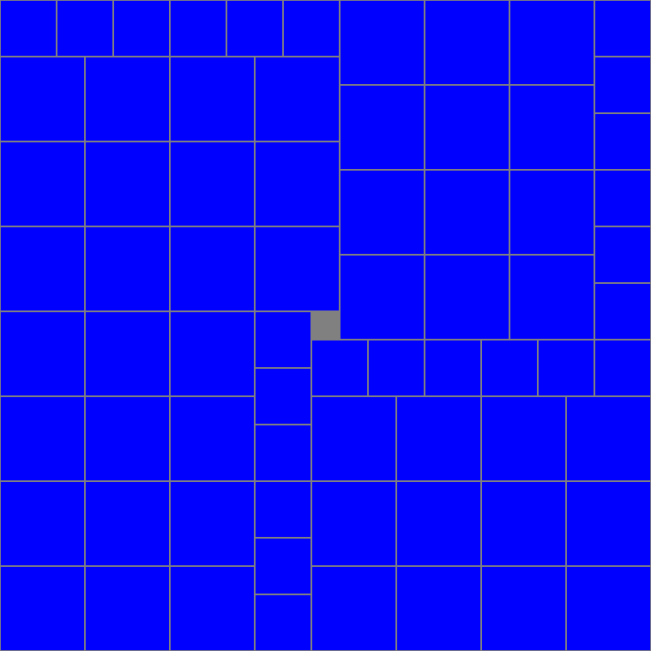

# Calendrier Mathématique Septembre 2020

[Solutions 2020](../README.md) - [Homepage](https://rene-d.github.io/calendrier-math/)

## Mardi 1 Septembre

(2020 + 4) × 5 = 10120 et 1 + 0 + 1 + 2 + 0 = 4

[Programme](01.py) Python de recherche.

```python
#!/usr/bin/env python3

for m in range(0, 101):
    for k in range(1, 10):
        N = k * (2020 + m)

        s = 0
        while N != 0:
            N, r = divmod(N, 10)
            s += r
        if s == m:
            print(m, k * (2020 + m))
```

> réponse: 4

## Mercredi 2 Septembre

Il faut que le nombre soit pair (i.e. se termine par 0 ou 2) et la somme des chiffres multiple de 3.

- les nombres qui contiennet 0 et 2: 102 210 120
- les nombres qui contiennet 0 et pas 2: 150 510
- les nombres qui contiennet 2 et pas 0: 132 312

Confirmation avec [programme](02.py) Python.

```python
#!/usr/bin/env python3

from itertools import permutations

nb = 0
for a, b, c in permutations([0, 1, 2, 3, 5], 3):
    if a == 0:
        continue
    n = a * 100 + b * 10 + c
    if n % 6 == 0:
        print(n)
        nb += 1
print("réponse:", nb)
```

> réponse: 7

## Jeudi 3 Septembre

> réponse: une solution parmi d'autres:

|   |   |   |   |   |   |
|---|---|---|---|---|---|
| 0 | 1 | 2 | 3 | 4 | 5 |
| 1 | 2 | 3 | 4 | 5 | 0 |
| 2 | 3 | 4 | 5 | 0 | 1 |
| 3 | 4 | 5 | 0 | 1 | 2 |
| 4 | 5 | 0 | 1 | 2 | 3 |
| 5 | 0 | 1 | 2 | 3 | 4 |

## Vendredi 4 Septembre

Soient b et h₁ la base et la hauteur du triangle supérieur, B et h₂ pour le triangle inférieur.

En exprimant l'aire des triangles, on peut écrire:

- b × h₁ = 18 × 2 = 36
- B × h₂ = 32 × 2 = 64

Or les triangles sont semblables. D'où:

- b / h₁ = B / h₂
- b / B = h₁ / h₂

En utilisant les formules des aires:

b / B × h₁ / h₂ = 36 / 64

Soit:

(b / B)² = 9 / 16

On fixe arbitrairement une des deux valeurs (b ou B). Compte tenu de la fraction, 3 et 4 semblent tout indiqués.

b = 3 et B = 4

On déduit h₁ et h₂:

h₁ = 12 et h₂ = 16

On peut calculer l'aire du trapèze:

(h₁ + h₂) × (b + B) / 2 = 28 × 7 / 2 = 98

> réponse: 98 cm²

## Lundi 7 Septembre

[Programme](07.py) Python.

```python
#!/usr/bin/env python3

from itertools import permutations

nb = 0
for a, b, c in permutations(range(1, 14), r=3):
    if a < b < c:  # ne tient pas compte de l'ordre
        if (a + b + c) % 3 == 0:  # divisble par 3
            nb += 1
print("réponse:", nb)
```

> réponse: 98

## Mardi 8 Septembre

Factorisons l'expression:

$$
\begin{aligned}
23^5 - 23 &= 23 \times (23^4 - 1) \\
          &= 23 \times (23^2 - 1) \times (23^2 + 1) \\
          &= 23 \times (23 - 1) \times (23 + 1) \times 530 \\
          &= 23 \times 22 \times 24 \times 530 \\
          &= 23 \times 2 \times 11 \times 2 \times 2 \times 2 \times 3 \times 2 \times 5 \times 53 \\
          &= 2^5 \times 3 \times 5 \times 11 \times 23 \times 53
\end{aligned}
$$

Le nombre de diviseurs est $\sigma_0(n)=\prod_{p^e|n}(e_p+1)=6\times2\times2\times2\times2\times2=192$

> réponse: 192

## Mercredi 9 Septembre

a > 0 et b > 0

a³ - b³ = (a - b) (a² + a b + b²) = 485 = 5 × 97

Deux possibilités: a - b = 1 ou a - b = 5. Ca ne peut valoir 97 ou 485 car l'autre facteur serait trop grand.

Si a - b = 1, ou a = b + 1:

(b+1)³ - b³ = 3 b² + 3 b + 1 = 485

Ce n'est pas possible car 484 n'est pas divisible par 3.

Si a - b = 5, ou a = b + 5:

(b + 5)³ - b³ = 15 b² + 75 b + 125 = 485

15 b² + 75 b = 360

b² + 5 b = 24

Cette équation admet une seule solution positive: b = 3. D'où a = 8. Et a³ + b³ = 539.

> réponse: 539

## Jeudi 10 Septembre

Additionnons les 50 nombres impairs entre 1 et 99:

1 + 3 + 5 + … + 99 = 50² = 2500

On voit que ça ne suffit pas. Il faut dépasser les 500 (plus que 500 pour compenser les nombres impairs qu'on ne prendra pas).

Donc au minimum six nombres pairs, car 100 + 98 + 96 + 94 + 92 + 90 = 570 > 500 (avec cinq, on atteint 480 < 500).

> réponse: 6

## Vendredi 11 Septembre

[Programme](11.py) Python.

```python
#!/usr/bin/env python3

nb = 0
for n in range(1000, 10000):
    s = 0
    while n != 0:
        n, r = divmod(n, 10)
        s += r
    if s % 10 == 0:
        nb += 1
print("réponse:", nb)
```

> réponse: 900

## Lundi 14 Septembre


Les triangles ADG et CD'G sont identiques. De même BEF et CE'F. GFE'D' est un carré identique à DEFG.

L'aire de ABC est donc deux fois l'aire du carré DEFG.

> réponse: 40 cm²

## Mardi 15 Septembre

Le prix de la robe sera P × (1 - 30%) × (1 - 20%) = P × 0.56 = P × (1 - 44%)

> réponse: 44%

## Mercredi 16 Septembre


On a:

- ∠ADE = 30°
- DG = a / 2
- EG = AE = r = rayon des cercles

r / (a / 2 - r) = tan 30° = √3 / 3

r = 1 / √3 (a / 2 - r)

√3 r + r = a / 2

r = a / 2 / (1 + √3)

> réponse: a / 2 / (1 + √3)

## Jeudi 17 Septembre

Existe-il n entier tel que:

4 ((n + 1)² - n²) = 2020

2n + 1 = 2020 ÷ 4 = 505

Oui: n = 252

> réponse: 252 et 253

## Vendredi 18 Septembre

Algorithme a 4 voyelles, donc 4 façons de choisir une voyelle pour commencer, 6 façons de choisir une consonne pour finir, 8! façons d'arranger les 8 lettres restantes.

4 × 8! × 6 = 967680

> réponse: 967680

## Lundi 21 Septembre

$$
\begin{aligned}
(x - 4)(x - 9) &= x^2 - (4 + 9) \times  x + 4 \times  9 \\
&= 3 x^2 - 3 \times (4+9) \times  x + 3 \times 4\times 9
\end{aligned}
$$

Il faut donc $3 \times 4\times 9=108=66_{base}$ et $3 \times (4+9)=39=25_{base}$

Soit $2 \times base + 5=39$. Donc $base=(39-5) \div 2=17$.

On vérifie que $6 \times base + 6 = 17 \times 6+6=102+6=108$.

On peut aussi chercher automatiquement à l'aide d'un [programme](21.py).

```python
#!/usr/bin/env python3


def to_base(n: int, base: int) -> str:
    """ Convertit un nombre entier dans son écriture dans la base indiquée qui doit être ≤ 36. """

    if base > 36 or base < 2:
        raise ValueError("to_base() base must be >= 2 and <= 36")

    if n == 0:
        return "0"

    if n < 0:
        n = -n
        sign = "-"
    else:
        sign = ""

    digits = ""
    while n != 0:
        n, r = divmod(n, base)
        digits += "0123456789abcdefghijklmnopqrstuvwxyz"[r]

    return sign + digits[::-1]


for base in range(11, 37):
    if to_base(39, base) == "25" and to_base(3 * 4 * 9, base) == "66":
        print("réponsé:", base)
        break
```

> réponse: 17

## Mardi 22 Septembre

Pour chaque point ABCDEF, il y a ${5 \choose 2} = 10$ moyens de tracer un triangle non dégénéré, sauf ABC qui est dégénéré à cause de l'alignement ABC.

Les triangles sont comptés trois fois, il faut donc diviser par 3.

$6 \times {10\choose 2}=6\times 10=60$ d'où $60\div 3-1=19$

> réponse: 19

## Mercredi 23 Septembre

Tous les nombres de 10 à 19 sont ok, puisque le seul parent est le nombre lui-même.

Pour 2x, il y a deux parents possibles: 11x et 2x. Soit l'équation avec 0 ≤ x ≤ 9 et k entier:

110+x = (20+x)×k → k=5 110-100=4x → pas de solution entière

[Programme](23.c) en C de recherche exhaustive.

La même chose en [Rust](23.rs).

```rust
// solution problème du 23 septembre 2020

// compilation:
//      rustc -O 23.rs

use std::time::Instant;

fn main() {
    let now = Instant::now();
    let mut reponse = 0;

    for a in 1..=9 {
        let n_max = (0..a).fold(0, |n, _| n * 10 + 1);

        let mut parents = 0;
        let mut nb_diviseurs = [0, 0, 0, 0, 0, 0, 0, 0, 0, 0];

        for n in 1..=n_max {
            // vérification ∑chiffres de n = a et chiffres≠O
            let mut somme_chiffres = 0;
            let mut nn = n;
            while nn != 0 {
                let c = nn % 10;
                if c == 0 {
                    somme_chiffres = 0;
                    break;
                }
                somme_chiffres += c;
                nn /= 10;
            }

            if somme_chiffres == a {
                parents += 1;

                // on compte le nombre de fois où <ab> divise <nb>
                // si ce nombre est égal au nombre de parents,
                // le critère de l'énoncé est respecté
                let n_10 = 10 * n; // attention au débordement, int est trop petit
                let a_10 = 10 * a;
                for b in 0..=9 {
                    if (n_10 + b) % (a_10 + b) == 0 {
                        nb_diviseurs[b as usize] += 1;
                    }
                }
            }
        }

        // le nombre de parents de a est nb_parents, celui de ab est 10 fois plus
        print!(
            "a={} n_max={:9} nb_parents={:4} ab=",
            a,
            n_max,
            parents * 10
        );

        // affiche les <ab> qui conviennent
        for b in 0..=9 {
            if nb_diviseurs[b] == parents {
                reponse += 1;
                print!("{}{} ", a, b);
            }
        }
        println!();
    }

    println!("réponse: {}", reponse);
    println!("temps: {} s", (now.elapsed().as_micros() as f64) / 1000000.);
}
```

> réponse: 13 nombres (10 à 19, 30, 45, 90)

## Jeudi 24 Septembre

∑n / 6 = 4

D'où ∑n = 24

(∑n + x) / 7 = 5

> réponse: 11

## Vendredi 25 Septembre

Le losange est constitué de quatre triangles rectangles de côtés a et b tels que:

$$
\begin{aligned}
&a + b = 56 \\
&3 a = 4 b
\end{aligned}
$$

Soit $a = 32$ et $b = 24$.

L'hypoténuse de ces triangles mesure: $\sqrt{(\frac{32}{2})^2+(\frac{24}{2})^2} = 20$

Le périmètre est donc $20 \times 4 = 80$.

> réponse: 80 m

## Lundi 28 Septembre

On voit assez vite que le numérateur de tₙ s'élimine avec le dénominateur de tₙ₋₂.

Donc pour n pair, tₙ = 1 / (n - 1). Et pour n impair ≥ 3, tₙ = 0 (car t₃ = 0).

Pour vérifier, [programme](28.py) Python.

```python
#!/usr/bin/env python3

from fractions import Fraction

n = 2
tn = 1  # valeur de t2
while n < 2020:
    n += 2
    tn = Fraction(n - 3, n - 1) * tn
print(f"n={n:5} tn={tn}")
```

> réponse: 1 / 2019

## Mardi 29 Septembre



[Source](29.tex) du damier réalisé en LaTeX avec TikZ.

> réponse: 1 seul carré 1×1 - cf. damier

## Mercredi 30 Septembre

Soient r₀, -r₀ et r₁ les trois racines de P(x). Le polynome peut donc s'écrire:

P(x) = (x - r₀) × (x + r₀) × (x - r₁)

P(x) = x³ - r₁ x² - r₀² x + r₀² r₁

Faisons l'équivalence avec l'expression développée:

P(x) = x³ + a x² + b x + c

On a donc:

- a = -r₁
- b = -r₀²
- c = r₀² r₁

D'où: ab - c = (-r₁)(-r₀²) - r₀² r₁ = 0

> réponse: 0
