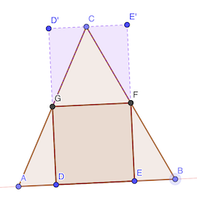
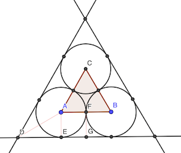

# Calendrier Mathématique Septembre 2020

## Mardi 1 Septembre

(2020 + 4) × 5 = 10120 et 1+0+1+2+0 = 4

[Programme](01.py) Python de recherche.

```python
#!/usr/bin/env python3

for m in range(0, 101):
    for k in range(1, 10):
        N = k * (2020 + m)

        s = 0
        while N != 0:
            N, r = divmod(N, 10)
            s += r
        if s == m:
            print(m, k * (2020 + m))
```

> réponse: 4

## Mercredi 2 Septembre

## Jeudi 3 Septembre

## Vendredi 4 Septembre

Soient b et h1 la base et la hauteur du triangle supérieur, B et h2 pour le triangle inférieur.

En exprimant l'aire des triangles, on peut écrire:

- b × h1 = 18 × 2 = 36
- B × h2 = 32 × 2 = 64

Or les triangles sont semblables. D'où:

- b / h1 = B / h2
- b / B = h1 / h2

En utilisant les formules des aires:

b / B × h1 / h2 = 36 / 64

Soit:

(b / B)² = 9 / 16

On fixe arbitrairement une des deux valeurs (b ou B). Compte tenu de la fraction, 3 et 4 semblent tout indiqués.

b = 3 et B = 4

On déduit h1 et h2:

h1 = 12 et h2 = 16

On peut calculer l'aire du trapèze:

(h1 + h2) × (b + B) / 2 = 28 × 7 / 2 = 98

> réponse: 98 cm²

## Lundi 7 Septembre

## Mardi 8 Septembre

Factorisons l'expression:


Le nombre de diviseurs est 

> réponse: 192

## Mercredi 9 Septembre

a > 0 et b > 0

a³ - b³ = (a - b) (a² + a b + b²) = 485 = 5 × 97

Deux possibilités: a - b = 1 ou a - b = 5. Ca ne peut valoir 97 ou 485 car l'autre facteur serait trop grand.

Si a - b = 1, ou a = b + 1:

(b+1)³ - b³ = 3 b² + 3 b + 1 = 485

Ce n'est pas possible car 484 n'est pas divisible par 3.

Si a - b = 5, ou a = b + 5:

(b+5)³ - b³ = 15 b² + 75 b + 125 = 485

15 b² + 75 b = 360

b² + 5 b = 24

Cette équation admet une seule solution positive: b = 3. D'où a = 8. Et a³ + b³ = 539.

> réponse: 539

## Jeudi 10 Septembre

Additionnons les 50 nombres impairs entre 1 et 99:

1 + 3 + 5 + … + 99 = 50² = 2500

On voit que ça ne suffit pas. Il faut dépasser les 500 (plus que 500 pour compenser les nombres impairs qu'on ne prendra pas).

Donc au minimum six nombres pairs, car 100+98+96+94+92+90 = 570 > 500 (avec cinq, on atteint 480 < 500).

> réponse: 6

## Vendredi 11 Septembre

[Programme](11.py) Python.

```python
#!/usr/bin/env python3

nb = 0
for n in range(1000, 10000):
    s = 0
    while n != 0:
        n, r = divmod(n, 10)
        s += r
    if s % 10 == 0:
        nb += 1
print("réponse:", nb)
```

> réponse: 900

## Lundi 14 Septembre



Les triangles ADG et CD'G sont identiques. De même BEF et CE'F. GFE'D' est un carré identique à DEFG.

L'aire de ABC est donc deux fois l'aire du carré DEFG.

> réponse: 40 cm²

## Mardi 15 Septembre

Le prix de la robe sera P × (1 - 30%) × (1 - 20%) = P × 0.56 = P × (1 - 44%)

> réponse: 44%

## Mercredi 16 Septembre



On a:

- ∠ADE = 30°
- DG = a / 2
- EG = AE = r = rayon des cercles

r / (a / 2 - r) = tan 30° = √3 / 3

r = 1 / √3 (a / 2 - r)

√3 r + r = a / 2

r = a / 2 / (1 + √3)

> réponse: a / 2 / (1 + √3)

## Jeudi 17 Septembre

Existe-il n entier tel que:

4 ((n + 1)² - n²) = 2020

2n + 1 = 2020 ÷ 4 = 505

Oui: n = 252

> réponse: 252 et 253

## Vendredi 18 Septembre

## Lundi 21 Septembre


Il faut donc  et 

Soit . Donc .

On vérifie que .

On peut aussi chercher automatiquement à l'aide d'un [programme](21.py).

```python
#!/usr/bin/env python3


def to_base(n: int, base: int) -> str:
    """ Convertit un nombre entier dans son écriture dans la base indiquée qui doit être ≤ 36. """

    if base > 36 or base < 2:
        raise ValueError("to_base() base must be >= 2 and <= 36")

    if n == 0:
        return "0"

    if n < 0:
        n = -n
        sign = "-"
    else:
        sign = ""

    digits = ""
    while n != 0:
        n, r = divmod(n, base)
        digits += "0123456789abcdefghijklmnopqrstuvwxyz"[r]

    return sign + digits[::-1]


for base in range(11, 37):
    if to_base(39, base) == "25" and to_base(3 * 4 * 9, base) == "66":
        print("réponsé:", base)
        break
```

> réponse: 17

## Mardi 22 Septembre

## Mercredi 23 Septembre

## Jeudi 24 Septembre

∑n / 6 = 4

D'où ∑n = 24

(∑n + x) / 7 = 5

> réponse: 11

## Vendredi 25 Septembre

Le losange est constitué de quatre triangles rectangles de côtés a et b tels que:

- a + b = 56
- 3 a = 4 b

Soit a = 32, b = 24.

L'hypoténuse de ces triangles mesure: 

Le périmètre est donc 20 × 4 = 80.

> réponse: 80 m

## Lundi 28 Septembre

On voit assez vite que le numérateur de tₙ s'élimine avec le dénominateur de tₙ₋₂.

Donc pour n pair, tₙ = 1 / (n - 1). Et pour n impair ≥ 3, tₙ = 0 (car t₃ = 0).

Pour vérifier, [programme](28.py) Python.

```python
#!/usr/bin/env python3

from fractions import Fraction

n = 2
tn = 1  # valeur de t2
while n < 2020:
    n += 2
    tn = Fraction(n - 3, n - 1) * tn
print(f"n={n:5} tn={tn}")
```

> réponse: 1 / 2019

## Mardi 29 Septembre

## Mercredi 30 Septembre

Soient r₀, -r₀ et r₁ les trois racines de P(x).

P(x) = (x - r₀) × (x + r₀) × (x - r₁)

P(x) = x³ - r₁ x² - r₀² x + r₀² r₁

P(x) = x³ + a x² + b x + c

On a donc:

- a = -r₁
- b = -r₀²
- c = r₀² r₁

D'où: ab - c = (-r₀²)(-r₀²) - r₀² r₁ = 0

> réponse: 0
