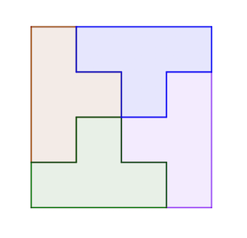
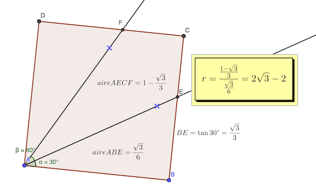
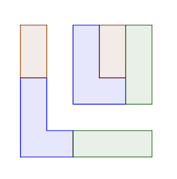
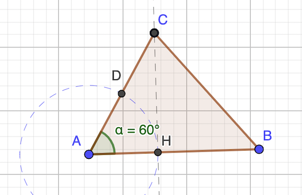

# Calendrier Mathématique Avril 2021

[Solutions 2021](../../README.md)

## Jeudi 1 Avril

On va utiliser le [théorème de l'angle au centre](https://fr.wikipedia.org/wiki/Théorème_de_l%27angle_inscrit_et_de_l%27angle_au_centre).

Ainsi BAX = 1/2 BOX = 45°

somme des angles du triangle BAX : (OXA + 45) + (20 + 45) + 45 = 180

OXA = 25°

> réponse: 25°

## Vendredi 2 Avril

soit x ∈ [0, 1] et y ∈ [0, 1]

min(x+2y) = min(x+√(1-x²))

la fonction a deux minimas: x=0 et x=1, et un maximum en x=√2/2

> réponse: 1

## Lundi 5 Avril

### coin supérieur gauche diagonale

- coin supérieur gauche sur (1,1): 5
- coin supérieur gauche sur (2,2): 4
- …
- coin supérieur gauche sur (5,5): 1
- ⇒ 1 + 2 + 3 + 4 + 5 = 15

### coin supérieur sur matrice triangulaire supérieure

- coin supérieur gauche sur (2,1): 4 … (5,1): 1  ⇒ 1 + 2 + 3 + 4 = 10
- coin supérieur gauche sur (3,2): 3 … (5,2): 1  ⇒ 1 + 2 + 3 = 6
- coin supérieur gauche sur (4,3): 2 … (4,1): 1  ⇒ 1 + 2 = 3
- coin supérieur gauche sur (5,4): 1             ⇒ 1
- ⇒ 10 + 6 + 3 + 1 = 20

### coin supérieur sur matrice triangulaire inférieure

- idem supérieure: 20

total: 15 + 20 + 20 = 55

> réponse: 55

## Mardi 6 Avril

- petite cartouche → 600 pages
- 1 moyenne = 3 × petite cartouche = 1800
- 2 grande = 3 moyenne = 5400

> réponse: 2700

## Mercredi 7 Avril

- angle ABC = 120  (hexagone)
- angle BAC = 30°  (triangle isocèle en A)
- angle ABF = angle CBY = 30%, donc angle BXY = 60°, BXY isocèle équilatéral
- BX = BY car BXY équilatéral
- par conséquent XY = AX = XC = AC / 3
- OAB équilatéral
- (AC) bissectrice, médiatrice, hauteur, médiane ⇒ OB ⊥ AC
- donc X intersection des bissectrices etc. de OAB ⇒ XO = XB = XY = …
- OG = √3/2 XY = OB / 2 = 1 / 2
- d'où: XY = 1 / √3

> réponse: 1 / √3 cm

## Jeudi 8 Avril

On a une chance sur 40 de trouver une carte désignée.

> réponse: 1/40

## Vendredi 9 Avril

Cf. [script](09.py) Python.

```python
#!/usr/bin/env python3

n = 0
for a in range(740, 2022, 5):
    if a % 400 == 0:
        n += 1
    elif a % 100 == 0:
        pass
    elif a % 4 == 0:
        n += 1

print("réponse:", n)
```

> réponse: 56

## Lundi 12 Avril

- 1 + x = y²
- 1 + y = x²

- (1 + x) - (1 + y) = y² - x²
- ⇒ -(y - x) = (y - x)(y + x)

2 possibilités:

- x = y
- x + y = -1

Si x = y:

x² - x - 1 = 0 <br>
⇒ x = y = (1 ± √5) / 2 ⇒ deux solutions

Si x + y = -1:

1 + x = (x + 1)² <br>
⇒  x² + 2x + 1 = x + 1 <br>
⇒  x² + x = 0 <br>
⇒  x (x + 1) = 0 <br>
⇒  x = 0, y = -1 ou x = -1, y = 0 ⇒ deux solutions

> réponse: 4

## Mardi 13 Avril

21 = 3 × 7

Donc les nombres qui conviennent sont les nombres non multiples de 3 et de 7, et non premiers, et pas 1.

Il suffit de compter… le [programme](13.py) Python le fait pour nous.

```python
#!/usr/bin/env python3

from sympy.ntheory.primetest import isprime

n = 0
for i in range(2, 101):
    if not isprime(i) and (i % 3) != 0 and (i % 7) != 0:
        n += 1
print("réponse:", n)
```

> réponse: 33

## Mercredi 14 Avril

> réponse: (voir schéma)



## Jeudi 15 Avril



[Notebook GeoGebra](15.ggb)

> réponse: 2 √3 - 2

## Vendredi 16 Avril

si tous les nombres sont pairs, ça fonctionne et donc réponse paire (puisque impairs = 0).

pour réussir à placer des nombres il faut:

```text
… - impair - pair - impair - impair - pair - impair - …
```

donc multiple de 3

> réponse: paire

## Lundi 19 Avril

1 + 2021³ = 1 + (2020 + 1)³ = 1 + 2020³ + 3 × 2020² + 3 × 2020 + 1 = 2020³ + 12247262 > 2020³ + 2³

(a + 1)³ + (2021 - a)³ = (a³ + 3a² + 3a + 1) + (2021³ - 3 × 2021² × a + 3 × 2021 × a² - a³) = 1 + 2021³ + 3 × ∆

avec ∆ = 2022 a²  - (2021² - 1) × a = 2022 a²  - 2020 × 2022 × a = 2022 a (a - 2020)

Donc tant que  1 ≤ a < 2020, ∆ < 0 et 1 + 2021³ > (a + 1)³ + (2021 - a)³

> réponse: 1 + 2021³

## Mardi 20 Avril

puissances de 2 qui sont ≥ 1+0 et ≤ 9+9: 1 2 4 8 16

pour 1: 1+0 ⇒ 1 possibilité
pour 2: 1+1 2+0 ⇒ 1+1=2 possibilités
pour 4: 1+3 2+2 et 0+4 ⇒ 2+1+1=4 possibilités
pour 8: 1+7 2+6 3+5 4+4 0+8 ⇒ 2+2+2+1+1=8 possibilités
pour 16: 7+9 8+8 ⇒ 2+1=3 possibilités

Ce qui donne 1 + 2 + 4 + 8 + 3 = 18 possibilités

> réponse: 18

Vérification avec Python:

```python
# comptage
print(sum(1 for i in range(10, 100) if (i // 10 + i % 10) in [1, 2, 4, 8, 16]))

# affichage
print(list(i for i in range(10, 100) if (i // 10 + i % 10) in [1, 2, 4, 8, 16]))
```

## Mercredi 21 Avril



> réponse: 2

## Jeudi 22 Avril

0 < a ≤ b ≤ c (†)

NB: les nombres doivent être non nuls pour être ∣urs.

- a ∣ b + c
- b ∣ c + a
- c ∣ a + b ⇒ c ≤ a + b = k × c , k∈𝐍 (‡)

(†) ⇒ a ≤ b et b ≤ c ⇒ a + b ≤ 2c

(‡) ⇒ k = 1 ou k = 2, donc a + b = c ou a + b = 2c

### Si a + b = c

- a ∣ a + b + c   (car ∃k ka=b+c ⇒ (k+1)a=a+b+c)
- b ∣ a + b + c
- c ∣ a + b + c

Puisque a,b,c doivent être premiers entre eux: abc ∣ a + b + c = 2c

D'où ab ≤ 2 et les deux solutions:

- a=1 b=1 c=2
- a=1 b=2 c=3

### Si a + b = 2c_

Comme a ≤ c et b ≤ c, la seule solution est a = b = c

La condition pas de diviseur premier en commun implique le seul triplet possible dans ce cas: a=b=c=1

> réponse: 3 triplets (1,1,1) (1,1,2) (1,2,3)

## Vendredi 23 Avril

Il faut choisir 3 points parmi X pour construire un triangle.

### Violet

C(6,3) = 6! / ((6-3)! 3!) = 20

Il faut en éliminer deux à cause des 3 points alignés

### Orange

C(10,3) = 10! / (7! 3!) = 120

Il faut éliminer les 3 points alignés et l'ensemble des 3 points de la colonne de droite: 5 + C(4,3) = 9

Au total, on peut dessiner 20 - 2 + 120 - 9 = 129

> réponse: 129

## Lundi 26 Avril

### Mise en équation

- bassine = 3 × grand_vase + petit_vase
- bassine = 2 × grand_vase + 4 × petit_vase

### Résolution

On cherche à exprimer grand_vase en fonction de petit_vase.

- 3 × grand_vase + petit_vase = 2 × grand_vase + 4 × petit_vase
- grand_vase  = 3 × petit_vase

On calcule bassine uniquement avec petit_vase.

bassine = 2 × (3 × petit_vase) + 4 × petit_vase = 10 × petit_vase

> réponse: 10

## Mercredi 27 Avril



aire AHC = CH × AH / 2 <br>
aire ABC = CH × AB / 2

r = AH / AB (calcul) <br>
r = AC / 2AB (énoncé)

d'où: AH = AC / 2

ce qui signifie que le triangle AHC est rectangle et cos 𝜶 = AH / AC = 1 / 2, on conclut que 𝜶  = 60°

> réponse: 60°

## Mercredi 28 Avril

2021 = 43 × 47

A moins de travailler en base 48, on ne peut trouver de chiffres décimaux de 1 à 9 qui décomposent 2021.

> réponse: non

## Jeudi 29 Avril

a × (b + c) - b × (a + c) = a × c - b × c = c × (a - b)

Les plus grands facteurs possibles sont 10 et 9, mais pas en même temps. 10 et 9-1=8 ou 9 et 10-1=9. Le reste donnera des nombres inférieurs.

La valeur max est atteinte pour a = 10 c = 9

```python
max(a*(b+c)-b*(a+c) for a in range(1,11) for b in range(1,11) for c in range(1,11) if a!=b and b!=c and c!=a)
```

> réponse: 81

## Vendredi 30 Avril

Le polynome se factorise de la façon suivante :

```text
n⁵ - 5n³ + 4 n
 = n ⋅ (n⁴ - 5n² + 4)
 = n ⋅ (n² - 4) ⋅ (n² - 1)
 = n ⋅ (n - 2) ⋅ (n + 2) ⋅ (n - 1) ⋅ (n + 1)
 = (n - 2) ⋅ (n - 1) ⋅ n ⋅ (n + 1) ⋅ (n + 2)

120 = 2³ × 3 × 5
    = 1 × 2 × 3 × 4 × 5
```

Le polynome est le produit de 5 nombres consécutifs, 120 = 5! est le produit de 5 nombres consécutifs. Donc quelquesoit n:

- n sera divisible par 2 ou 3 ou 4 ou 5
- n+1 sera divisible par 3 ou 4 ou 5 ou 2
- etc.

Si -2 ≤ n ≤ 2, alors le polynome est nul, il est aussi divisible par 120.

> réponse: ∀ n ∈ 𝐙
