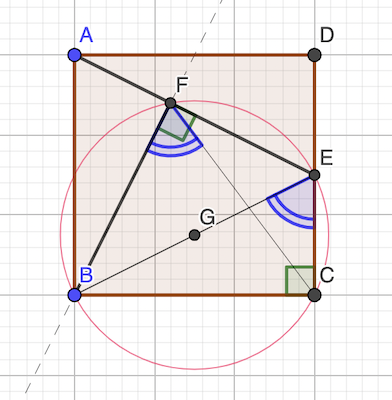
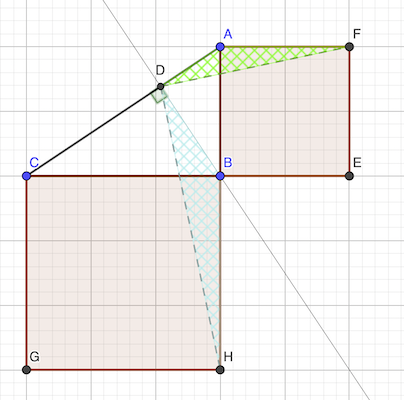

# Calendrier Mathématique Mai 2021

[Solutions 2021](../../README.md)

## Lundi 3 Mai

Le triangle bleu ABP a la même aire que le triangle équilatéral ABO: même base AB, même hauteur h

Ainsi l'aire de la région bleue est la même l'aire du secteur OAB du disque, soit 1/6e du disque.

> réponse: π r² / 6

## Mardi 4 Mai

(x + 1) + (x + 2) / 2 + ... + (x + 2021) / 2021 = 2021

x × (1 + 1/2 + 1/3 + ... + 1/2021) + 2021 × 1 = 2021

x × 𝑨 = 0

La seule solution est x = 0

> réponse: 0

## Mercredi 5 Mai

1. orange > rouge
2. bleue > jaune
3. bleue et jaune non mitoyennes

Il y a trois possibilités pour les maisons bleues et jaunes:

1. BxJx
2. BxxJ
3. xBxJ

Et une fois celles-ci posées, les maisons orange et rouge ont leur place.

> réponse: 3

## Jeudi 6 Mai

21, 91, 161, ..., 1911, 1981, 2051

1981 = 21 + 70 * 28

Vérification Python:

```python
sum(1 for i in range(1,2022) if i % 10 == 1 and i % 7 == 0)
```

> réponse: 29

## Vendredi 7 Mai

Soit a l'arête du cube.

- volume: a³ = 64 cm³ = 2⁶
- arête: a = 2² cm
- aire côté: a² = 2⁴ = 16 cm²
- aire cube: 16 × 6 = 96 cm²

> réponse: 96 cm²

## Lundi 10 Mai

Soit a = ∛(2 + √5) + ∛(2 - √5)

a³ = (2 + √5) + 3 × ∛(2 + √5)² × ∛(2 - √5) + 3 × ∛(2 + √5) × ∛(2 - √5)² + (2 - √5)

a³ = (2 + √5) + 3 × ∛(2 + √5) × ∛(2² - 5) + 3 × ∛(2 - √5) × ∛(2² - 5) + (2 - √5)

a³ = 4 - 3 × (∛(2 + √5) + ∛(2 - √5))

a³ = 4 - 3 × a

a³ + 3a - 4 = 0

(a - 1)(a² + a + 4) = 0

Une seule racine: a = 1

> réponse: 1

## Mardi 11 Mai

sommets violets (10 en tout):

- 4+1 de 2x2
- 4 de 4x2
- 1 de 4x4

sommets bleus (6 en tout):

- 4 de 2x2
- 2 de 4x2

> réponse: 16

## Mercredi 12 Mai

Si (3n + 4) / (2n - 1) est entier, alors (3n + 4) / (2n - 1) - 2 aussi.

(3n + 4) / (2n - 1) - 2 = (6 - n) / (2n - 1)

Il faut que numérateur = 0 ou numérateur >= dénominateur: 6 - n >= 2n - 1 ⇒ 7 >= 3n

Donc trois valeurs pourraient convenir: 1, 2, 6

Si n = 1, (3 + 4) / (2 - 1) = 7 → ok

Si n = 2, (6 + 4) / (4 - 1) = 10 / 3 → ko

Si n = 6, (18 + 4) / (12 - 1) = 22 / 11 → ok

Donc 2 valeurs conviennent: n = 1 et n = 6

> réponse: 2 valeurs

## Jeudi 13 Mai



∠BFE = ∠BCE = 90° (par construction)

BCEF est un [quadrilatère cyclique](https://fr.wikipedia.org/wiki/Quadrilatère_inscriptible): il existe un point G centre du cercle inscrit

[théorème des angles aux centres](https://fr.wikipedia.org/wiki/Théorème_de_l%27angle_inscrit_et_de_l%27angle_au_centre): deux angles qui interceptent le même arc sont égaux.

D'où: ∠BEC = ∠BFC

- angle ∠FBC = 90° - ∠FBA = ∠BAF car BAF triangle rectangle
- = ∠AED car AB et DE sont //
- = ∠BEC car E milieu de DC

D'où: ∠FBC = ∠BEC

En définitive, on a ∠BEC = ∠FBC = ∠BFC

le triangle BCF est donc isocèle en C et BC = FC

> réponse: 3 cm

## Vendredi 14 Mai

1/2+1/5+1/10 = 7/10+1/10 = 8/10 = 4/5

10 × (4/5)⁻¹ = 10 × 5 / 4 = 25 / 2

> réponse: 25 / 2

## Lundi 17 Mai

Il faut faire 16 17 ou 18

Soit (selon le premier dé):

- 6-6-6 6-6-5 6-5-5 6-5-6 6-6-4 6-4-6
- 5-6-6 5-5-6 5-6-5
- 4-6-6

Soit 10 jets possibles.

Vérification en Python:

```python
sum(1 for a in range(1,7) for b in range(1,7) for c in range(1,7) if a+b+c>15)
```

Il y a 6³ = 216 jets possibles. La probabilité de faire plus de quinze est 10 / 216 = 5 / 108

> réponse: 5 / 108

## Mardi 18 Mai

- 23¹ se termine par 3
- 23² se termine par 9
- 23³ se termine par 7
- 23⁴ se termine par 1
- et ça recommence

3 + 9 + 7 + 1 = 20 donc la somme se termine par 0 toutes les quatre puissances.

Il y a 2021 termes, soit 505 × 4 + 1. La somme va se terminer par le chiffre de 23²⁰²¹, soit 3

```python
sum(23 ** i for i in range(1, 2022)) % 10
```

> réponse: 3

## Mercredi 19 Mai

aire trapèze : (L + l) × h / 2

aire ABFE:  h × (3 + 1) / 2 = 2 h

aire CDEF:  (3 - h) × (3 + 1) / 2 = 2 × (3 - h)

aire bleue:  2 h + 6 - 2 h = 6 cm²

> réponse: 6 cm²

## Jeudi 20 Mai

Chaque jour Kikikou mange 1/3 + 1/4 = 7/12 de boîte par jour, soit 6 / (7/12) = 72 / 7 de cagette

Le chat a à manger pendant un peu plus de 10 jours, il finira le 11ème jour.

> réponse: jeudi de la semaine suivante

## Vendredi 21 Mai

```text
X-X-X
-----
X-X-X
-----
X-X-X
```

> réponse: 9

## Lundi 24 Mai

On ne peut pas atteindre les nombres 1 2 3 4 6 8 9 11 13 16 18 23:

- pour atteindre 18 il faut 0 1 ou 2 pièces de 7, aucun ne convient: on ne peut pas compléter avec un multiple de 5.
- pour atteindre 23 il faut 0 à 3 pièces de 7, aucun ne convient: on ne peut pas compléter avec un multiple de 5.

On peut faire 5 7 10 12 14 15 17 19 20 21 22 24 ...

Si on peut faire 24 à 30, on pourra tout faire.

- 24 = 2 × 7 + 2 × 5
- 25 = 5 × 5
- 26 = 3 × 7 + 5
- 27 = 7 + 4 × 5
- 28 = 4 × 7
- 29 = 24 + 5
- 30 = 6 × 5 bingo

Pour faire un nombre supérieur ou égal à 31, il faut retirer 5 ou 7 jusqu'à tomber entre 24 et 30, qu'on peut obtenir.

> réponse: 23

## Mardi 25 Mai



Les triangles ADB BCD et ABC sont semblables (mêmes angles). Donc:

DA / AB = DB / BC = AB / AC

D'où: DA / AF = DB / BH. En ajoutant que les angles DBH et DAF sont égaux, on peut affirmer que les triangles DBH et DAF sont semblables.

Par conséquent, ADF = BDH, et comme ADB = 90°, on a FDH = 90°

> réponse: 90°

## Mercredi 26 Mai

Edouard effectue 40 km. Pour les faire en 24 min, il doit rouler à:

40 / 24 × 60 = 100 km/h

> réponse: 100 km/h

## Jeudi 27 Mai

Il est possible que les 4 conjoints 1 arrivent en premier. La cinquième personne formera forcément un couple.

> réponse: 5

## Vendredi 28 Mai

810 = 2 × 5 × 3 × 3 × 3 × 3

pour que M soit un cube et soit divisible par M, il faut qu'il ait en facteur (2 × 5 × 3 × 3)³. Ainsi

M = (2 × 5 × 3 × 3)³ / 810 = 900

> réponse: 900

## Lundi 31 Mai


AC = √(3² + 4²) = 5

aire ABC = 3 × 4 / 2 = 6 cm²

[Formule de Héron](https://fr.wikipedia.org/wiki/Formule_de_Héron): aire ACD : √(p(p-a)(p-b)(p-c)) avec p = (a+b+c)/2

p = (5 + 5 + 6) / 2 = 8

aire ACD = √(8 (8 - 5) (8 - 5) (8 - 3)) = √(8 × 3 × 3 × 2) = 3 × 4 = 12 cm²

> réponse: 18 cm²
