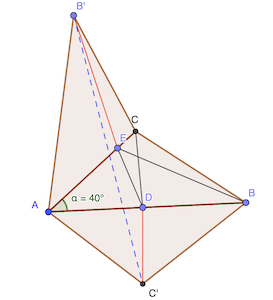
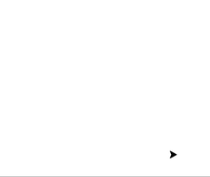

# Calendrier Mathématique Septembre 2021

[Solutions 2021](../README.md) - [Homepage](https://rene-d.github.io/calendrier-math/)

## Mercredi 1 Septembre

Le critère de divisibilité par 3 est que la somme des chiffres soit multiple de 3.

> réponse: 1 4 7

## Jeudi 2 Septembre

Cela revient à compter le nombre de rectangles ci-dessous:

```text
X
XX
XXX
XXXX
XXXXX
```

Il y a 15 rectangles. Chaque rectangle est le coin inférieur gauche d'un autre rectangle.

Sur ligne du bas, de gauche à droite: on peut faire:

- 5+4+3+2+1 = 15 rectangles (5 de hauteur 1, 4 de hauteur 2, 3 de hauteur 3, etc.)
- 4+3+2+1 = 10 (4x1, 3 de h2, 2 h3, 1 de h4)
- 3+2+1 = 6
- 2+1 = 3
- 1 = 1

Soit 35 pour la dernière ligne.

Pour l'avant-dernière ligne:

- 4+3+2+1 = 10
- 3+2+1
- 2+1
- 1

Soit 20.

De même, 10 en partant la ligne du milieu, puis 4, puis 1.

Au total: 35+20+10+4+1 = 70

Nota: la formule générale est n(n+1)(n+2)(n+3)/24 - cf. [A000332](https://oeis.org/A000332).

> réponse: 70

## Vendredi 3 Septembre

x⁴ - 51x² + 50 = (x² - 1)(x² - 50)

Donc pour x² strictement compris entre 1 et 50, le polynome sera strictement négatif. Dans 2 ≤ ∣x∣ ≤ 7

> réponse: -7 à -2 et 2 à 7

## Lundi 6 Septembre

La quadrilatère est le carré inscrit dans le cercle.

> réponse: 2 cm²

## Mardi 7 Septembre

La condition peut s'écrire: 10 a + b = a + b + c ⇒ 9 a = c

La seule possibilité est a = 1 et c = 9

> réponse: c = 9

## Mercredi 8 Septembre

Les chiffres utilisables sont 1 et 2.

Voici les possibilités: 20000 10001 10010 10100 11000

> réponse: 5

## Jeudi 9 Septembre

ADC et ABC sont des triangles rectangles. On a donc:

AC² = AD² + AC² = 10 + 11 = 21

AB² + BC² = AC² = 21 ⇒ AB = √(21 - 12) = 3

> réponse: 3 cm

## Vendredi 10 Septembre

Le coefficient $r$ entre deux termes vaut:

$$
r = \frac{\sqrt[3]{3}}{\sqrt{3}} = \frac{3^{\frac{1}{3}}}{3^{\frac{1}{2}}} = {3}^{\frac{1}{3}-\frac{1}{2}} = {3}^{-\frac{1}{6}}
$$

Le terme suivant est donc:

$$
\sqrt[6]{3}\times{3}^{-\frac{1}{6}} = {3}^{\frac{1}{6}-\frac{1}{6}} = 3^0 = 1
$$

> réponse: 1

## Lundi 13 Septembre

Il s'agit du plus petit nombre premier qui suit 23, à savoir 29.

> réponse: 29

## Mardi 14 Septembre

En dessous de la diagonale:

- trois 1x1
- deux 2x2
- un 3x3

Idem au dessus de la diagonale.

> réponse: 12

## Mercredi 15 Septembre



Soit C' le symétrique de C par rapport à AB et B' le symétrique de B par rapport à AC.

On a donc EB = EB' et DC = DC'. Donc BE+ED+DC = B'E+ED+DC'.

La plus court chemin de B' à C' étant la ligne droite, il faut calculer cette distance qui sera la longueur minimale recherchée.

Par construction des points B' et C', l'angle ∠C'AB' est le triple de ∠BAC, soit 120°.

La [loi des cosinus](https://fr.wikipedia.org/wiki/Loi_des_cosinus) permet de calculer B'C':

$$
\begin{aligned}
(B'C')^2&=(AC')^2+(AB')^2-2(AC')(AB')cos(120^{\circ}) \\
&=6^2+10^2-2\times 10\times 6\times \left(-\dfrac{1}{2}\right) \\
&=136+60=196 \\
&={14}^2
\end{aligned}
$$

> réponse: 14 cm

## Jeudi 16 Septembre

Trois équations à trois inconnues:

Soit sg la somme des notes des garçons, sf celles des filles, ng le nombre de garçons.

- (sf + sg) / 40 = 66
- sg / ng = 60
- sf / (40 - ng) = 70

- sf = 2640 - sg
- ng = sg / 60
- sf = 70 × (40 - sg / 60)

2640 - sg = 70 × (40 - sg / 60) ⇒ sg = 960

Le nombre de garçons est: 960 / 60 = 16

> réponse: 16

## Vendredi 17 Septembre

1225 = 5² × 7²

Les nombres qui conviennent sont les permutations différentes de 5577.

5577 5757 5775 7557 7575 7755

> réponse: 6

## Lundi 20 Septembre

Soit ($a_i$) la série des 1000 nombres. $(a_i)=0$ est une solution triviale. Et dès qu'il y a un nombre égal à 0, son voisin est aussi égal à 0, etc. Donc tous les nombres sont nuls ou aucun ne l'est.

```text
N B N B N B
    n*0*n
  b+0+b
```

- Si un blanc = 0, un noir doit être = 0 pour n × n = 0.
- Si un noir = 0, alors le blanc = 0 parce que = 0 × l'autre voisin

Supposons donc ici que $a_i \ne 0$. Dès la deuxième égalité, on va voir que $a_1\ne1$ (sinon $a_0$ serait forcément égal à 0 et tous les nombres seraient aussi égaux à 0 comme vu ci-avant, ce qui provoque une contradiction).

$$
\begin{aligned}
a_0+a_2=a_1 \implies &a_2=a_1 - a_0 \\
a_1\times a_3=a_2 \implies &a_3=(a_1 - a_0) / a_1=1-a_0/a_1 \\
a_2+a_4=a_3 \implies &a_4=(a_1 - a_0) / a_1 - (a_1 - a_0) \\
a_3\times a_5=a_4 \implies &a_5=\frac{(a_1 - a_0) / a_1 - (a_1 - a_0)} {(a_1 - a_0) / a_1} = 1 - a_1 \\
a_4+a_6=a_5 \implies &a_6=(1 - a_1) - \left[ (a_1 - a_0) / a_1 - (a_1 - a_0) \right] = a_0 (1 - a_1)/a_1 \\
a_5\times a_7=a_6 \implies &a_7=\frac{a_0(1 - a_1)/a_1}{1 - a_1} = a_0 / a_1 \\
a_6+a_8=a_7 \implies &a_8= (a_0 / a_1) - \left[a_0 (1 - a_1)/a_1\right] = a_0 \\
a_7\times a_9=a_8 \implies &a_9=\frac{a_0}{a_0 / a_1} = a_1
\end{aligned}
$$

On constate donc que $a_{0}=a_{8}$ et $a_{1}=a_{9}$. Par conséquent il y a un cycle de longueur 8 et  $a_{i}=a_{i+8}$. Faisons la somme des $a_0$ à $a_7$ :

$$
\begin{aligned}
S&=a_0
+a_1
+(a_1-a_0)
+(1-a_0/a_1)
+\left[(a_1-a_0)/a_1-(a_1-a_0)\right]
+(1-a_1)
+(a_0 (1-a_1)/a_1)
+(a_0/a_1) \\
&=3
\end{aligned}
$$

Ainsi, tous les huit nombres, la somme est 3. Comme 1000 est un multiple de 8 et 1000 / 8 = 125, la somme totale est 3 × 125 = 375.

(🙏 Merci à [WolframAlpha](https://www.wolframalpha.com) pour les calculs symboliques et à [Visual Studio Code](https://code.visualstudio.com) et son ⌘2 afin d'écrire l'expression en [$\LaTeX$](https://www.latex-project.org)).

> réponse: 0 ou 375

## Mardi 21 Septembre

La hauteur issue de D de ADB vaut h = 24 / AB × 2

La hauteur issue de C de ACB vaut h = 16 / AB × 2

Comme M est le milieu de DC, la hauteur issue de M de AMB vaut la moyenne des deux hauteurs précédentes, à avoir: 20 / AB × 2

L'aire de AMB est donc:  20 / AB × 2 × AB / 2 = 20 cm²

> réponse: 20 cm²

## Mercredi 22 Septembre

ab = c²

a = 2b - c

D'où: (2b - c) b = c²

2b² - cb - c² = 0 ⇔ (b - c) (2b + c) = 0

Comme a < b < c, b = c n'est pas possible et c = -2b.

En remplaçant c par -2b: a = 4b

Ce qui entraine nécessairement a < b < 0 (si 0 < a < b, a=4b n'est pas possible) et c > 0.

La solution qui minimise c est donc: a = -4 b = -1 c = 2

> réponse: 2

## Jeudi 23 Septembre

n = 11111 en base b vaut b⁴ + b³ + b² + b¹ + b⁰ = (b⁵ - 1) / (b - 1)

- Pour b = 2, n = 31 ❌
- Pour b = 3, n = 121 = 11² ✅

> réponse: base 3

## Vendredi 24 Septembre



Les choix 1 et 3 ne sont pas possibles parce qu'il faut un nombre impair d'arêtes au point B (passages puis arrivée).

[programme](24.py) Python qui trace le chemin.

```python
#!/usr/bin/env python3

import turtle


turtle.speed(1)
turtle.penup()

turtle.goto(115, 0)
turtle.write("A", font=("Menlo", 20, "normal"))

turtle.goto(100, 0)
turtle.pendown()
turtle.goto(-100, 00)
turtle.goto(-80, 150)
turtle.goto(120, 120)
turtle.goto(100, 0)
turtle.goto(-80, 150)
turtle.goto(100, 200)
turtle.goto(120, 120)
turtle.penup()

turtle.goto(135, 120)
turtle.write("B", font=("Menlo", 20, "normal"))


turtle.mainloop()

# conversion de la capture pour la création du GIF animé:
# ffmpeg -i capture.mov -vf "fps=10,scale=-1:200:flags=lanczos,split[s0][s1];[s0]palettegen[p];[s1][p]paletteuse" -loop 0 24.gif
```

> réponse: 2

## Lundi 27 Septembre

Le triangle ABD est isocèle en B puisque l'angle ∠ADB fait 180 - 80 - 50 = 50° = angle ∠DAB.

Donc AD = BD = CD. Par conséquence, BCD est aussi isocèle en D et x = 180 - 30 × 2 = 120°

> réponse: 120°

## Mardi 28 Septembre

S = 2021 a + 2020 × 2021 / 2 = 2021 × (a + 1010) = 43 × 47 × (a + 1010).

Il faut que a + 1010 = 2021, soit a = 1011. En-deça, il n'y aura pas 43 et 47 en facteur de a + 1010.

> réponse: a = 1011

## Mercredi 29 Septembre

1 / 9² = 0,0̅1̅2̅3̅4̅5̅6̅7̅9̅

> réponse: 37

## Jeudi 30 Septembre

Taille à atteindre: 8 pièces par pile. Il y a au moins 1 + 2 mouvements, puisque le mouvement de départ ne peut laisser 8 pièces et il faut au moins 2 mouvements pour équilibrer 3 colonnes (1 mouvement peut équilibrer 0, 1 ou 2 colonnes au max).

| étape             | pile ① | pile ② | pile ③ |
 ------------------ |---------|---------|---------|
| état initial      |      11 |       7 |       6 |
| 7 de ① vers ②    |       4 |      14 |       6 |
| 6 de ② vers ③    |       4 |       8 |      12 |
| 4 de ③ vers ①    |       8 |       8 |       8 |

> réponse: 3 mouvements
