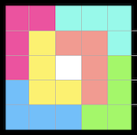
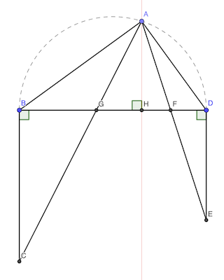
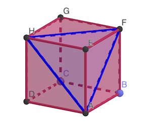

# Calendrier Mathématique Août 2022

[Solutions 2022](../README.md) - [Homepage](https://rene-d.github.io/calendrier-math/)

## Lundi 1 Août

Dans 60 jours consécutifs, comme $60 = 8 \times 7 + 4$ il y a 8 semaines et 4 jours. Donc 8 mardis dans une semaine complète et 1 mardi supplémentaire éventuellement.

> réponse: 9

## Mardi 2 Août

Soit O le centre du cercle circonscrit par lequel passe A, B, C, D et E. Avec le [théorème de l'angle au centre](https://fr.wikipedia.org/wiki/Théorème_de_l%27angle_inscrit_et_de_l%27angle_au_centre), on a :

∠ACE = ½ ∠AOE = 360 / 5 = 36°

La somme des angles est donc 36 × 5 = 180°.

> réponse: 180°

## Mercredi 3 Août

- Alice joue, il reste 10 possibilités pour Bernardo.
- Bernardo joue, il reste 9 possibilités pOur Alice.
- Alice joue, il reste 8 possibilités pour Bernardo.
- Bernardo joue, il reste 7 possibilités pour Alice.
- Alice joue, il reste 6 possibilités pour Bernardo.
- Bernardo joue, il reste 5 possibilités pour Alice.
- Alice joue, il reste 4 possibilités pour Bernardo.
- Bernardo joue, il reste 3 possibilités pour Alice.
- Alice joue, il reste 2 possibilités pour Bernardo.
- Bernardo joue, il reste 1 possibilité pour Alice.
- Alice joue, il reste 0 possibilité pour Bernardo.

> réponse: Alice va gagner

## Jeudi 4 Août

Il faut que ces nombres soient multiples de 7, 11, 13, 17, etc.

Parmi les produits d'au moins deux de ces nombres, il n'y a guère que 7×7=49, 7×11=77 et 7×13=91 qui sont inférieurs à 100.

> réponse: trois, 49, 77 et 91

## Vendredi 5 Août

Hannah car ce sont tous des [palindromes](https://fr.wikipedia.org/wiki/Palindrome).

> réponse: Hannah

## Lundi 8 Août

Le damier ayant 25 cases, on peut placer au maximum 6×4=24 pièces.



> réponse: 6

## Mardi 9 Août

Il y a 12 solutions uniques à une rotation ou symétrie près, 64 solutions en tout.

```text
··●● | ·●·● | ·●●· | ·●●· | ·●●· | ·●●· | ●··● | ●··● | ●·●· | ●·●· | ●·●· | ●●··
·●·● | ●··● | ●·●· | ●·●· | ●●·· | ●●●● | ··●● | ·●·● | ·●●· | ·●●· | ●●●● | ·●·●
●··● | ··●● | ··●● | ●●●● | ·●·● | ●●·· | ·●·● | ··●● | ··●● | ●●●● | ·●●· | ·●●·
●●●● | ●●●● | ●●●● | ··●● | ●●●● | ·●·● | ●●●● | ●●●● | ●●●● | ··●● | ··●● | ●●●●
````

Ce [programme](./09.py) Python permet de lister toutes les solutions.

> réponse: plusieurs solutions

## Mercredi 10 Août

- Femme de Georges: 1/5
- Frère de Georges: (1-1/5) × (1/6) = 2/15
- Enfant: (1- 1/5 - 2/15) / 12 = 1/18

> réponse: 1/18

## Jeudi 11 Août



Soit AH la hauteur du triangle GAF.

On a:

- ∠BAC = ∠BCA car ABC est isocèle, et ∠BAC = ∠BAG
- ∠BCA = ∠CAH car BC et AH sont parallèles

De même: ∠HAF = ∠FDA

Donc ∠BAG + ∠GAH + ∠HAF + ∠FAD = 2 ∠FAH + 2 ∠HAF = 2 ∠GAF = 90° et ∠GAF = 45°

> réponse: 45°

## Vendredi 12 Août

Pour que 10 divise (2𝑥+1)(5𝑥+2) avec 𝑥 entier de 1 à 100, il faut que:

- 10 divise 2𝑥+1 : aucune valeur possible
- 10 divisie 5𝑥+2 : aucune valeur possible
- 5 divise 2𝑥+1 et 2 divise 5𝑥+2
- 2 divise 2𝑥+1 et 5 divise 5𝑥+2 : aucune valeur possible

5 divise 2𝑥+1 si 𝑥 est de la forme 10𝑘+2, donc 2, 12, 22, etc. Il y a 10 valeurs possibles.

5𝑥+2 sera alors toujours pair, donc divisible par 2.

> réponse: 10 valeurs

## Lundi 15 Août

Les triangles ne peuvent pas être sur une face, sinon ils auraient au moins un angle à 90° ou 45°.

Le côté du triangle ne peut pas être non plus sur des sommets opposés, la longueur du côté serait trop grande.



Par aommet, il y a trois triangles possibles. Mais chaque triangle appartient à trois sommets, donc entre dans le compte de trois sommets. Il y a donc autant de triangles que de sommets.

> réponse: 8

## Mardi 16 Août

Les multiples de 3 sont $3k$, mais ne doivent pas être pairs, donc $k$ doit être impair. On en déduit que les multiples de 3 qui ne sont pas multiples de 2 sont de la forme $3(2k+1)=6k+3$

$$
1 \le 6k+3 \le 300
$$

$$
-2 \div 6 \le 6k \le \lfloor 297 \div 6 \rfloor=49
$$

La moyenne de $6k+3$ pour $k$ entre 0 et 49 vaut:

$$
\frac 1 {50} \sum_{k=0}^{49} {\left(6k+3\right)}
=\frac 1 {50} \left( 6 \times \sum_{k=0}^{49}{k} + 3 \times 50\right)
=\frac 1 {50} \left( 6 \times \frac {49 \times 50} 2 +150\right)
= \frac {7500} {50}=150
$$

Vérification en Python:

```python
E = [k for k in range(1, 301) if k % 3 == 0 and k % 2 != 0]
print(sum(E) / len(E))
```

> réponse: 150

## Mercredi 17 Août

Il y 5!=120 permutations possibles des chiffres impairs, donc 120 nombres qui répondent aux critères.

Il y a en 24 qui commmencent par un chiffre donné, donc de 97 à 120 les nombres commencent par 9.

Il y a ensuite 6 nombres différents à trois chiffres, donc le deuxième chiffre doit être 1.

On peut finir en énumérant les nombres:

- 97: 91357
- 98: 91375
- 99: 91537
- 100: 91573

Vérification en Python:

```python
from itertools import permutations
print([p for i, p in enumerate(permutations([1, 3, 5, 7, 9]), 1) if i == 100])
```

> réponse: 91573

## Jeudi 18 Août

$n(n^2-1)(n^2-4)=n(n-1)(n+1(n-2)(n+2)=(n-2)(n-1)n(n+1)(n+2)$

C'est donc égal au produit de 5 nombres consécutifs. Parmi ces nombres, il y a nécessairement un multiple de 5 et 2 ou 3 multiples de 2. Donc au minimum un multiple de 5×2×2, c'est-à-dire 20.

> réponse: 0

## Vendredi 19 Août

10 × 30 × (10 / 8) = 375

> réponse: 375 litres

## Lundi 22 Août

Il faut que la somme des chiffres soit multiple de 9 pour que le nombre soit divisible par 9.

La somme des chiffres vaut 52.

Le multiple de 9 inférieur est 45. Il faut donc enlever un des quatre 7.

```python
n = 7_231_123_772_137_321
sum(int(c) for c in str(n))
int(str(n).replace("7", "", 1)) % 9
```

> réponse: quatre possibilités

## Mardi 23 Août

- Dimensions rectangle: 7 × 4 = 28
- Aire triangle blanc supérieur: 1 × 7 ÷ 2
- Aire triangle blanc inférieur: (4 - 1) × (7 - 3) ÷ 2 = 6
- Aire colorée: 28 - 7 ÷ 2 - 6 = 37 ÷ 2

> réponse: 37/2 cm² = 18.5 cm²

## Mercredi 24 Août

Durée du trajet : (17h30 - 13h - 2h30) / 2 = 1h

Nota: l'horloge retarde d'une heure.

> réponse: 18h30

## Jeudi 25 Août

On peut former 3! = 6 mots avec BCD. Les voyelles sont forcément intercalées entre les consonnes. Donc deux possibilités : `_A_E_` ou `_E_A_`

> réponse: 12

## Vendredi 26 Août

Le point est forcément sur la médiatrice d'un côté (distances équivalentes de 3 cm), donc également à équidistance des deux autres sommets.

> réponse: 7 cm

## Lundi 29 Août

> réponse: n = 5

## Mardi 30 Août

Ils ont 32 ans de différence. Quand le père aura 64 ans, le fils aura 32.

> réponse: 29 ans

## Mercredi 31 Août

Les carrés canditats sont 4, 9, 16 et 25 ≤ 15+16.

15 est donc entouré de 1 et 10.

Nota: l'unique solution est [16, 9, 7, 2, 14, 11, 5, 4, 12, 13, 3, 6, 10, 15, 1, 8].

> réponse: 1 et 10
