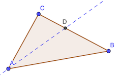

# Calendrier Mathématique Avril 2022

[Solutions 2022](../README.md) - [Homepage](https://rene-d.github.io/calendrier-math/)

## Vendredi 1 Avril

[Formule de Héron](https://fr.wikipedia.org/wiki/Formule_de_Héron) aire triangle avec ses côtés:

- p = (a + b + c) / 2
- A = √(p × (p - a) × (p - b) × (p - c))

Soit x la longueur du côté inconnue, x > 0.

On a donc:

- 16 * A² = 2p (2p - 2a) (2p - 2b) (2p - 2c)
- a = 13, b = 10, c = x
- p = (x + 23) / 2
- 16 * 60² = (x + 23) (x + 23 - 26) (x + 23 - 20) (x + 23 - 2x)
- 57600 = (x + 23) (x - 3) (x + 3) (-x + 23)
- 57600 = (23² - x²) (x² - 3²)

On obtient donc l'équation du second degré en X = x² :

X² - 538 X + 62361 = 0

X = (+538 ± √(538² - 4*62361)) / 2 = (538 ± 200) / 2 = 169 ou 369

Donc x = √X = 13 ou 3 √41


### Nota

Complément de solution par rapport à celle du livret: le triangle rectangle constitué avec la hauteur peut se construire à l' « extérieur » de la base, ce qui donne un autre résultat (3√41 en l'occurrence).


> réponse: 13 cm ou 3 √41 cm

## Lundi 4 Avril

Après avoir réécrit l'expression sous forme de produit de fractions, on simplifie deux à deux les termes identiques:


> réponse: 71/80

## Mardi 5 Avril

Un nombre se termine par 0 si et seulement s'il est multiple de 2 et de 5, respectivement par n 0, 2ⁿ et 5ⁿ.

Donc si a = 2¹⁰ × 100000 et b = 5¹⁰ × 100000, alors a × b = 10²⁰.

> réponse: oui

## Mercredi 6 Avril

L'aire recherchée vaut h × 2 / 2 + h × 2 / 2 = 2 h  (avec h = IJ = BJ)


Le point I est à l'intersection des droites d'équation:

- y = -2x + 2  (droite AG)
- y = -x/2 + 1 (droite CH)

-2x + 2 = x/2 + 1 ⇒ -4x + 4 = x + 2 ⇒ 2 = 3 x ⇒ x = 2/3

Les coordonnées du point I sont (2/3; 2/3). D'où l'aire = 2 × 2/3 = 4/3 cm²

> réponse: 4/3 cm²

## Jeudi 7 Avril

Dans un carré 4x4, on peut dessiner au maximum 5 rectangles 3x1 ou 1x3. Il faut donc supprimer au minimum 5 cases.


> réponse: 5

## Vendredi 8 Avril

Déterminons la valeur de :


D'où: 

On peut maintenant calculer :


> réponse: 61

## Lundi 11 Avril

Dans un quadrillage carré de taille impaire, il y a un nombre impair de carrés formant les diagonales (5 pour une grille 3×3).

Le quadrillage est donc de taille paire, et le nombre de carrés formant une diagonale est la taille du côté. Les diagonales n'ont pas de carrés en commun.

Donc la mosaïque a pour côté 1616/2 = 808. Il y a en tout 652864 carrés, dont 1616 bleus et donc
651248 rouges.

> réponse: 651248

## Mardi 12 Avril

Le [théorème des bissectrices](https://fr.wikipedia.org/wiki/Bissectrice#Bissectrices_d'un_triangle) d'un triangle permet d'écrire:




On peut calculer la longueur :


car


Le périmètre du triangle est donc:


> réponse: 36 cm

## Mercredi 13 Avril

Si n a 6 diviseurs, alors sa décomposition en facteurs premiers peut être:

- p²⋅q où p et q sont premiers → 1, p, p², p⋅q, q, p²⋅q
- p⁵ où p est premier → 1, p, p², p³, p⁴, p⁵

Dans le premier cas, n² = p⁴⋅q² → 5×3 = 15 diviseurs.

Dans le deuxième cas, n⁵ = p¹¹ → 11 diviseurs.

> réponse: 11 ou 15

## Jeudi 14 Avril

x⁴y⁴ est toujours positif, donc le facteur restant yz doit être strictement positif.

> réponse: yz > 0

## Vendredi 15 Avril

## Lundi 18 Avril

Pour M / N soit maximal, il faut M le plus grand possible et N le plus petit possible. M vaut au maximum 999, N au minimum 100. Le rapport vaut au maximum 9.99, soit 9 puisque il doit être entier. Donc M = 999 et N = 111.

> réponse: 9

## Mardi 19 Avril

a est un diviseur de .

c est un diviseur de .

Ainsi, b est un diviseur de , soit 6 valeurs possibles.

Programe en [Python](19.py):

```python
#!/usr/bin/env python3

for a in range(1, 141):
    for b in range(1, 141):
        for c in range(1, 141):
            if a * b == 100 and b * c == 140:
                print(a, b, c)
```

> réponse: 6

## Mercredi 20 Avril

Soit H l'aire de l'hexagone dessiné par l'intersection des deux triangles.

L'aire du premier triangle est:

- A1 = H + 2 + 3 + 4
- A2 = H + x + 1 + 2

## Jeudi 21 Avril

Pour les nombres à n chiffres, il y a 9ⁿ possibilités. Soit 9 + 9 × 9 + 9 × 9 × 9 = 819 jusqu'à 999.

Entre 1100 et 1200, il y a 9×9 supplémentaires, soit 900 en tout.

Idem entre 1200 et 1300, il y a 9×9 supplémentaires, soit 981 en tout.

Chaque dizaine apporte ensuite 9 nombres supplémentaires: jusqu'à 1330 il y aura 999 nombres. Le suivant et millième est donc 1331.

Nota: 1331 est l'écriture de 1000 en base 9.

Exemples de conversion en Python et en Rust:

```python
import numpy
print(int("1331", 9))
print(numpy.base_repr(1000, 9))
```

```rust
extern crate num_bigint;
use num_bigint::BigUint;

fn main() {
    println!("{}", u32::from_str_radix("1331", 9).unwrap());
    println!("{:?}", BigUint::from(1000u32).to_radix_be(9));
}
```

Vérification par comptage en [Python](21.py):

```python
#!/usr/bin/env python3

n = 0
i = 0
while True:
    if "0" not in str(i):
        n += 1
        if n == 1000:
            print(i)
            break
            break
    i += 1
```

> réponse: 1331

## Vendredi 22 Avril

Soient  et  les chiffres des dizaines et des unités. Ils doivent vérifier l'équation:  qui se simplifie en: .

- 
- 
- 
- 
- 
- 

Programme en [Rust](22.rs):

```rust
fn main() {
    println!(
        "{:?}",
        (1..=100)
            .filter(|n| *n == (n / 10) * (n % 10) + 2 * ((n / 10) + (n % 10)))
            .collect::<Vec<_>>()
    );
}
```

Et en Python:

```python
print(list(n for n in range(1, 101) if n == (n // 10) * (n % 10) + 2 * ((n // 10) + (n % 10))))
```

> réponse: 14 36 77

## Lundi 25 Avril

Il a acheté 27 bonbons, il en a reçu 5 gratuits, donc 27 + 5 = 32.

> réponse: 2.70€

## Mardi 26 Avril

500 000 007 × 499 999 993 = (500 000 000 - 7) × (500 000 000 + 7) = (5⋅10⁸)² - 7² = 250 000 000 000 000 000 - 49 = 249 999 999 999 999 951

La somme des chiffres vaut 2 + 4 + 5 + 1 + 9 × 14 = 138

```python
sum(int(c) for c in str(500_000_007 * 499_999_993))
```

> réponse: 138

## Mercredi 27 Avril

On peut prendre tous les nombres pairs ou tous les nombres impairs.

> réponse: 15

## Jeudi 28 Avril

Les diagonales d'un rectangle se coupent en leur milieu et sont de même longueur.

Ainsi dans le rectangle ABCE, on a AD=CD : D est donc le milieu de la diagonale CB et donc de AE.


> réponse: 10 cm

## Vendredi 29 Avril

Il faut que n+4 ou n+2 soit multiple de 7.

n+4 est multiple de 7 pour n=7k+3 : 3, 10, 17, ... 94. Soit (94-3)/7+1=14 valeurs.

n+2 est multiple de 7 pour n=7k+5 : 5, 12, 19, ... 96. Soit (96-5)/7+1=14 valeurs.

Programme en [Rust](29.rs):

```rust
fn main() {
    println!(
        "{:?}",
        (1..=100)
            .filter(|n| (n + 4) * (n + 2) % 7 == 0)
            .collect::<Vec<_>>()
    );

    println!(
        "{}",
        (1..=100).filter(|n| (n + 4) * (n + 2) % 7 == 0).count()
    );
}
```

> réponse: 28
