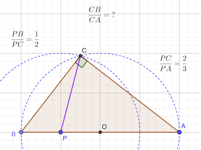

# Calendrier Mathématique Février 2022

[Solutions 2022](../README.md) - [Homepage](../../README.md)

## Mardi 1 Février



### Construciton géométrique


autrement dit:


### Résolution analytique

Considérons le repère orthonormé où les points B, P, A ont pour coordonnées respectives (-2; 0), (-1, 0) et (2; 0).

coordonnées du point C:


distance BC:


distance CA en utilisant Pythagore:


d'où le rapport :


> réponse: √(3/5)

## Mercredi 2 Février

Avec les chiffres des unités, on déduit que X + Y = 10 puisque X + Y + Z ≡ Z (mod 10).

Avec la retenue qui en suit, on sait que X = Z + 1.

- X + Y + Z + 1 = 10 * Y + X
- 10 + X = 10 * Y + X
- 10 = 10 * Y
- Y = 1

Et par conséquence : X = 9 et Z = 8

Vérification:

```text
     9 9 9 9
   + 1 1 1 1
   + 8 8 8 8
────────────
   1 9 9 9 8
```

> réponse: Z = 8

## Jeudi 3 Février


> réponse: (a - M) / (n - 1)

## Vendredi 4 Février

Programme [Python](04.py)

C'est le nombre de permutations des éléments ABC A B C, dans lequel il ne faut compter qu'une fois le doublon constitué par "ABC A B C" et "A B C ABC".

> réponse: 23

## Lundi 7 Février

## Mardi 8 Février

On équilibre le contenu des boîtes en déplaçant la moitié de la différence (qui est paire, puisque p et q sont impairs): (p - q) / 2. En déplaçant un chocolat de plus, la boîte B en aura plus que la boîte A.

> réponse: (p - q) / 2 + 1

## Mercredi 9 Février

## Jeudi 10 Février

## Vendredi 11 Février

## Lundi 14 Février

## Mardi 15 Février

## Mercredi 16 Février

## Jeudi 17 Février

## Vendredi 18 Février

## Lundi 21 Février

## Mardi 22 Février

## Mercredi 23 Février

## Jeudi 24 Février

## Vendredi 25 Février

## Lundi 28 Février
