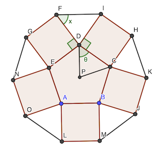

# Calendrier Mathématique Février 2022

[Solutions 2022](../README.md) - [Homepage](https://rene-d.github.io/calendrier-math/)

## Mardi 1 Février


### Construciton géométrique

$$
\frac {PB} {PC} \times \frac {PC} {PA} = \frac 1 2\times\frac 2 3=\frac 1 3
$$

autrement dit:
$$
\frac {BP} {BA} = \frac 1 4
$$

### Résolution analytique

Considérons le repère orthonormé où les points B, P, A ont pour coordonnées respectives (-2; 0), (-1, 0) et (2; 0).

coordonnées du point C:
$$
\begin{align*}
x_C &= - \frac 1 2       \\
y_C &= \sqrt {2^2 - {\left(\frac 1 2 \right)}^2} = \frac {\sqrt {15}} 2
\end{align*}
$$

distance BC:
$$
\begin{align*}
BC &= \sqrt { {\left(x_C - x_B\right)}^2 + {\left(y_C-y_B\right)}^2} \\
&= \sqrt { {\left( - \frac 1 2 - (-2) \right)}^2 + {\left( \frac {\sqrt {15}} 2 - 0 \right)}^2} \\
&= \sqrt {\frac 9 4 + \frac {15} 4} \\
&= \sqrt {6}
\end{align*}
$$

distance CA en utilisant Pythagore:
$$
CA=\sqrt{ {AB}^2-{BC}^2}=\sqrt{16-6}=\sqrt{10}
$$

d'où le rapport $\frac {CB} {CA}$:
$$
\frac {CB} {CA} = \frac {\sqrt {6}} {\sqrt {10}} = \sqrt \frac 3 5
$$

> réponse: √(3/5)

## Mercredi 2 Février

Avec les chiffres des unités, on déduit que X + Y = 10 puisque X + Y + Z ≡ Z (mod 10).

Avec la retenue qui en suit, on sait que X = Z + 1.

- X + Y + Z + 1 = 10 * Y + X
- 10 + X = 10 * Y + X
- 10 = 10 * Y
- Y = 1

Et par conséquence : X = 9 et Z = 8

Vérification:

```text
     9 9 9 9
   + 1 1 1 1
   + 8 8 8 8
────────────
   1 9 9 9 8
```

> réponse: Z = 8

## Jeudi 3 Février

$$
\begin{align*}
M &= \frac { \sum {(a_i + a})} n
\\
N &= \frac { \sum { a_i }} {n-1}
\end{align*}
$$

$$
\begin{align*}
M - N &=  \frac { \sum {(a_i + a})} n - \frac { \sum { a_i }} {n-1}
\\
&= \frac { \sum {(a_i + a})} n - \frac n {n-1} \left(\frac {\sum { a_i }}  n + \frac a n - \frac a n \right)
\\
&= M - \frac n {n-1} \left(M - \frac a n \right)
\\
&= M \left( 1 - \frac n {n-1} \right) + \frac {a} {n-1}
\\
&= - \frac M {n - 1} + \frac {a} {n-1}
\\
&= \frac {a-M} {n - 1}
\end{align*}
$$

> réponse: (a - M) / (n - 1)

## Vendredi 4 Février

Programme [Python](04.py)

C'est le nombre de permutations des éléments ABC A B C, dans lequel il ne faut compter qu'une fois le doublon constitué par "ABC A B C" et "A B C ABC".

> réponse: 23

## Lundi 7 Février

Si Adèle écrit 15, la seule solution est 1 + 2 + 3 + 4 + 5.

Si Adèle écrit 16, la seule solution est 1 + 2 + 3 + 4 + 6. En effet si on remplace un autre nombre par 6 qui est le premier nombre libre, la somme sera supérieure à 16.

Si Adèle écrit 17, on peut remplacer dans la somme initiale le 4 par 6 ou le 5 par 7.

Si Adèle écrit 18, on peut remplacer le 5 par 8 ou le 4 par 7.

Et ainsi de suite: on pourra toujours trouver au moins deux séries de nombres dont la somme vaut le nombre noté.

> réponse: 15 et 16

## Mardi 8 Février

On équilibre le contenu des boîtes en déplaçant la moitié de la différence (qui est paire, puisque p et q sont impairs): (p - q) / 2. En déplaçant un chocolat de plus, la boîte B en aura plus que la boîte A.

> réponse: (p - q) / 2 + 1

## Mercredi 9 Février

- A : "B est vraie"
- B : "E n'est pas vraie"
- C : "les affirmations de A à E sont vraies"
- D : "les affirmations de A à E sont fausses"
- E : "A n'est pas vraie"

C et D ne peuvent pas être vraies car elles se contredisent.

Si A est vraie et E fausse, alors B serait vraie. Ce qui est impossible.

Si A est vraie et E vrai, il y a contradiction.

Si B est vraie, E doit être fausse dans A serait vraie ce qui est impossible.

Il reste E qui est vraie. Et qui entraine B et C fausses.

> réponse: E

## Jeudi 10 Février



Le triangle FDI est isocèle, dans l'angle ∠FDI = 180° - 2 x.

On a aussi ∠FDI + 90° + 90° + ∠EDF = 360°.

∠EDG = 2 𝜃 et ∠DPC = 180 - 2 𝜃. ∠DPC = 360 / 5 = 72°.

D'où:

- 𝜃 = (180 - ∠DPC) / 2 = 108 / 2 = 54°
- ∠FDI = 180 - 2 𝜃 = 180 - 108 = 72°
- x = (180 - 72) / 2 = 54°

> réponse: 54°

## Vendredi 11 Février

- u₀ = 1
- u₁ = 2
- u₂ = 3 = 1 + 2 = 3 × 2²⁻²
- u₄ = 6 = 3 × 2³⁻²
- uₙ = 3 × 2ⁿ⁻²
- u₁₉ = 3 × 2¹⁷ = 393216

Vérification du calcul en [Rust](11.rs).

```rust
fn main() {
    fn u_n(n: u64) -> u64 {
        match n {
            0 => 1,
            1 => 2,
            _ => (0..n).fold(0, |acc, i| acc + u_n(i)),
        }
    }
    println!("{}", u_n(19)); // = 3 × 2ⁿ⁻²
}
```

> réponse: 393216

## Lundi 14 Février

Les cubes laissés en blanc sont ceux non visibles. Les cubes jaunes sont:

- face avant: 12
- face supérieure: 10 (on ne compte pas ceux de la face avant)
- face droite: 8 (idem)

Il y a donc 30 cubes peints, et donc 34 cubes blancs.

> réponse: 34

## Mardi 15 Février

Le deuxième nombre multiple du premier entraine: ∃ k ∈ 𝐍 ⎸ (n + 1011) = k × n

Soit (k - 1) × n = 1011 = 1 × 3 × 337

Donc n peut valoir 1, 3, 337 ou 1011.

Vérification en [Rust](15.rs):

```rust
fn main() {
    (1..=1011)
        .filter(|i| (i + 1011) % i == 0)
        .for_each(|i| println!("{:4} * {:4} = {:4}", i, (i + 1011) / i, i + 1011))
}
```

> réponse: 4

## Mercredi 16 Février

[Pythagore](https://fr.wikipedia.org/wiki/Théorème_de_Pythagore) $a^2+b^2=c^2$ :

$$
\sqrt { 6^2-4^2 } = \sqrt {20} = 2 \sqrt 5 = 4.472 \text{ m}
$$

> réponse: 2 √5 m

## Jeudi 17 Février

Soit 𝑥 le coût à l'achat d'une boîte de cacao et n le nombre de boîtes de café vendues.

La mise en équation de l'énoncé donne:

n × 140 + (n / 2) × (𝑥 × 1.2) = (n × 100 + (n / 2) × 𝑥) × 1.36

En simplifiant par n (non nul!) on obtient:

140 + 𝑥 × 0.6 = 136 + 0.68 × 𝑥

0.08 × 𝑥 = 4

𝑥 = 50

Le prix d'achat est donc 50€ et celui de vente 50 × 1.2 = 60€

> réponse: 60 €

## Vendredi 18 Février

Margaux peut échanger avec Juliette 2×2=4 parts de gâteau avec ses 2×5 parts de pizza. Elle peut donc récupérer 2×3 verres de jus de fruits.

> réponse: 6

## Lundi 21 Février

Les diviseurs positifs de 8 sont: 1 2 4 8. Ceux de 10 sont 1 2 5 10.

Il y a donc 4×4=16 sommes possibles. Parmi celles-là, seules ces huit sommes 1+10 2+10 4+10 8+10 4+5 8+5 8+2 8+1 sont strictement supérieures à 8.

> réponse: 1 / 2

## Mardi 22 Février

En appliquant la fonction logarithme puis en simplifiant les équations par $\ln 2$ (respectivement $\ln 3$), on obtient:

$$
x \ln 8 - (x+y) \ln 2 = \ln 64 \implies x+y = \frac {x \ln 2^3 - \ln 2^6} {\ln 2} = {3x-6}
$$

$$
(x+y) \ln 9 - 4y \ln 3 = \ln 243 \implies x+y = \frac {\ln 3^5 + 4y \ln 3} {\ln 3^2} = \frac {5+4y}{2}
$$

Soit:

$$
2x-y=6
\\
2x-2y=5
$$

On résoud ce système linéaire de deux équations à deux inconnues:

$$
-y-(-2y)=6-5 \implies y=1 \implies x=\frac 7 2
$$

D'où:

$$
2xy = 7
$$

> réponse: 7

## Mercredi 23 Février

Il faut placer les chiffres 8 et 9 "entre" les chiffres 1 2 3 4 5 6 7.

Il y a 8 "cases vides" autour de chaque chiffre, donc $A_{n}^{k} = A_{8}^{2} = 8 \times 7 = 56$ possibilités (ou [arrangements](https://fr.wikipedia.org/wiki/Arrangement)) de placer les 8 et 9 entre les autres.

Dans ces 8 cases vides, on peut placer de deux manières différentes les chiffres 8 et 9: 89 ou 98. Ce qui fait 16 possibilités, moins la dernière  car 1 2 3 4 5 6 7 89 est interdit: il en reste 15.

Vérification en [Python](23.py).

```python
#!/usr/bin/env python3

from itertools import permutations

n = 0
for a in permutations(range(1, 10)):
    p = 0
    for c in a:
        if c == 9 or c == 8:
            # on ignore 8 et 9
            continue
        if p > c:
            # si 1 2 3 4 5 6 7 ne sont pas rangés dans cet ordre, on ne compte pas la solution
            break
        p = c
    else:
        n += 1
print(n - 1)  # -1 pour éliminer 123456789
```

> réponse: 71

## Jeudi 24 Février

75 × 0.8 = 60

> réponse: 60

## Vendredi 25 Février

Soit n le nombre de personnes avant et après Sandra. Le nombre total d'élèves est donc 2n+1.

- n + 1 ≤ 19 (Raoul après Sandra) : n ≤ 18
- 28 ≤ 2n+1 (rang de Thomas) : n ≥ 13.5
- il faut que le 2n+1 soit multiple de 3

```text
                                 Th                         Ra
1 ... 10 11 12 13 14 15 16 17 18 19 20 21 22 23 24 25 26 27 28 ...
                  ^^ ^^ ^^ ^^ ^^
                      Sandra
```

Seul n=16 (car 16×2+1 = 33 = 11×3) convient, les autres possibilités ne conduisent pas à un effectif total divisible par 3.

Le rang de Sandra est donc n+1 = 17.

> réponse: 17

## Lundi 28 Février

La base de chaque triangle équilatéral vaut exactement la somme des deux autres côtés. Ainsi la somme de tous les côtés autres que les bases vaut exactement le double de la somme des bases. Et ce, quelque soit le nombre de triangles équilatéraux.

> réponse: 40 cm
