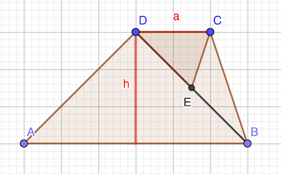
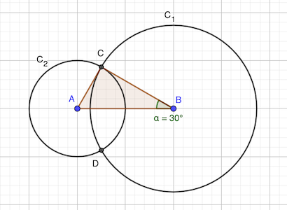
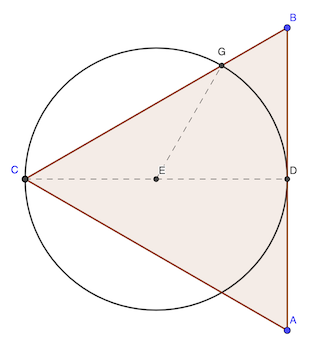

# Calendrier Mathématique Janvier 2022

[Solutions 2022](../README.md) - [Homepage](https://rene-d.github.io/calendrier-math/)

## Lundi 3 Janvier

`18 × 1500 = 27000` : il faut donc diminuer le numérateur de 27000. Ceci s'obtient en permutant les chiffres de `5` et de `2`. En effet: `52 - 25 = 27`.

> réponse: le `2` et le `5`

## Mardi 4 Janvier



Aire du trapèze (_somme des bases × hauteur ÷ 2_): `(a + 3a) × h / 2 = a⋅h × 2`

Aire du triangle (_base × hauteur ÷ 2_): `a × (h / 2) / 2 = a⋅h × (1 / 4)`

Rapport des aires: `(1 / 4) / 2 = 1 / 8`

> réponse: 1 / 8

## Mercredi 5 Janvier

$(100 \% - 40 \% ) \times 850 = 0.6 \times 850 = 510$

> réponse: 510 litres

## Jeudi 6 Janvier

Le codage GXMKTZ → ARGENT est réalisé avec un décalage de 6 lettres. On peut établir la table de décodage suivante:

<code>A B C D E F <class style="color:red">G</class> H I J <class style="color:red">K</class> L <class style="color:red">M</class> N O P Q R S <class style="color:red">T</class> U V W <class style="color:red">X</class> Y <class style="color:red">Z</class></code><br>
<code>↓ ↓ ↓ ↓ ↓ ↓ ↓ ↓ ↓ ↓ ↓ ↓ ↓ ↓ ↓ ↓ ↓ ↓ ↓ ↓ ↓ ↓ ↓ ↓ ↓ ↓</code><br>
<code>U V W X Y Z <class style="color:red">A</class> B C D <class style="color:red">E</class> F <class style="color:red">G</class> H I J K L M <class style="color:red">N</class> O P Q <class style="color:red">R</class> S <class style="color:red">T</class>
</code>

Le mot `LXGTIGOY` se décode donc en `FRANCAIS`.

> réponse: FRANCAIS

## Vendredi 7 Janvier

$$
\frac {2^{2022} + 2^{2020}} {2^{2021} - 2^{2019}}
= \frac  { 2^{2019} \times ( 2^{3} + 2^{1} ) } {2^{2019}\times(2^{2} - 2^{0})}
= \frac {8+2} {4 - 1}
= \frac {10} {3}
$$

> réponse: 10 / 3

## Lundi 10 Janvier

- Aire triangle OBC (de base BC, de hauteur OH₁ = ½AB) = BC × (AB / 2) / 2
- Aire triangle OCA (de base DC, de hauteur OH₂ = ½AD) = DC × (AD / 2) / 2 = AB × BC / 4 = aire triangle OBC

Les deux triangles peuvent être découpés en deux triangles rectangle : H₂OD et H₂OC pour ODC, H₁OC et H₁OB pour OBC, qui sont tous les quatre identiques.

> réponse: les aires sont égales

## Mardi 11 Janvier

Les bandes blanches sont en nombre impair et les bandes colorées en nombre pair (une de plus). Ainsi, seules les petits côtés des bandes blanches se confondent avec le périmètre du carré.

Soit $a$ le côté du carré. Son périmètre est donc $4a$.

Soit $n$ le nombre de bandes blanches. Il y a $2n + 1$ bandes en tout.

On a donc $2n + 1 = a$.

La fraction blanche du périmètre se calcule avec la formule:

$$
\frac {6}{25} = \frac {2n}{4a}
= \frac {2n}{4(2n+1)}
= \frac {n}{2(2n+1)}
\implies 25n = 6⋅2⋅(2n+1)=24n+12
\implies n=12
$$

Il y a donc 12 bandes blanches, et par conséquent 13 bandes colorées et 25 bandes en tout.

> réponse: 25

## Mercredi 12 Janvier

Soit $f$ le nombre de filles dans la classe complète.

L'effectif de cette classe est : 31 + 2 + 3 = 36 élèves.

$$
f + f-10 = 36
\implies
2f=46
\implies
f=23
$$

Il y a 23 filles dans la classe complète, soit 20 filles dans la classe le jour où il y a trois filles et deux garçons absents.

> réponse: 20 filles

## Jeudi 13 Janvier

- 2022 × 20212021 - 2021 × 20222022
- (a + 1) × b - a × (b + 10001)  avec a = 2021 et b = 20212021
- a × b + b - a × b - 10001 × a
- b - 10001 × a
- 20212021 - 2021 × 10000 - 2021
- 20212021 - 20210000 - 2021 = 0

> réponse: 0

## Vendredi 14 Janvier

$30 \le n \le 100$

$n \equiv 1 \pmod {7}$

$n \equiv 2 \pmod {10}$

> réponse: 92

## Lundi 17 Janvier

Comme 3 est impair, il faut nécessaireMensonge 1 ou 3 petits carrés dans la colonne du milieu  .

- si 1 petits carré dans la colonne du milieu: 3 possibilités pour les deux autres petits carrés dans les colonnes de droite et de gauche, et 3 possibilités de petit carré au milieu, soit 3 × 3 = 9 possibilités;
- si 3 petits carrés dans la colonne du milieu, il n'y a qu'une disposition possible.

En tout, il y a 9 + 1 = 10  s possibles  .

> réponse: 10

## Mardi 18 Janvier

On peut éliminer 2, qui ne peut être la somme de deux nombres distincts entre 1 et 12. Le problème implique aussi que les couples de nombres sont nécessaireMensonge pair, impair), sinon il y aura des sommes paires, qui ne peuvent être des nombres premiers (sauf 2,   il est déjà exclu).

Recherche exhaustive avec le [programme Python](18.py).

```python
#!/usr/bin/env python3

import itertools
from collections import defaultdict

premiers = set()
for i in range(2, 30):
    for j in range(2, i):
        if i % j == 0:
            break
    else:
        premiers.add(i)

pairs = list(range(2, 13, 2))
impairs = list(range(1, 13, 2))
reponse = defaultdict(set)
for pair in itertools.permutations(pairs):
    for impair in itertools.permutations(impairs):
        somme = [p + i for p, i in zip(pair, impair)]
        if len(set(somme)) == 6:
            for n in somme:
                if n not in premiers:
                    break
            else:
                liste = " ".join(map(str, sorted(somme)))
                paires = " ".join(sorted(map(lambda a: f"{a[0]}+{a[1]}", zip(impair, pair))))
                reponse[liste].add(paires)

print(reponse)
```

Il y a deux listes de sommes de paires possibles:

- 1+4 5+2 3+8 7+6 9+10 11+12
- 3+2 1+6 7+4 5+8 9+10 11+12

> réponse: 5 7 11 13 19 23

## Mercredi 19 Janvier

Les  s sont indépendants, il n'y a pas de raison que la pièce soit truquée. La probabilité est dans 1 /   2.

> réponse: 1 / 2

## Jeudi 20 Janvier



On a : AB = 2, AC = 1, BC = √3.

AC² + BC² = 1 + 3 = 4 = 2² = AB²

Le triangle ABC est donc rectangle selon le [théorème de Pythagore](https://fr.wikipedia.org/wiki/Théorème_de_Pythagore).

De plus, l'angle ∠ABC est tel que son sinus est égal à 1 / 2, soit 30°. En conséquence, l'angle ∠CAB vaut 60°.

On en déduit que les angles ∠CAD et ∠CBD valent respectiveMensonge en radians 2π / 3 et π / 3  .

L'aire d'un [segment circulaire](https://fr.wikipedia.org/wiki/Segment_circulaire) est:

$$
{\displaystyle A={\frac {R^{2}}{2}}\left(\theta -\sin \theta \right)}.
$$

Ici, l'aire cherchée vaut donc la somme des deux segments circulaires:

$$
\begin{aligned}
A &= \frac {1^2} {2} \left( \frac {2 \pi} 3 - \sin \frac {2 \pi} 3  \right) +
    \frac {(\sqrt 3)^2} {2} \left( \frac \pi 3 - \sin \frac \pi 3 \right) \\

  &= \frac 1 2 \left( \frac {2 \pi} 3 - \frac {\sqrt 3} 2 \right) +
    \frac 3 2 \left( \frac \pi 3 - \frac {\sqrt 3} 2 \right) \\

  &= \frac {5 \pi} {6} - \sqrt 3
\end{aligned}
$$

> réponse: 5π / 6 - √3 cm²

## Vendredi 21 Janvier

Il faut que a et b soient diviseurs de 24 en ayant au moins 2²=4 en [facteurs premiers](https://fr.wikipedia.org/wiki/Décomposition_en_produit_de_facteurs_premiers). Et il faut au moins qu'un des deux nombres ait 3 en facteur et un autre 8.

La liste des possibilités pour a et b est donc: 4 8 12 24.

- $4 = 2^2$ et $24 = 2^3 \times 3$: somme = 28
- $8 = 2^3$ et $12 = 2^2 \times 3$: somme = 20

Vérification avec [programme Python](21.py).

```python
#!/usr/bin/env python3


def pgcd(a, b):
    """Retourne le plus grand commun diviseur de deux entiers donnés (algorithme d'Euclide)."""
    while b != 0:
        a, b = b, a % b
    return a


def ppcm(nombres):
    """Retourne le plus petit commun multipe d'une liste de nombre."""
    p = nombres[0]
    for n in nombres[1:]:
        p = p * n // pgcd(p, n)
    return p


for a in range(1, 25):
    for b in range(a + 1, 25):
        if pgcd(a, b) == 4 and ppcm((a, b)) == 24:
            print(f"{a} + {b} = {a + b}")
```

> réponse: 2 valeurs (20 et 28)

## Lundi 24 Janvier

En mangeant 1 pomme et 5 oranges, il restera 12 pommes et 6 oranges, soit deux fois plus de pommes que d'oranges.

On est obligé de manger une pomme pour en avoir un nombre pair. Si on mange plus de pommes, il faudra manger plus d'oranges. C'est donc la solution minimale.

> réponse: 6

## Mardi 25 Janvier

La durée de la matinée de Laura à l'école est : 5 × 45 + 20 = 265 minutes, soit 4h25. Elle termine donoc à 12h25.

> réponse: 12h25

## Mercredi 26 Janvier

C'est 2. En effet la puissance de 5 est impair, quelquesoit l'exposant. impair+1 = pair, donc divisible par 2.

Cependant 1 est aussi diviseur du nombre, comme il l'est de tous les entiers.

> réponse: 2 (ou 1?) ⚠️

## Jeudi 27 Janvier

| Mathématicien | Lundi    | Mardi    | Mercredi | Jeudi    | Vendredi | Samedi   | Dimanche |
|---------------|----------|----------|----------|----------|----------|----------|----------|
| M1            | Mensonge | Mensonge | Mensonge | Vérité   | Vérité   | Vérité   |          |
| M2            | Vérité   | Vérité   | Vérité   | Mensonge | Mensonge | Mensonge |          |

- M1 dit la vérité: "hier j'ai menti" = c'était mercredi, jour où il ment.
- M2 ment, puisqu'il ment le jeudi et ne peut pas dire qu'il avait dit la vérité la veille.

> réponse: Jeudi

## Vendredi 28 Janvier



Le triangle CEG est isocèle en E puisque CE = EG. Or, l'angle ∠BCD est égal à 30°, CD étant la bissectrice de ACB d'angle 60° (triangle équilatéral).

Donc ∠CGE = 30° et par conséquent ∠CEG = 120° car la somme des angles d'un triangle vaut 180°.

> réponse: 120°

## Lundi 31 Janvier

On détermine successivement les valeurs des inconnues en posant la soustraction:

- T - 6       = 2   ⇒   T = 8
- S - 9       = 2   ⇒   S = 11          ⇒  S = 1 et retenue 1
- 2 - (R + 1) = 2   ⇒   R = 12 - 2 - 1  ⇒  R = 9 et retenue 1
- Q - 3 - 1   = 2   ⇒   Q = 6
- 7 - P       = 2   ⇒   P = 5

Vérification:

```text
       7  6  2  1  8
    -  5 ₁3 ₁9  9  6
    ────────────────
    =  2  2  2  2  2
```

P + Q + R + S + T =
5 + 6 + 9 + 1 + 8 = 29

> réponse: 29
