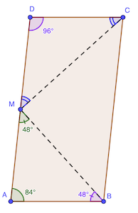

# Calendrier Mathématique Juillet 2022

[Solutions 2022](../README.md) - [Homepage](https://rene-d.github.io/calendrier-math/)

## Vendredi 1 Juillet

Soit $x=10b+a,y=10c+b,x^2=y^3$. Que vaut $a+b+c$ ?

Si on ramène les nombres à leur décomposition en facteurs premiers, on voit que $x$ doit être un cube et $y$ un carré. Or, les cubes à deux chiffres sont 27 et 64.

On a donc pour choix $b=2, a=7$ ou $b=6, a=4$, et donc $y=\sqrt[3]{ {27}^2}={\left(\sqrt[3]{27}\right)}^2=3^2=9$ ou  $y=\sqrt[3]{ {64}^2}=16$.

La première solution ne convient pas car $b$ vaudrait 0 ce qui est contraire à l'énoncé.

La deuxième implique $a=4$ et $b=6$, ce qui est correct. Donc $c=1$.

$a+b+c=4+6+1=11$

> réponse: 11

## Lundi 4 Juillet

```text
    S E R V I
  ×         4
  ───────────
    I V R E S
```

On part de `I`=8 et `S`=2, puis `E`=1 pour éviter la retenue, etc.

```text
    2 1 9 7 8
  ×         4
  ───────────
    8 7 9 1 2
```

> réponse: 21978 × 4 = 87912

## Mardi 5 Juillet

n² + 6n = n (6 + n)

Pour qu'il n'y ait qu'un diviseur premier, il faut que n et n+6 soient une puissance d'un nombre premier. Et que ce nombre premier divise aussi n+6, donc 6.

n=1 convient car 6+1=7 et 7 est premier.

6 est divisible par 2 et par 3: 2×(2+6)=16=2⁴, 3×(3+6)=27=3³

> réponse: 1 2 3

## Mercredi 6 Juillet

Il faut résoudre dans 𝐍 ab = 2(a+b).

- ab - 2a - 2b = 0
- a(b - 2) - 2(b - 2) - 4 = 0
- (a - 2)(b - 2) = 4

On en déduit que a-2 et b-2 sont des diviseurs de 4.

Donc a peut valoir 4+2 ou 2+2 ou 1+2, et b respectivement 1+2, 2+2, 4+2.

Ce qui donne soit un carré 4×4 soit un rectangle 6×3. Ou bien soit n=16 soit n=18.

> réponse: 16 et 18

## Jeudi 7 Juillet

| voyage | reste sur rive 1 | aller | retour | reste sur la rive 2
| ------ | ---------------- | ----- | ------ | -------------------
|    1   |   H1    H2 F3 H3 | F1 F2 | F1     |       F2
|    2   |   H1    H2    H3 | F1 F3 | F1     |       F2    F3
|    3   |         H2    H3 | F1 H1 | F2     | F1 H1       F3
|    4   |               H3 | F2 H2 | F3     | F1 H1 F2 H2
|    5   |                  | F3 H3 |        | F1 H1 F2 H2 F2 H3

> réponse: oui, en 9 trajets

## Vendredi 8 Juillet

On a $xy=4(y-x)$.

$$
\frac{2y+12(y-x)-2x}{y-x-8(y-x)}
=\frac{(12+2)(y-x)}{(1-8)(y-x)}
=-\frac{14}7=-2
$$

> réponse: -2

## Lundi 11 Juillet

> réponse: 8.50€

## Mardi 12 Juillet

L'aire du carré jaune est 25 cm² donc son côté 5 cm et sa diagonale 5√2 cm. Cette dernière est le diamètre du petit cercle, qui est aussi le côté du carré médian. La diagonale du carré médian est dans 5√2×√2 = 10 cm, qui est le diamètre du grand cercle, et le côté du carré ABCD.

> réponse: 100 cm²

## Mercredi 13 Juillet


> réponse: les deux carrés au milieu

## Jeudi 14 Juillet

La condition $15a-13b=1$ peut s'écrire:

$$
b=\frac {15a-1}{13} \le 500
\implies
a \le \frac {500\times 13+1}{15} = 433.4
$$

C'est $a$ qui limite, car la condition ci-dessus n'impose pas la limite 500 pour $b$.

Le plus petit $a$ qui convienne est $a=7$. Donc $a=7+13k$.

$7+13k \le 433 \implies k=32 \implies a=423$

$a=423$ est la plus grande valeur possible pour a.
Ceci implique _de facto_ $b=\frac{15\times 423-1}{13}=488$.

Finalement: $a+b=423+488=911$

Vérification en Python:

```python
print(max((a + b, a, b)
          for a in range(501) for b in range(501)
          if 15 * a - 13 * b == 1))
```

> réponse: 911

## Vendredi 15 Juillet

On doit avoir 3 × a = 𝑥8, donc a = 6. On vérifie aisément que 6 est la solution: 6 + 66 + 666 = 738.

> réponse: 6

## Lundi 18 Juillet

Les triangles sont isocèles et rectangles (pour que les triangles remplissent le coin du rectangle).

Leur diagonale vaut donc 2√2. Et l'aire du rectangle: 3×2√2 × 2×2√2 = 48

> réponse: 48 cm²

## Mardi 19 Juillet

Il y a 9 barres noires et 8 blanches. Donc 8-3=5 barres noires épaisses et par conséquent 4 barres blanches fines.

> réponse: 4

## Mercredi 20 Juillet

Le vol dure 11h. Le repas est donc servi à 19h30.

> réponse: 19h30

## Jeudi 21 Juillet

Sur chaque extrêmité il y a 4 cordes : il faut donc 4×10=40 extrêmités de corde en tout. Et une corde a deux extrémités.

> réponse: 20

## Vendredi 22 Juillet

Les multiples de 3 qui ont pour chiffre des unités 6 sont $6+30k$ et ceux par 7 $27+30k$.

Multiples qui se terminent par 6:
$$
1 \le 6+30k \le 1000
\\
0 \le  k \le \lfloor \frac{1000-6}{30}   \rfloor= 33
\\
\implies 34 \text{ valeurs}
$$

Multiples qui se terminent par 7:
$$
1 \le 27+30k \le 1000
\\
0 \le  k \le \lfloor \frac{1000-27}{30}   \rfloor= 32
\\
\implies 33 \text{ valeurs}
$$

> réponse: multiples qui finissent par 6

## Lundi 25 Juillet

Le critère de divisibilité par 4 est que les deux derniers chiffres forment un nombre dvisible par 4. Avec les chiffres donnés, on peut former:

- 24
- 32, 36
- 52, 56
- 64
- 72, 76

Soit 8 terminaisons possibles. Avec les quatre autres chiffres, on peut former 4!=24 nombres par terminaison.

D'où 8×24 = 192 nombres

> réponse: 192

## Mardi 26 Juillet

Conditions:

- Rouge ≥ 1, Bleu ≥ 1, Vert ≥ 1
- Rouge + Vert ≥ 10
- Vert + Bleu ≥ 20
- Bleu + Rouge ≥ 40

Il faut au moins 41 billes: 40 bleues et rouges et 1 verte.

Exemple:

- 20 billes rouges
- 20 billes bleues
- 1 bille verte

> réponse: 41

## Mercredi 27 Juillet

- Il y a 12 triangles de côté 1.
- Il y a 6 triangles de côté 2.
- Il y a 2 triangles de côté 3.

> réponse: 20

## Jeudi 28 Juillet



L'angle ∠ABM vaut 180 - 48 - 84 = 48°, donc le triangle ABM est isocèle en A.

AM = MD par définition et AB = DC parce que ABCD est un parallelogramme. Donc MDC est également isocèle en D.

L'angle ∠MDC vaut 180 - 84 = 96°, parce que ABCD est un parallélogramme. Et donc l'angle ∠DCM vaut (180 - 96) / 2 = 42°

> réponse: 42°

## Vendredi 29 Juillet

Posons: $X=x^{20}$ et $Y=y^{20}$

L'équation devient: $X^2-XY+Y^2=0$

$X=\frac 1 2 \left( Y \pm \sqrt {Y^2-4Y^2} \right)=\frac 1 2 Y \left( 1 \pm  i \sqrt {3} \right)$

On voit que la seule solution réelle est Y=0 et X=0.

> réponse: un couple: (0, 0)
