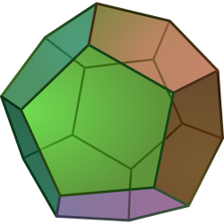
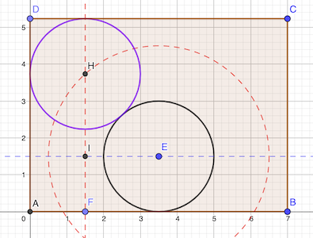

# Calendrier Mathématique Juin 2022

[Solutions 2022](../README.md) - [Homepage](https://rene-d.github.io/calendrier-math/)

## Mercredi 1 Juin

Soient $x,y$ tels que:

$$
\frac 1 {x+1}+\frac 1 {y+1}=1
$$

Notons que $x \ne 0$ sinon il n'y a pas de solution.

$$
y=\frac {1} {1-\frac 1 {x+1}}-1=\frac{x+1}{x+1-1}-1=\frac{1}{x}
$$

Remplaçons $x$ par $\frac 1 y$ dans l'équation:

$$
\begin{aligned}
\frac {1}{x-1}+\frac {1}{y-1}&=
\frac {1}{ \frac 1 {y}-1}+\frac {1}{y-1}
\\
&=\frac {y}{1-y}+\frac {1}{y-1}
\\
&=\frac {1-y}{y-1}
\\
&=-1
\end{aligned}
$$

> réponse: -1

## Jeudi 2 Juin

Il faut que le nombre soit divisible par 9 et par 2. Donc que la somme des chiffres soit multiple de 9 et le dernier chiffre pair.

∑ = 2+3+2+5+8+7+8 = 35

En enlèvent le premier 8 (et non le dernier!), on remplit les conditions.

> réponse: 232578

## Vendredi 3 Juin

L'angle en A du triangle rectangle est le [complémentaire](https://fr.wikipedia.org/wiki/Angles_complémentaires) de 40°, soit 50°, parce que l'angle ∠CAB est droit.

Son autre angle non droit est à son tour le complémentaire de 50°, soit 40°.

> réponse: x = 40°

## Lundi 6 Juin

Si on prend comme premier chiffre 8, les autres s'imposent d'eux-mêmes: 876543210.

Si on prend comme premier chiffre 9, on doit enlever un des neuf autres chiffres. Soit neuf possibilités.

> réponse: 10 possibilités

## Mardi 7 Juin

E est le milieu de DC car la médiatrice de AB passe par E, coupe AB en son milieu de Thalès nous assure que E est bien dans la même proportion dans DC que le pied de la médiatrice dans AB.

Donc la hauteur du triangle AEB est (5+3)/2=4, sa base 7 et son aire 4×7/2=14 cm²

> réponse: 14 cm²

## Mercredi 8 Juin

> réponse: 96 secondes, ou 1 min 36 secondes

## Jeudi 9 Juin

En admettant qu'il n'y ait pas d'animal estropié, 14 ailes ⇒ 7 perroquets, 62 pattes ⇒ (62-2×7)/4=12 lapins, 24 têtes ⇒ (24-12-7)=5 serpents.

> réponse: 5 serpents

## Vendredi 10 Juin

Les carrés à un ou deux chiffres sont:

- 4: trop petit
- 9: 10 convient car 11 premier
- 16: 15 et 17 ne conviennent pas car 14 et 18 ne sont pas premiers, tous les carrés pairs ne peuvent donc convenir
- 25: 24 est ok (23 premier), mais pas 26 (27 non premier))
- 36: idem car pair
- 49: 48 est ok (47 premier), mais pas 50 (51 non premier)
- 64: idem car pair
- 81: 79 et 83 sont premiers

> réponse: cinq nombres (10 24 48 80 82)

## Lundi 13 Juin

La plus grande valeur pour ab est (-7)×(-5)=35 et pour c +6.

> réponse: 41

## Mardi 14 Juin

a7b + b8a + 9ac = 2022

- a + b + c = 2 ou 12 ou 22
- 7 + 8 + a + r₁ = 2 ou 12 ou 22
- a + b + 9 + r₂ = 20

De la deuxième équation, on voit qu'elle ne peut valoir que 22 (à cause du 15). Donc r₂ = 2, et a + b = 20 - 9 - 2 = 9.

La première équation devient 9 + c = 2 ou 12, donc c = 3, et r₁ = 1.

Par suite a = 6 et b = 3.

> réponse: a=6 b=3 c=3

## Mercredi 15 Juin

> réponse: 1/5

## Jeudi 16 Juin

En coloriant les sommets de deux faces opposées, seules ces deux faces auront au moins trois sommets rouges, les autres n'en aurant que deux.

> réponse: deux

## Vendredi 17 Juin

$$
a^3+2b^3-ba^2-2ab^2=0
\\
a^2(a-b) +a^2 b +2b^3-ba^2-2ab^2=0
\\
a^2(a-b)+  b^2( 2b-2a)=0
\\
(a-b)(a^2- 2b^2)=0
$$

Les solutions sont soit $a=b$ soit $a^2=2b^2$.

Seule $a=b$ donne des solutions entières.

> réponse: 0

## Lundi 20 Juin

Le petit côté des rectangles fait 1/√2 (puisque l'hypoténuse du triangle rectangle isocèlde fait 1).

Donc l'aire rouge: 1/√2 + 1 + 1/√2 = √2 + 1

Aire jaune: (1/√2)²/2 × 3 + 1/√2 × 2 = 3/4 + √2

> réponse: 1/4 cm²

## Mardi 21 Juin

> réponse: 757252

## Mercredi 22 Juin

On doit trouver a et b entiers tel que c soit entier: 2a+7b=5c

2a+7b = 2a+2b+5b

Il faut donc que 2(a+b) soit multiple de 5.

> réponse: 5

## Jeudi 23 Juin

> réponse: 1 fille et 6 garçons, soit 7 élèves

## Vendredi 24 Juin

Soit N le nombre de bananes très radioactives.

La probabilité de piocher dans une caisse avec ces bananes est 2/5. La proba d'avoir une banane radioactive est N/72 × 2/5.

N/72 × 2/5 = 0.05 ⇒ N = 72 × 0.05 × 5/2 = 9

> réponse: 9 bananes

## Lundi 27 Juin

$$
\frac {x^3+y^3}{x+y}=x^2-xy+y^2=(x+y)^2-3xy
$$

En remplaçant par les valeurs de l'énoncé:

$$
\frac {133}{7} = 7^2-3xy
$$

$$
xy=\frac {7^3-133}{3\times 7}=\frac {210}{21}=10
$$

> réponse: 10

## Mardi 28 Juin

> réponse: 41 × 32 = 1312

## Mercredi 29 Juin

5 car tous les nombres à deux chiffres ou plus qui se terminent par 5 sont multiples de 5.

> réponse: 5

## Jeudi 30 Juin

Pour être tangent au côté du rectangle et au cercle central C (noir), le centre H du cercle C1 (violet) doit être à l'intersection de la droite y=15 et du cercle de centre E et de rayon 30.

Le triangle EIH est rectangle en I, son hypoténuse est 30 et un de ses côtés 35 - 15 = 20. D'où IH = √(30² - 20²) = √500 = 10√5.

La longueur l = AD est donc 15 + 10√5 + 15 = 30 + 10√5 ≈ 52.4

> réponse: 30+10√5 cm
