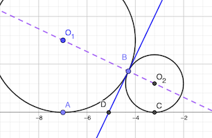

# Calendrier Mathématique Mai 2022

[Solutions 2022](../README.md) - [Homepage](https://rene-d.github.io/calendrier-math/)

## Lundi 2 Mai

Le rayon $r$ du [cercle inscrit](https://fr.wikipedia.org/wiki/Cercles_inscrit_et_exinscrits_d%27un_triangle#Cercle_inscrit) dans un triangle vaut:

$$
r=\frac{2S}{a+b+c}
$$

où S est la surface du triangle, a, b et c sont les côtés du triangle.

Ici, $r=6$, $c=39$ et $a^2+b^2={39}^2$.

Comme le triangle est rectangle, $S=\frac 1 2 ab$. Ainsi, $a+b+c=\frac {ab} r$.

Calculons $a+b$:

$$
\begin{align*}
(a+b)^2 &= a^2+b^2 + 2ab
\\
&=c^2+2\times(a+b+c)\times r
\\
&=39^2+2\times 6\times (a+b)+2\times 6 \times 39
\\
&=12(a+b)+1989
\end{align*}
$$

$a+b$ est donc solution de l'équation du deuxième degré $X^2-12X-1989=0$.

Ce polynome a deux solutions: $X=-39$ et $X=51$.

$a+b$ doit être positif, donc $a+b=51$.

Le périmètre du triangle est donc $51+39=90$.

Par ailleurs, on a $ab=90*6=540$ et $a+b=51$.

$$
\begin{align*}
& x=51-540/x
\\
& x^2-51x+540=0
\\
& x=\frac {51 \pm  \sqrt{{51}^2-4\times 540}} {2}
\\
& x=\frac {51 \pm 21} {2}
\\
& x=15 \text{ ou } x=36
\end{align*}
$$

Donc $a=15$ et $b=36$ (ou l'inverse).


> réponse: 90 cm

## Mardi 3 Mai

Soient p = nombre de pots et c = nombre de crayons.

Mise en équation:

- 4 × (p - 1) = c
- 3 × p + 1 = c

3 p + 1 = 4 p - 4 ⇒ p = 5 ⇒ c = 16

> réponse: 16 crayons et 5 pots

## Mercredi 4 Mai

$756 = 2^2 \times 3^3 \times 7$

Puisque le nombre de cerises distribuées est divisble en quart (et donc par 4, le nombre de parts divise $3^3 \times 7$, et strictement supérieur à 3.

Il faut que $P\times \left(1+3\times \frac 1 4\right) > 150$ avec $P=\frac {756} {n}$ la part en cerises.

$$
\frac {756} {n} \times \left(1+3\times \frac 1 4\right) > 150
\implies
n < \frac {756} {150} \times \frac 7 4 = 8.82
$$

La seule solution possible est $n=7$. 1 et 3 ne conviennent pas et les autres diviseurs de $3^3 \times 7$ sont supérieurs à 9.

Donc Damien a 6 amis, il a distribué 108 cerises et en a mangé 108 * 7 / 4 = 189.

> réponse: 189

## Jeudi 5 Mai

En n jours, Jean dépense 1+2+3+...+n = n(n+1)/2 €.

- n (n + 1) / 2 = 210
- n² + n - 420 = 0
- n = 20 (ou n = -21 mais on ne peut pas revenir dans le temps)

> réponse: 20 jours

## Vendredi 6 Mai

Il y a deux dispositions possibles, la rouge et la bleue.


Et pour chaque disposition, 8 positions initiales. Donc 16 en tout.

Le [programme](pizza.py) Python qui dessine les parts de pizza avec [Turtle](https://docs.python.org/fr/3/library/turtle.html).

> réponse: 16

## Lundi 9 Mai

Il faut trouver v et n entiers tels que 3v + 2n = 22.

v=6 et n=2 conviennent.

> réponse: deux matchs nuls

## Mardi 10 Mai

0 répond _stricto sensu_ à l'énoncé. Mais cherchons un nombre non nul.

Ce nombre doit être divisible par 16 et par tous les entiers impairs entre 3 et 15. Il faut qu'il soit donc divisible par 3 deux fois, 5, 7, 11, 13. Soit:

16 × 3 × 3 × 5 × 7 × 11 × 13 = 720720

> réponse: 720720 (ou 0, réponse triviale) ⚠️

## Mercredi 11 Mai

La partie colorée du carré droite bas correspond à la partie blanche du carré supérieur.

> réponse: 1 cm²

## Jeudi 12 Mai

Le nombre commence forcément par le chiffre 1, puis le chiffre 0 ou 1. Il faudra également le chiffre 9, à la dernière ou avant-dernière position.

Si c'est 1 le chiffre des centaines, on aboutit qu'à des produits supérieurs à 10000. Donc le nombre cherché est 10𝑥9 ou 109𝑥.

Si c'est 109𝑥 il faudra aussi un 9 car 9 x 9 = 81. Mais 1098 ne convient pas. Il faut 𝑥 tel 8 + 9𝑥 = 𝑥0 = 10𝑥. D'où 𝑥 = 8.

> réponse: 1089

## Vendredi 13 Mai

Les différentes combinaisons pour a+b+c+d et e sont:

- (50, 3)
- (48, 5)
- (44, 9)
- (42, 11)
- (28, 25) → 700

> réponse: 700

## Lundi 16 Mai

Les cases hors coin ont un côté peint. Il y en a 6 par côté.

> réponse: 24

## Mardi 17 Mai

$27000 = 2^3 \times 3^3 \times 5^3$

Pour x et y soient premiers entre eux, il faut mettre tous les puissances de chaque facteur premier ensembles.

Donc:

- $x=1$ et $y=2^3 \times 3^3 \times 5^3$
- $x=2^3$ et $y=3^3 \times 5^3$
- $x=2^3 \times 3^3$ et $y=5^3$
- $x=2^3 \times 5^3$ et $y=3^3$

> réponse: il y a 8 couples (ou 5 paires uniques)

## Mercredi 18 Mai

$m=\frac 1 5 \sum n_i = 4.4 \implies \sum n_i = 22 \implies 3\sum n_i = 66$

> réponse: 66

## Jeudi 19 Mai


Si le point P est le milieu de l'hypoténuse, la surface sera 144 cm².

Soit $x=HC$.

L'aire du triangle PHC est $\frac 1 2 8 x=4x$ avec $x > 0$.

Le triangle AGH est semblable à PHC. Donc:

$$
\frac {AG} {GP}=\frac {PH}{HC} \implies \frac {AG} {9}=\frac {8}{x} \implies AG=\frac {72}{x}
$$

Son aire est:

$$
\frac 1 2 \times 9 \times \frac {72}{x}=\frac {324} {x}
$$

L'aire du triangle ABC est donnée par la fonction:

$$
f(x) = 72 + 4x +\frac {324} {x}
$$

La dérivée de cette fonction est:

$$
f \prime(x)=4-\frac {324} {x^2}
$$

Entre ]0, +∞[, le signe de la dérivée est - 0 +. Sur cet intervalle, la fonction $f(x)$ est donc minimale lorsque $f \prime(x)=0 \implies x=\sqrt{324 \div 4}=9$


Donc l'aire minimale du rectangle ABC est $f(9)=144$.

> réponse: 144 cm²

## Vendredi 20 Mai

- 2a < b
- 3b < c => 6a < 3b < c
- 4c < d => 18a < 9b < 4c < d

Donc si a=1, b=3, c=10, d=41

Tout autre choix imposera une valeur supérieure pour d.

> réponse: 41

## Lundi 23 Mai

```text
1 2 3 4 5 6 1 2 3 4 5 6
A B C D E F              ✅
  A B C D E F            ❌ B↔︎3
    A B C D E F          ✅
      A B C D E F        ❌ A↔︎4 C↔︎6
        A B C D E F      ✅
          A B C D E F    ✅
```

> réponse: 4

## Mardi 24 Mai

$127=2^7-1=2^0+2^1+2^2+2^3+2^4+2^5+2^6$

> réponse: 7

## Mercredi 25 Mai

$$
\frac 9 5 =1+ \frac {1} {1+\frac{1}{x} }
\implies
\frac 4 5=\frac {1} {1+\frac{1}{x} }
$$

$$
\frac 5 4 = 1+\frac 1 x
\implies
\frac 1 x = \frac 1 4
$$

D'où: $x=4$

> réponse: 4

## Jeudi 26 Mai

Ce sont tous les entiers pairs entre -16 et 16, soit 17 valeurs possibles.

```python
from itertools import combinations

print(len(set(a + b for a, b in combinations([-9, -7, -5, -3, -1, 1, 3, 5, 7, 9], 2))))
```

> réponse: 17

## Vendredi 27 Mai

Soit a, b, c les trois côtés du triangle, c l'hypoténuse.

L'aire coloriée est la somme des deux petits demi-cercles plus l'aire du triangle moins l'aire du demi-cercle porté par l'hypoténuse.

$$
\begin{aligned}
A_{c} &= \frac 1 2 \pi {\left(\frac a 2\right)}^2
+ \frac 1 2 \pi {\left(\frac b 2\right)}^2
+ \frac 1 2 ab
- \frac 1 2 \pi {\left(\frac c 2\right)}^2
\\
&= \frac \pi 8 \left(
a^2+b^2-c^2
\right)
+\frac {ab} 2
\\
&=\frac {ab} 2
\end{aligned}
$$

> réponse: les aires sont identiques ⚠️

⚠️ erreur dans la solution du livret: l'aire du demi-disque est $S_a=\frac \pi 8 a^2$ et non $S_a=\frac \pi 2 a^2$ comme indiqué (resp. $S_b$, $S_c$).

## Lundi 30 Mai

Comme (x + 20)(x + 5) = 100 + 25 x + x², il faut x divise 100. Il y a: 1, 2, 4, 5, 10, 20, 25, 50, 100.

> réponse: 9

## Mardi 31 Mai



Le point B est aligné avec les centres O₁ O₂ des deux cercles: le rayon BO₁ est perpendiculaire à la tangente, le rayoon BO₂ est également perpendiculaire à la même tangente.

Le point D est sur la bissectrice de l'angle AO₁B, donc AD = DB.

De même, CD = BD.

On en déduit que ABC sont sur un cercle de centre C. Et donc que l'angle ABC est droit.

> réponse: 90°
