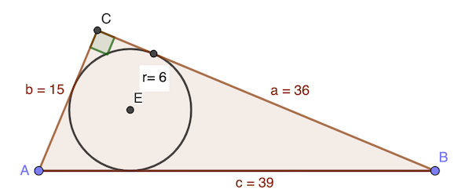
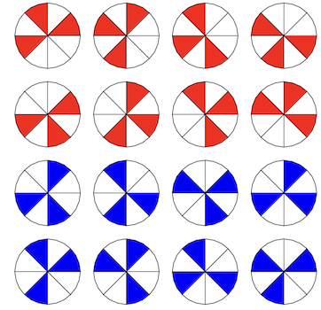
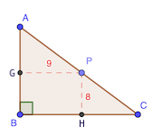
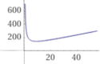

# Calendrier Mathématique Mai 2022

[Solutions 2022](../README.md) - [Homepage](https://rene-d.github.io/calendrier-math/)

## Lundi 2 Mai

Le rayon  du [cercle inscrit](https://fr.wikipedia.org/wiki/Cercles_inscrit_et_exinscrits_d%27un_triangle#Cercle_inscrit) dans un triangle vaut:

où S est la surface du triangle, a, b et c sont les côtés du triangle.

Ici, ,  et .

Comme le triangle est rectangle, . Ainsi, .

Calculons :

 est donc solution de l'équation du deuxième degré .

Ce polynome a deux solutions:  et .

 doit être positif, donc .

Le périmètre du triangle est donc .

Par ailleurs, on a  et .

Donc  et  (ou l'inverse).

> réponse: 90 cm

## Mardi 3 Mai

Soient p = nombre de pots et c = nombre de crayons.

Mise en équation:

- 4 × (p - 1) = c
- 3 × p + 1 = c

3 p + 1 = 4 p - 4 ⇒ p = 5 ⇒ c = 16

> réponse: 16 crayons et 5 pots

## Mercredi 4 Mai

Puisque le nombre de cerises distribuées est divisble en quart (et donc par 4, le nombre de parts divise , et strictement supérieur à 3.

Il faut que  avec  la part en cerises.

La seule solution possible est . 1 et 3 ne conviennent pas et les autres diviseurs de  sont supérieurs à 9.

Donc Damien a 6 amis, il a distribué 108 cerises et en a mangé 108 * 7 / 4 = 189.

> réponse: 189

## Jeudi 5 Mai

En n jours, Jean dépense 1+2+3+...+n = n(n+1)/2 €.

- n (n + 1) / 2 = 210
- n² + n - 420 = 0
- n = 20 (ou n = -21 mais on ne peut pas revenir dans le temps)

> réponse: 20 jours

## Vendredi 6 Mai

Il y a deux dispositions possibles, la rouge et la bleue.

Et pour chaque disposition, 8 positions initiales. Donc 16 en tout.

Le [programme](pizza.py) Python qui dessine les parts de pizza avec [Turtle](https://docs.python.org/fr/3/library/turtle.html).

> réponse: 16

## Lundi 9 Mai

Il faut trouver v et n entiers tels que 3v + 2n = 22.

v=6 et n=2 conviennent.

> réponse: deux matchs nuls

## Mardi 10 Mai

0 répond _stricto sensu_ à l'énoncé. Mais cherchons un nombre non nul.

Ce nombre doit être divisible par 16 et par tous les entiers impairs entre 3 et 15. Il faut qu'il soit donc divisible par 3 deux fois, 5, 7, 11, 13. Soit:

16 × 3 × 3 × 5 × 7 × 11 × 13 = 720720

> réponse: 720720 (ou 0, réponse triviale) ⚠️

## Mercredi 11 Mai

La partie colorée du carré droite bas correspond à la partie blanche du carré supérieur.

> réponse: 1 cm²

## Jeudi 12 Mai

Le nombre commence forcément par le chiffre 1, puis le chiffre 0 ou 1. Il faudra également le chiffre 9, à la dernière ou avant-dernière position.

Si c'est 1 le chiffre des centaines, on aboutit qu'à des produits supérieurs à 10000. Donc le nombre cherché est 10𝑥9 ou 109𝑥.

Si c'est 109𝑥 il faudra aussi un 9 car 9 x 9 = 81. Mais 1098 ne convient pas. Il faut 𝑥 tel 8 + 9𝑥 = 𝑥0 = 10𝑥. D'où 𝑥 = 8.

> réponse: 1089

## Vendredi 13 Mai

Les différentes combinaisons pour a+b+c+d et e sont:

- (50, 3)
- (48, 5)
- (44, 9)
- (42, 11)
- (28, 25) → 700

> réponse: 700

## Lundi 16 Mai

Les cases hors coin ont un côté peint. Il y en a 6 par côté.

> réponse: 24

## Mardi 17 Mai

Pour x et y soient premiers entre eux, il faut mettre tous les puissances de chaque facteur premier ensembles.

Donc:

-  et 
-  et 
-  et 
-  et 

> réponse: il y a 8 couples (ou 5 paires uniques)

## Mercredi 18 Mai

> réponse: 66

## Jeudi 19 Mai

Si le point P est le milieu de l'hypoténuse, la surface sera 144 cm².

Soit .

L'aire du triangle PHC est  avec .

Le triangle AGH est semblable à PHC. Donc:

Son aire est:

L'aire du triangle ABC est donnée par la fonction:

La dérivée de cette fonction est:

Entre ]0, +∞[, le signe de la dérivée est - 0 +. Sur cet intervalle, la fonction  est donc minimale lorsque 

Donc l'aire minimale du rectangle ABC est .

> réponse: 144 cm²

## Vendredi 20 Mai

- 2a < b
- 3b < c => 6a < 3b < c
- 4c < d => 18a < 9b < 4c < d

Donc si a=1, b=3, c=10, d=41

Tout autre choix imposera une valeur supérieure pour d.

> réponse: 41

## Lundi 23 Mai

## Mardi 24 Mai

> réponse: 7

## Mercredi 25 Mai

D'où: 

> réponse: 4

## Jeudi 26 Mai

## Vendredi 27 Mai

Soit a, b, c les trois côtés du triangle, c l'hypoténuse.

L'aire coloriée est la somme des deux petits demi-cercles plus l'aire du triangle moins l'aire du demi-cercle porté par l'hypoténuse.

⚠️ erreur dans solution du livret

> réponse: les aires sont identiques ⚠️

## Lundi 30 Mai

## Mardi 31 Mai
