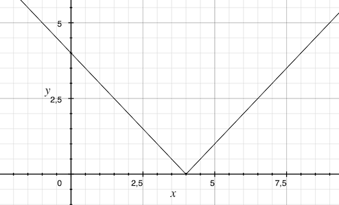
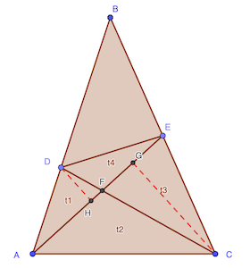
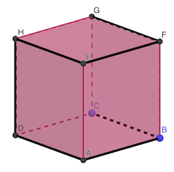

# Calendrier Mathématique Mars 2022

[Solutions 2022](../README.md) - [Homepage](../../README.md)

## Mardi 1 Mars

Sur une quantité totale de 1, la quantité de garçons est 4/5 et celle des filles 1/5.

Après expulsion de 2/3 des garçons, il en reste 1/3, soit 4/5 × 1/3 = 4/15.

Il reste une quantité totale de = 4/15 + 1/5 = 7/15

La proportion de filles est: 

> réponse: 3/7

## Mercredi 2 Mars



> réponse: en prenant la symétrique par rapport à l'axe des abscisses jusqu'à 4

## Jeudi 3 Mars

A faire de tête ou avec un papier, sinon pas beaucoup d'intérêt... ([factordb](http://factordb.com/index.php?query=112266) [wa](https://www.wolframalpha.com/input/?i=112266) etc.)

- 112266 ÷ 2 = 56133
- 56133 ÷ 9 = 6237
- 6237 ÷ 9 = 693
- 693 ÷ 9 = 77

On en déduit la décomposition en facteurs premiers: 2 × 3⁶ × 7 × 11

> réponse: n = 6

## Vendredi 4 Mars

En commençant par le sommet A, on peut choisir un sommet parmi B C D E puis un troisième parmi I H F G, ce qui permet de dessiner 16 triangles.

En partant de G E I, on obtient en tout 64 triangles différents.

> réponse: 64

## Lundi 7 Mars

105 = 3 × 5 × 7

- on ne peut pas enlever 0 sinon plus multiple de 5
- on ne peut pas enlever ni 4 ni 2 sinon plus multiple de 3
- il reste 4320 et 4620 comme possibilités

Test [divisibilité par 7](https://fr.wikipedia.org/wiki/Liste_de_critères_de_divisibilité#Lemmes_de_divisibilité_par_7):

- 4320 → 432 + 5 × 0 = 432 → 43 + 5 × 2 = 53 → non divisible par 7
- 4620 → 462 + 5 × 0 = 462 → 46 + 5 × 2 = 56 = 7 × 8 → divisible par 7

Il faut enlever le 3 de 43620 car 4620 est un multiple de 105.

> réponse: 3

## Mardi 8 Mars

Sur 40% qui n'ont pas réussi aux deux examens, 10% n'ont réussi que les maths et 20% que le français. Il reste donc 10%.

> réponse: 10%

## Mercredi 9 Mars

Suspect | Déclaration                               | Statut
------- | ----------------------------------------- | --------
David   | Je suis le seul innoncent                 | Coupable
Alain   | Je suis le seul coupable                  | Coupable
Bruno   | Nous sommes tous innocents                | Coupable
Charles | Au moins deux d'entre nous sont coupables | Innocent

Si David est innocent, les autres sont coupables, donc mentent. Mais la déclaration de Charles serait vraie donc. Donc David

Si David est innocent, il ne peut pas dire qu'il est coupable. Donc il est coupable, et ce n'est pas le seul.

Si Bruno est innocent, tous seraient innocents, ce qui n'est pas le cas.

Charles est innocent, car sa phrase est vraie.

> réponse: trois coupables

## Jeudi 10 Mars



En considérant les [aires](https://fr.wikipedia.org/wiki/Aire_d%27un_triangle) des triangles t₁ et t₄: t₁ = AF⋅DH / 2 et t₄ = EF⋅DH / 2

D'où: t₄ / t₁ = EF / AF

Avec celles de t₂ et t₃: t₃ = CG⋅EF / 2 et t₂ = CG⋅AF / 2

D'où: t₃ / t₂ = EF / AF

Ainsi, on a: t₃ / t₂ = t₄ / t₁

On peut calculer t₄ = t₁⋅t₃ / t₂ = 3 × 6 / 5 = 3.6

> réponse: 18 / 5 = 3.6

## Vendredi 11 Mars

Soient  trois réels tels que:


Pour  donnés,  vaut, en utilisant le [discriminant](https://fr.wikipedia.org/wiki/Équation_du_second_degré#Discriminant):


On constate que si  est [réel](https://fr.wikipedia.org/wiki/Nombre_réel), il faut que . Et par suite .

Donc les solutions réelles imposent  et par conséquent 

> réponse: 0

## Lundi 14 Mars

Soient  et  deux entiers tels que 

Les solutions entières sont (±1, ±7) et (±5, ±5).

### x, y entiers naturels

Deux valeurs possibles: 8 et 10

### x, y entiers relatifs

Sept valeurs possibles: 8, 6, -6, -8, 10, -10, 0

> réponse: 2 (entiers naturels) ou 7 (entiers relatifs)

## Mardi 15 Mars

Soit  les numéros de feuille entre 1 et 200. Les numéros de page sont .


Or 2022 - 25 = 1997 et 1997 n'est pas un multiple de 4. Donc on ne peut pas trouver 25 nombres entre 1 et 200 qui satisfassent la condition.

> réponse: non

## Mercredi 16 Mars

n° | proposition 1 | proposition 2
---|---------------|----------------------
 A | pair          | multiple de 3
 B | multiple de 3 | chiffre des unités 5
 C | multiple de 5 | somme des chiffres 12

Si le nombre est pair (A1 vraie), alors le chiffre des unités serait 5 (B2), ce qui est contradictoire. Donc le nombre est forcément multiple de 3, non pair et avec un chiffre des unités différent de 5. Et comme C1 ne peut être que fausse, la somme des chiffres vaut 12.

12 = 3+9 = 4+8 = 5+7 = 6+6

39, 93, 57 conviennent, mais pas 75 (multiple de 5), ni 48 84 66 (pairs).

> réponse: trois

## Jeudi 17 Mars


> réponse: 7 / 15

## Vendredi 18 Mars

Soit 𝑥 = EF

Aire triangle ABC: (𝑥 + 2) × (5 + 10) ÷ 2

Aire partie colorée: (10 + 5) × 2 + 5 × 𝑥

Equation:

- 15 / 2 (𝑥 + 2) = 30 + 5 𝑥
- 5 / 2 𝑥 = 30 - 15
- 𝑥 = 6

> réponse: 6 cm

## Lundi 21 Mars

En noir le chemin qui passe par tous les sommets, une seule fois (donc impossible de faire plus court).



> réponse: 7

## Mardi 22 Mars

> réponse: 18 ans

## Mercredi 23 Mars

La somme des nombres de 1 à 9 est 45.

La somme des trois côtés du triangle fait donc 45 + 7 + a où a est le nombre placédans le troisème sommet. Cette somme doit être divisible par 3.

Les valeurs 1, 3, 4, 6, 7, 9 ne conviennent pas. 2 et 5 sont déjà prises. Il reste donc 8.

La somme des côtés est donc 20.

Programme [Python](23.py) pour énumérer toutes les solutions.

```python
#!/usr/bin/env python3

from itertools import permutations

for a, b, c, d, e, f, g in permutations([1, 3, 4, 6, 7, 8, 9]):
    if 5 + a + b + 2 == 5 + c + d + e == e + f + g + 2:
        print(5, a, b, 2, "-", 5, c, d, e, "-", e, f, g, 2, "=", 5 + a + b + 2)
```

> réponse: 20

## Jeudi 24 Mars

Soient m, c, p, b le nombre de mathématiciens, de chimistes, de physiciens et de biologistes.

Mise en équation:

- p + b + c + m = 30
- p + b = m / 2
- p + c = 2 b
- p ≥ 1
- p, b, c, m entiers naturels

Calculons b et c en fonction de m et p:

- b = m / 2 - p
- c = 2 b - p = m - 2 p - p = m - 3 p

En remplaçant dans la première équation:

- p + m / 2 - p + m - 3 p + m = 30
- 5 / 2 m - 3 p = 30
- 5 m = 60 + 6 p

Comme p est un strictement positif, il faut que 60 + 6 p soit multiple de 5, et même de 10 puisque m est pair. p = 5 convient et cela entraîne m = 18.

C'est la seule solution car p = 10 conduirait à un effectif incompatible puisqu'il y aurait 34 mathématiciens et physiciens.

m = 18, p = 5, b = 4, c = 3

> réponse: 18

## Vendredi 25 Mars

 est disible par 4 mais par 8.

En effet :


Le premier terme est multiple de 4 (au moins) puisque  et  sont pairs. Mais le deuxième terme est multiple de 4 mais pas de 8.

Il y a donc deux puissances de 2 par facteur. Il y a 100 facteurs.

> réponse: 200

## Lundi 28 Mars

Les possibilités de triplets de chiffres sont:

- 1 3 9
- 1 2 4 car √(1 × 4) = √4 = 2
- 2 4 8 car √(2 × 8) = √16 = 4
- 4 6 9 car √(4 × 9) = √36 = 6
- tous les triplets avec le même chiffre (sauf 0) : ccc car c = √c × √c
- toutes les centaines : c00 car 0 = √c × 0

Soit au total, 6 + 6 + 6 + 6 + 9 + 9 = 42 possibilités.

> réponse: 42

## Mardi 29 Mars

a, b distincts, a=x et b=x sont impossibles.


> réponse: (a+b)/2

## Mercredi 30 Mars

Les nombres suivants sont:

- a = 2020
- b = 2021
- c = 2022
- d = 2100

La différence est donc 80.

Une manière de faire le calcul en Python est la suivante, en utilisant la base 3:

```python
import numpy
int(numpy.base_repr(int("2012", 3) + 4, base=3)) - int(numpy.base_repr(int("2012", 3) + 1, base=3))
```

> réponse: 80

## Jeudi 31 Mars

Aire PQR : 3𝑥4÷2

Aire XYZ : 4𝑥7÷2

> réponse: 3/7
