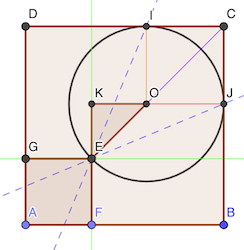

# Calendrier Mathématique Septembre 2022

[Solutions 2022](../README.md) - [Homepage](https://rene-d.github.io/calendrier-math/)

## Jeudi 1 Septembre

## Vendredi 2 Septembre

## Lundi 5 Septembre

Le volume total est égal à 5 + 5/2 = 7.5. Il faut donc que chacun ait 2.5 l de vin. Comme il y a 15 bouteilles, c'est 5 bouteilles chaque.

P = bouteille pleine, M = bouteille moitié pleine, V = bouteille vide.

- personne 1: P P M V V
- personne 2: P P M V V
- personne 3: P M M M V

> réponse: oui c'est possible

## Mardi 6 Septembre

Comme 3² + 4² = 5², le triangle est rectangle, et donc 5 est le diamètre.

> réponse: 2.5 cm

## Mercredi 7 Septembre

_Quel est le chiffre en position 2022 dans le développement décimal de_  _?_

Les décimales 0396 se répêtent par groupe de 4. Donc la 2022e décimale est aussi la 2è, soit 3.

> réponse: 3

## Jeudi 8 Septembre

L'équation équivaut à , soit .

> réponse: 0

## Vendredi 9 Septembre

## Lundi 12 Septembre

Le triangle EKO est isocèle rectangle, et on a KO + OJ = KO + EO = 4.

Donc, si a est le côté, son hypoténuse est  et:

Le rayon du cercle est donc  :

> réponse: 4(2-√2) cm

## Mardi 13 Septembre

## Mercredi 14 Septembre

Soit F la somme des notes des femmes et H celle des hommes. Soit f le nombre de femmes.

On a:

- (F + H) / 35 = 5.75
- F / f = 6
- H / (35 - f) = 4.75

Soit le système de trois équations à trois inconnues:

- F + H = 35 × 5.75
- F = 6 × f
- H = 4.75 × (35 - f)

En remplaçant F et H, on obtient:

6 × f + 4.75 × (35 - f) = 35 × 5.75

(6 - 4.75) × f = 35 × (5.75 - 4.75)

f = 35 / 1.25 = 28

> réponse: 28 femmes

## Jeudi 15 Septembre

Il faut le plus de facteurs 2 et 5.

104 est multiple de 8 = 2³, 375 est multiple de 5³. On obtiendra donc un nombre avec trois 0 en les multipliant.

> réponse: trois

## Vendredi 16 Septembre

Les deux nombres sont égaux, et valent .

> réponse: nombres égaux

## Lundi 19 Septembre

## Mardi 20 Septembre

## Mercredi 21 Septembre

## Jeudi 22 Septembre

## Vendredi 23 Septembre

## Lundi 26 Septembre

## Mardi 27 Septembre

## Mercredi 28 Septembre

## Jeudi 29 Septembre

## Vendredi 30 Septembre
