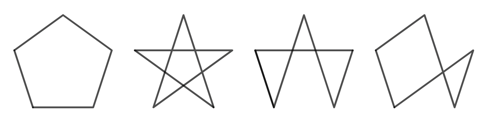
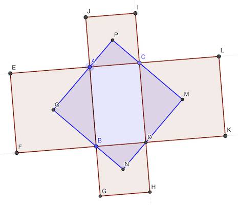
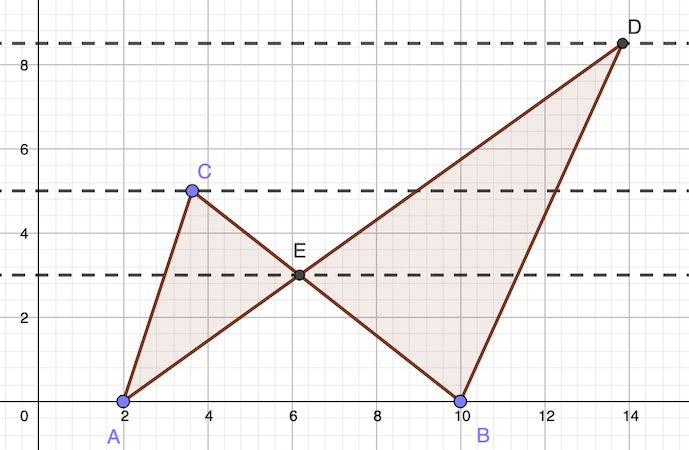
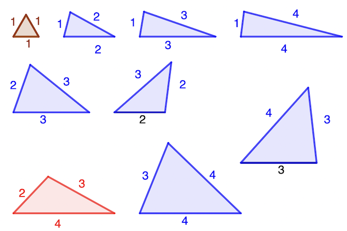
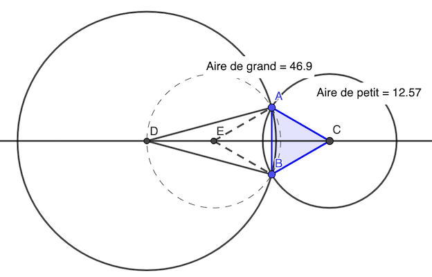

# Calendrier Mathématique Août 2021

## Lundi 2 Août

```text
8^672 - 2^2015 - 4^1007 - 2^2014
= 2^2016 - 2^2015 - 2^2014 - 2^2014
= 2^2014 (4 - 1 - 1 - 1)
= 0
```

Vérification avec [WolframAlpha](https://www.wolframalpha.com/input/?i=8%5E672+-+2%5E2015+-+4%5E1007+-+2%5E2014).

> réponse: 0

## Mardi 3 Août

Il faut qu'il se termine par 5. Il y en a 10, de 5 à 95.

```python
sum(1 for i in range(1, 100) if (i//4)%2==1 and i%5==0)
```

> réponse: 10

## Mercredi 4 Août



En plus du polygone régulier, on peut relier les points de trois manières différentes.

Le pentagone et l'étoile sont invariants dans la symétrie radiaire d'ordre 5, tant que les deux autres figures non.

Il y a donc 1 + 1 + 5 + 5 = 12 manières de relier 5 points, soit 11 de plus que le pentagone.

> réponse: 11

## Jeudi 5 Août

Soient L, l, h les dimensions de la caisse.

- aire de la caisse: L × l × 2 + l × h × 2 + L × h × 2 = 94
- somme des arêtes: (L + l + h) × 4 = 48

Calculons la diagonale de la caisse:  d² = h² + L² + l²

Les deux équations se simplifient en:

- L × l + l × h + L × h = 47
- L + l + h = 12

Remplaçons successivement L, l, h dans la première:

- L = 12 - l - h  ⇒  - hl + 12h + 12l - 47 = h² + l²
- l = 12 - L - h  ⇒  - hL + 12h + 12L - 47 = h² + L²
- h = 12 - L - l  ⇒  - lL + 12l + 12L - 47 = l² + L²

En additionnant les trois, on a:

- -47 × 3 + 12 × (h + l + L) × 2 - hl -hL -lL = 2 × d²
- -141 + 288 - 47 = 2 × d²
- 100 = 2 × d²

D'où la solution: d = 5 √2

> réponse: 5 √2 cm

## Vendredi 6 Août

Le diviseur et le quotient sont forcément 90+u et 9. En effet, 99 × 8 = 792 < 900 - 9 et 89 × 9 = 801 < 900 - 9.

99 × 9 = 891

Ainsi 900 = 9 * 99 + 9

> réponse: 900 / 99 = 9 reste 9

## Lundi 9 Août

Soit u ∈ [0, 9]. Observons deux éléments:

1. (10 a + u)⁵ = 10 × [un nombre] + u⁵
2. 0⁵ = 0, 1⁵ = 1, 2⁵ = 32, 3⁵ = 243, 4⁵ = 1024, 5⁵ = 3125, 6⁵ = 7776, 8⁵ = 32768, 9⁵ = 59049 : ainsi u⁵ se termine par u.

Le chiffre des unités de ∑ n⁵ va donc être celui de ∑ n.

∑ n (1,2021) = 2021 × 2022 / 2 = 2043231

Donc ∑ n⁵ se termine par 1.

Vérification Python:

```python
sum(n ** 5 for n in range(1, 2022)) % 10
```

> réponse: 1

## Mardi 10 Août

Pour que la moyenne des deux nombres soit entière, il faut les deux nombres soient de la même parité.

Le deuxième nombre a une chance sur deux d'être de la même parité.

> réponse: ½

## Mercredi 11 Août



Les diagonales d'un carré sont à 45° (bissectrices d'angles droits).

Ainsi les angles ACP et DCM valent 45°. Et comme ACD est droit, les points P,C,M sont alignés. Idem pour les points M,D,N O,B,N et P,A,O.

De plus, les angles CMD (et les autres) sont droits. Donc MNOP  est un rectangle (quatre angles droits).

CM = MD = OA = OB, PC = PA = ND = NB car les carrés CDKL et ABFE resp. ACIJ et BDHG sont de même dimension.

Donc MNOP est aussi un losange.

Rectangle losange = carré.

> réponse: carré

## Jeudi 12 Août

On peut additionner, multiplier par un nombre strictement positif, élever au carré, sans changer l'ordre de deux nombres positifs.

```text
1 / √2 - 1 / √6   ??   3 / 10     simplification
√2 / 2 - √6 / 6   ??   3 / 10     simplification
√2 (3 - √3) / 6   ??   3 / 10     factorisation par √2
√2 (3 - √3)       ??   9 / 5      multiplication par 6
2 (3 - √3)²       ??   81 / 25    au carré
9 - 6 √3 + 3      ??   81 / 50    division par 2
12 - 81 / 50      ??   6 √3       addition/soustraction
173 / 100         ??   √3         division par 6
29929 / 10000     ??   3          au carré
29929             ??   30000      multiplication
```

En définitive, on trouve que ?? est doit être <.

> réponse: 1 / √2 - 1 / √6 < 3 / 10

## Vendredi 13 Août

Le tavernier vend V + 2 × V = 3 × V litres vin, avec V entier.

La somme des 5 barils de vin doit être un multiple de 3.

∑ 15 16 18 19 20 31 = 119

15 ne convient pas, ni 16, ni 18, ni 19, ni 31. 20 en revanche convient.

Le tavernier a donc vendu 99 l de vin et il lui reste un baril de 20 l de bière.

> réponse: 20

## Lundi 16 Août

La probabilité de tirer 2 boules vertes est:

pv = 4 / 10 × 16 / (16 + N)

La probabilité de tirer 2 boules bleues est:

pb = 6 / 10 × N / (16 + N)

On doit avoir pv + pv = 29 / 50

(4 × 16 + 6 × N) / (10 × (16 + N)) = 29 / 50

⇒ 50 × (64 + 6 × N) = 29 × 10 × (16 + N)

⇒ 3200 + 300 × N = 4640 + 290 × N

⇒ 10 × N = 4640 - 3200 = 1440

⇒ N = 144

> réponse: N = 144

## Mardi 17 Août



Calculons les aires des différents triangles de la figure:

Calcul aire partie évidée:

- Aire AEB = 3 × 8 / 2 = 12

Calcul aire partie gauche:

- Aire ABBC = 5 × 8 / 2 = 20
- Aire AEC = 20 - AEB = 20 - 12 = 8

Calcul aire partie droite:

- Aire ABD = 8.5 × 8 / 2 = 34
- Aire BED = 34 - AEB = 34 - 12 = 22

Ainsi, aire ABCD = aire AEC + aire BED = 8 + 22 = 30

> réponse: 30 cm²

## Mercredi 18 Août

ax² + bx - 8 = 0

x (ax + b) = 8

x et ax + b étant entiers donc supérieurs ou égaux à 1, il faut -8 ≤ x ≤ 8

De plus, x doit être une puissance de 2 (1, 2, 4, 8), et (a, b) tels que ax + b = 8 / x

x = 8 est une solution de l'équation où a = 1 b = 8 par exemple.

> réponse: 8

## Jeudi 19 Août

Calcul avec [programme](19.py) Python

> réponse: 996506

## Vendredi 20 Août

> réponse: 2220

## Lundi 23 Août

Soit h la hauteur du parallèlograme, h1 celle du triangle ABP. h2 = h - h1 est la hauteur du triangle DPC.

AB × h = 12  (aire du parallèlogramme)

AB × h1 / 2 = 4  (aire du triangle ABP)

AB × (h2 + h1) = 12

AB × h2 + AB × h1 = 12

AB × h2 = 12 - 8 = 4

AB × h2 / 2 = 2

Donc l'aire du triangle DPC est 2.

> réponse: 2 cm

## Mardi 24 Août

(3^x - 3^y) (3^x + 3^y) = 9^x - 9^y

4 (3^x + 3^y) = 32

> réponse: 3^x + 3^y = 8

## Mercredi 25 Août

Le produit des entiers impairs jusqu'à 2021 est celui des entiers jusqu'à 2021 divisé par le produit des entiers pairs jusqu'à 2020.

Le produit des entiers pairs jusqu'à 2020 est: 2 × 4 × … × 2020, soit 2^1010 × (1 × 2 × … × 1010) = 2^1010 × 1010!

> réponse: 2021! / (2^1010 × 1010!)

## Jeudi 26 Août

Une fourmi pourra faire 2 aller-retours en 1h, soit ramener 2 × 2 = 4g. Pour ramener 5 kg, il faudra 5000 / 4 = 1250 fourmis.

> réponse: 1250

## Vendredi 27 Août



Il y a un triangle équilatéral (les autres sont semblables).

Il y a sept triangles isocèles (le rapport des longueurs font qu'ils ne sont pas semblables tandis que 4-4-2 est semblable à 2-2-1).

Il y a un triangle quelconque. Il ne peut y en avoir d'autre à cause de la règle des longueurs de côtés a + b > c.

> réponse: 9

## Lundi 30 Août

x - y = y² - x² = (y - x) (y + x)

d'où x + y = -1 puisque x ≠ y

> réponse: -1

## Mardi 31 Août



Par énoncé, le triangle ABC est équilatéral (isocèle en C et angle 60°).

En considérant le [cercle circonscrit](https://fr.wikipedia.org/wiki/Cercle_circonscrit_à_un_triangle) au triangle ABD, et le [théorème angle au centre](https://fr.wikipedia.org/wiki/Théorème_de_l%27angle_inscrit_et_de_l%27angle_au_centre), le E du cercle est tel que AEC = 2 × angle ADC = 30°. Donc AEB = 60° et par conséquent ABE est équilatéral car isocèle. Ce qui entraîne AE = AC = AB.

Le rapport Rg/p des [aires](https://fr.wikipedia.org/wiki/Aire_(géométrie)#Disque) du grand et petit cercles vaut AD² / AC², ou encore AD² / AE².

Le triangle ADE est isocèle, ses angles sont 15° (par énoncé) et 150° (somme des angles = 180°).

La [loi des cosinus](https://fr.wikipedia.org/wiki/Loi_des_cosinus) permet d'écrire:

AD² = AE² + DE² - 2 × AE × DE × cos DEA = 2 × AE² × (1 - cos DEA)

D'où Rg/p = 2 × (1 - cos 150°)

On a par [décalage de cosinus](https://fr.wikipedia.org/wiki/Identité_trigonométrique#Périodicité,_décalages): cos (𝜷 + π / 2) = - sin 𝜷

Ainsi cos 150° = - sin (150° - 90°) = - sin 60° = - √3 / 2

Rg/p = 2 × (1 + √3 / 2) = 2 + √3

> réponse: 2 + √3
