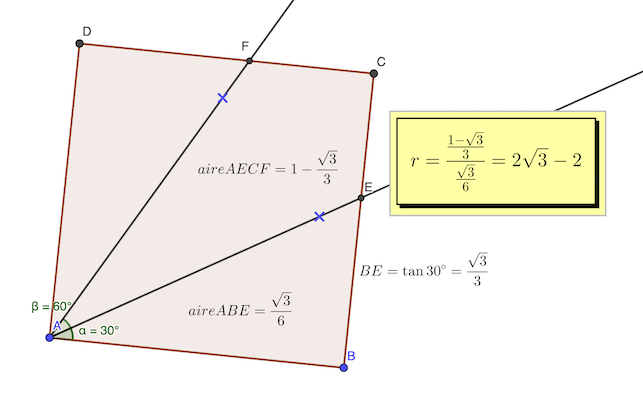

# Calendrier Mathématique Avril 2021

## Jeudi 1 Avril

On va utiliser le [théorème de l'angle au centre](https://fr.wikipedia.org/wiki/Théorème_de_l%27angle_inscrit_et_de_l%27angle_au_centre).

Ainsi BAX = 1/2 BOX = 45°

somme des angles du triangle BAX : (OXA + 45) + (20 + 45) + 45 = 180

OXA = 25°

> réponse: 25°

## Vendredi 2 Avril

soit x ∈ [0, 1] et y ∈ [0, 1]

min(x+2y) = min(x+√(1-x²))

la fonction a deux minimas: x=0 et x=1, et un maximum en x=√2/2

> réponse: 1

## Jeudi 8 Avril

On a une chance sur 40 de trouver une carte désignée.

> réponse: 1/40

## Vendredi 9 Avril

Cf. [script](09.py) Python.

> réponse: 56

## Lundi 12 Avril

1 + x = y² <br>
1 + y = x²

(1 + x) - (1 + y) = y² - x² <br>
⇒ -(y - x) = (y - x)(y + x)

2 possibilités:

* x = y
* x + y = -1

Si x = y:

x² - x - 1 = 0 <br>
⇒ x = y = (1 ± √5) / 2 ⇒ deux solutions

Si x + y = -1:

1 + x = (x + 1)² <br>
⇒  x² + 2x + 1 = x + 1 <br>
⇒  x² + x = 0 <br>
⇒  x (x + 1) = 0 <br>
⇒  x = 0, y = -1 ou x = -1, y = 0 ⇒ deux solutions

> réponse: 4

## Jeudi 15 Avril



[Notebook GeoGebra](15.ggb)

> réponse: 2 √3 - 2

## Mercredi 28 Avril

2021 = 43 × 47

A moins de travailler en base 48, on ne peut trouver de chiffres décimaux de 1 à 9 qui décomposent 2021.

> réponse: non

## Vendredi 30 Avril

Le polynome se factorise de la façon suivante :

```
n⁵ - 5n³ + 4 n
 = n ⋅ (n⁴ - 5n² + 4)
 = n ⋅ (n² - 4) ⋅ (n² - 1)
 = n ⋅ (n - 2) ⋅ (n + 2) ⋅ (n - 1) ⋅ (n + 1)
 = (n - 2) ⋅ (n - 1) ⋅ n ⋅ (n + 1) ⋅ (n + 2)

120 = 2³ × 3 × 5
    = 1 × 2 × 3 × 4 × 5
```

Le polynome est le produit de 5 nombres consécutifs, 120 = 5! est le produit de 5 nombres consécutifs. Donc quelquesoit n:
- n sera divisible par 2 ou 3 ou 4 ou 5
- n+1 sera divisible par 3 ou 4 ou 5 ou 2
- etc.

Si -2 ≤ n ≤ 2, alors le polynome est nul, il est aussi divisible par 120.

> réponse : ∀ n ∈ 𝐙
