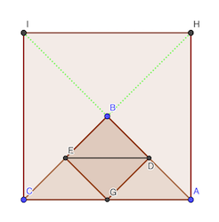
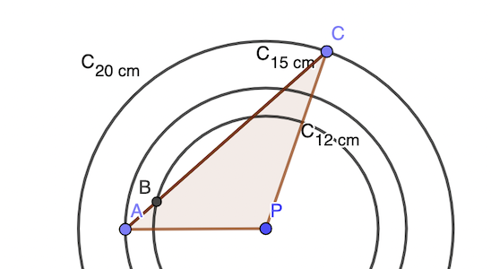
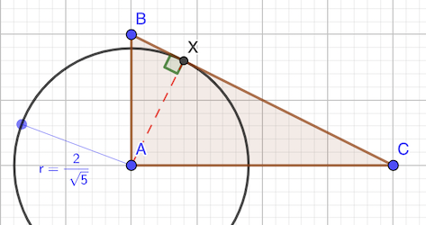
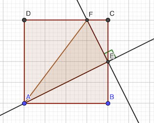
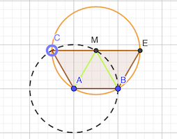

# Calendrier Mathématique Déccembre 2021

## Mercredi 1 Décembre

- 9 chiffres de 1 à 9
- 2 × 90 chiffres de 10 à 99
- 3 × 900 chiffres de 100 à 999
- 4 × 1022 chiffres de 1000 à 2021

Soit 9 + 2 × 90 + 3 × 900 + 4 × 1022 = 6977

Vérification en Python:

```python
len("".join(map(str, range(1, 2022))))
```

> réponse: 6977

## Jeudi 2 Décembre

Il n'y a que deux possibilités de suites sans nombres consécutifs à côté.

- 1 3 5 2 4
- 1 4 2 5 3

Elles correspondent d'ailleurs, au sens de rotation près.

Il y a donc 2 × 5 solutions.

Vérification avec [programme](02.py) Python.

```python
#!/usr/bin/env python3

import itertools

n = 0
for p in itertools.permutations("12345"):
    pp = "".join(p)  # recrée une chaine
    pp = pp + pp  # pour éliminer si le premier et le dernier sont consécutifs
    if "12" in pp or "23" in pp or "34" in pp or "45" in pp:
        continue
    if "21" in pp or "32" in pp or "43" in pp or "54" in pp:
        continue
    print("".join(p))
    n += 1
print("réponse:", n)
```

> réponse: 10

## Vendredi 3 Décembre

On a:

37² = AC² + AB²

AD² + AC² = CD² ⇒ AC² = 13² - 5² = 144 ⇒ AC = 12 cm

AB² = 37² - 144 = 1225

D'où AB = 35 cm et l'aire 35 × 12 / 2 = 210 cm²

> réponse: 210 cm²

## Lundi 6 Décembre



L'aire du triangle ABC est 8 cm². Les aires des petits triangles BED etc. est 2 cm². En effet E est le milieu de BC, G le milieu de CA et D le milieu de AD. Donc l'aire du trapèze est 6 cm².

> réponse: 6 cm²

## Mardi 7 Décembre

3n+2 est toujours impair. Donc les nombres à considérer doivent être impairs. De plus, ça ne peut pas être un multiple de 3 car 3n+2 n'est pas divisible par 3.

En carré impair entre 5 et 302 sans facteur 3, il y a 25 49 169 289.

- 25 - 2 = 22 pas divisible par 3 et pas ok
- 49 - 2 = 47 idem
- 169 - 2 = 167 idem
- 289 - 2 = 287 idem

> réponse: aucun

## Mercredi 8 Décembre

Autant compter avec un [programme](08.py).

```python
#!/usr/bin/env python3

import itertools
from sympy.ntheory import sieve

primes = sieve._list

n = 0
for p in itertools.permutations([2, 4, 6, 8]):
    for a, b in zip([1, 3, 5, 7], p):
        if a + b not in primes:
            break
    else:
        print(p)
```

> réponse: 6

## Jeudi 9 Décembre



On va essayer de maximiser l'aire du triangle APC.

Aire = AP × h / 2 avec h la hauteur issue de C. La valeur est maximale quand h = AC, qui est la plus grande valeur. Elle a pour valeur 20 × 15 / 2 = 150 cm².

Reste à vérifier si B est sur le cercle de 12 cm lorsque AP et AC sont perpendiculaires.

AC = √(AP² + AC²) = √(225 + 400) = √625 = 25.

La hauteur issue de P doit vérifier h × 25 / 2 = 150 pour que le calcul de l'aire soit correct. On trouve h = 12 cm. Donc AC coupe bien le cercle de 12 cm en un point P. De plus, B est tangent au cercle.

> réponse: 150 cm²

## Vendredi 10 Décembre

Soit a et p les âges de Arlette et Patrick en 2021.

- p - 3 = 3 (a - 3) / 4   ⇒   4p = 3a + 3  ①
- p + 3 = a - p + 20      ⇒   2p = a + 17  ②

① - 2 × ②   ⇒   a + 3 - 34 = 0, soit a = 31

> réponse: 31 ans

## Lundi 13 Décembre

(√a + √b)² = (√c)²

a + 2 √ab + b = c

Cela implique que √ab doit être un entier. C'est possible avec notamment a = pⁿ et b = pⁿ⁺² : ab = p²ⁿ⁺² et √ab = pⁿ⁺¹

> réponse: oui

## Mardi 14 Décembre

La première ligne a pour somme minimale 17 + 1 + 2 = 20. Les deux cases de la dernière doivent être remplies par 7 et 8. Si somme de la première ligne est supérieure à 20, la dernière ne pourra pas être remplie.

La troisième ligne doit ajouter 11, et une seule possibilité: 5 + 6.

La deuxième ligne: 13 + 3 + 4 = 20 : ça fonctionne.

Il y a un seul choix par ligne. 2⁴ = 16 choix si on tient compte de l'ordre.

> réponse: 16

## Mercredi 15 Décembre

Il y a n² lancés possibles. Le nombre de couples de nombres consécutifs est (n - 1) si le premier est plus petit et (n - 1) s'il est plus grand. On donc résoudre l'équation:

2(n - 1) / n² = 7 / 32

Cette équation admet deux solutions: 8 / 7 et 8. Comme n doit être entier, n = 8.

> réponse: 8

## Jeudi 16 Décembre

Ecrivons le système de quatre équations à quatre inconnus:

```text
camille + sasha + fille + fils = 85 ①
fille = fils + 5 ②
camille = sasha + 2 ③
sasha + 2 = 3 (fille + 2) ④
```

① avec ② et ③ : (sasha + 2) + sasha + (fils + 5) + fils = 85  ⇒ sasha + fils = (85 - 5 - 2) / 2 = 39  ⑤
④ : sasha + 2 = 3 ((fils + 5) + 2)                             ⇒ sasha - 3 fils = 21 - 2 = 19  ⑥

⑤ - ⑥ fils + 3 fils = 39 - 19 = 20 ⇒ fils = 5

On complète:

- fille = 5 + 5 = 10
- sasha = 3 × (10 + 2) - 2 = 34
- camille = 34 + 2 = 36

> réponse: camille=36 sasha=34 fille=10 fils=5

## Vendredi 17 Décembre

Les nombres candidats se terminent par 2 4 6 8 (divisibles par 4 et pas par 5). Et commmencent par 5 (inverse divisible par 5 et pas par 4).

Dans cette plage, seuls 52 et 56 conviennent (sinon pas de divibilité par 4).

> réponse: 52 et 56

## Lundi 20 Décembre

Ahmed tire :

- 1: aucune possibilité
- 2: aucune possibilité
- 3: Bernard doit faire un double 1 : 1 / 36
- 4: Bernard doit faire 1-1 1-2 : 3 / 36
- 5: Bernard doit faire 1-1 1-2 2-2 1-3 : 6 / 36
- 6: Bernard doit faire 1-1 1-2 2-2 1-3 1-4 2-3 : 10 / 36

Soit en tout 1 + 3 + 6 + 10 = 20 sur les 6³ tirages possibles = 20 / 216 = 5 / 54

[Programme](20.py) Python de vérification.

```python
#!/usr/bin/env python3

n = 0
for a in range(1, 7):
    for b1 in range(1, 7):
        for b2 in range(1, 7):
            if a > b1 + b2:
                # print(a,b1,b2)
                n += 1

print("réponse:", n, "/ 216")
```

> réponse: 5 / 54

## Mardi 21 Décembre



aire ABC = 1 × 2 / 2 = 1 cm²

BC = √(1 + 2²) = √5 cm

Soit AH la hauteur issue de A, H ∈ (BC). On a AH × BC / 2 = aire ABC = 1 cm².

D'où AH = 1 × 2 / BC = 2 / √5 cm. H est X sont donc confondus et il n'y a pas d'autre point X possible.

Ainsi, AX est la hauteur issue de A et donc AX est perpendiculaire à BC.

> réponse: 90°

## Mercredi 22 Décembre

Si a et b sont solutions de l'équation x² + ax + b = 0, on a:

- a² + a × a + b = 0  ⇒  2a² + b = 0 ①
- b² + a × b + b = 0  ⇒  a + b + 1 = 0  (b ≠ 0) ②

On en tire:

- ① - ② ⇒ 2a² - a - 1 = 0 ⇒ a = 1 ou - 1 / 2
- ② ⇒ b = -1 - a = -2 ou -1 / 2

On peut calculer les deux valeurs possibles de a - b:

- a - b = 1 - (-2) = 3
- a - b = -1 / 2 - (-1 / 2) = 0 : non valide car a ≠ b (énoncé)

> réponse: 3

## Jeudi 23 Décembre

- Etape 0: 7
- Etape 1: (7 - 1) + 7 = 13
- Etape 2: (13 - 1) + 7 = 19

Suite  uₒ = 7  uₙ = uₙ₋₁ + 6

uₙ = = n × 6 + 7

uₙ > 2021 ⇔ n × 6 + 7 > 2021 ⇔ n > 2014 / 6 ⇒ n > 335 et donc uₙ = 336 * 6 + 7 = 2023

> réponse: 2023

## Vendredi 24 Décembre

La somme de la ligne 4 est 14 et celle de la première 11. Si on supprime un nombre de la première la somme sera au maximum 10. Or, dans la dernière il faut supprimer 4 ou 7 si on veut une somme inférieure à 11.

Si on enlève 7, la somme à atteindre sera 7. Ce qui n'est pas possible avec la première ligne puisqu'on peut faire 6, 8, 9 ou 10.

Il faut donc enlève 4 à la dernière et la somme à atteindre est 10. Le tableau s'en suit.

> réponse: somme = 10

```text
2 * 5 3
3 4 3 *
1 3 * 6
* 2 1 7
```

## Lundi 27 Décembre



Les triangles ABE et CEF sont semblables (mêms angles).

Donc CF / CE = EB / AB = EF / AE = 1 / 2.

AE = √(2² + 4²) = √20 = 2√5

On en ddéuit que EF = V5

L'aire du triangle AEF est donc AE × EF / 2 = 2√5 × √5 / 2 = 5

> réponse: 5 cm²

## Mardi 28 Décembre


Soit t le temps en secondes.

Les angles des heures et minutes sont donnés par les formules suivantes:

- `h = ((t / 3600) * (360 / 12)) mod 360 = (t / 120) mod 360`
- `m = ((t / 60) * (360 / 60)) mod 360 = (t / 10) mod 360`

La relation d'angle est: m = 12 × h

Il faut résoudre  m - h = 90 + 180 × k, soit 11 × h = 90 + 180 × k

En 12h, les aiguilles seront perpendiculaires 22 fois. En 24h, le double.

> réponse: 44

## Mercredi 29 Décembre

a et n entiers

√a - √2021 = √n

a + 2021 - 2√(a 2021) = n

2021 = 43 × 47

Donc a doit être de la forme 43 × 47 × k² pour que √(a 2021) soit entier.

Si k = 1, √a - √2021 = 0 ❌
Si k = 2, 2√2021 - √2021 = 1 ✅

> réponse: 8084

## Jeudi 30 Décembre

Il y a 7! = 5040 façons de disposer les nombres 1 à 7.

Il y a 3! = 6 façons de disposer les nombres 1 à 3.

Ainsi parmi les 5040 permutations, il y en a une sur six dans laquelle 1 2 3 sont dans cet ordre.

5040 / 6 = 840

[Programme](30.py) Python de vérification.

```python
#!/usr/bin/env python3

from itertools import permutations

n = 0
for perm in permutations(range(1, 8)):
    prev = 0
    for i in perm:
        if i == 1 and prev == 0:
            prev = 1
        elif i == 2 and prev == 1:
            prev = 2
        elif i == 3 and prev == 2:
            n += 1
            break

print("réponse:", n)
```

> réponse: 840

## Vendredi 31 Décembre



Le quadrilatère doit être [inscriptible](https://fr.wikipedia.org/wiki/Quadrilatère_inscriptible). Donc les angles opposés sont supplémentaires. De plus, les triangles ACM et BEM sont isocèles du fait de la longueur de leurs côtés.

L'aire du quadrilatère vaut inscriptible:

A = √((s - a) (s - b) (s - c) (s - d)) avec s = (a + b + c + d) / 2

s = (1 + 1 + 1 + 2)/ 2  = 5 / 2

A = √((5 / 2 - 1)³ (5 / 2 - 2)) = √(27 / 16) = 3 / 4 √3

On a aussi A = 1 / 2 (bc + ad) sin 𝛄 = 3 / 2 sin 𝛄 avec 𝛄 = angle entre les côtés b et c

3 / 2 sin 𝛄 = 3 / 4 √3

sin 𝛄 = √3 / 2

𝛄 = 60° ou 120°

Donc on trouve que les angles du quadrilatère sont 60° ou 120°, que les triangles ACM et BEM sont équilatéraux et donc M le centre du cercle.

> réponse: 2 cm
