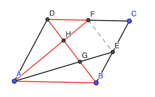

# Calendrier Mathématique Février 2021

## Lundi 1 Février

Cf. [programme](01.py) en Python.

> réponse: 90

## Mardi 2 Février

Mise en équation sous forme d'équations linéaires:

| filles | garçons | cheveux_clairs | cheveux_foncés | filles_cheveux_clairs | filles_cheveux_foncés | garçons_cheveux_clairs | garçons_cheveux_foncés | valeurs |
| ------ | ------- | -------------- | -------------- | --------------------- | --------------------- | ---------------------- | ---------------------- | ------- |
| filles=garçons | 1 | -1 | 0 | 0 | 0 | 0 | 0 | 0 | 0 |
| 40% foncés | 0,4 | 0,4 | 0 | -1 | 0 | 0 | 0 | 0 | 0 |
| 60% clairs | 0,6 | 0,6 | -1 | 0 | 0 | 0 | 0 | 0 | 0 |
| 75% foncés=filles | 0 | 0 | 0 | -0,75 | 0 | 1 | 0 | 0 | 0 |
| Σ filles | -1 | 0 | 0 | 0 | 1 | 1 | 0 | 0 | 0 |
| Σ garçons | 0 | -1 | 0 | 0 | 0 | 0 | 1 | 1 | 0 |
| Σ foncés | 0 | 0 | 0 | -1 | 0 | 1 | 0 | 1 | 0 |
|  | 1 | 0 | 0 | 0 | 0 | 0 | 0 | 0 | 50 |

résolution avec numpy avec un [script](02.py) Python.

> réponse: 40%

## Mercredi 3 Février

- aire triangle = c × a / 2
- aire trapèze = c × (b + a / 2)

- rapport 4:1 →
  - 4 × a / 2 = (b + a / 2)
  - 2 a = b + a / 2
  - 3/2 a = b ou a = 2/3 b

> réponse: b/a = 3/2

## Jeudi 4 Février

Calcul avec [script](04.py) Python.

> réponse:

```text
              [10]
     [14]  [ 6]  [12]  [ 2]
     [ 3]              [11]
[15]                        [ 1]
     [ 4]              [16]
     [13]  [ 7]  [ 9]  [ 5]
              [ 8]
```

## Vendredi 5 Février

| proposition | interprétation | équation |
| ----------- | -------------- | -------- |
| Pierre a trois plus de sœurs que de frères      | 3 frères = sœurs | 3 (garçons - 1) = filles |
| Pauline a deux fois plus de sœurs que de frères | 2 frères = sœurs | 2 garçons = filles - 1   |

- 2 garçons + 1 = 3 ( garçons - 1)  ⇒ garçons = 4
- filles = 1 + 2 garçons ⇒ filles = 9

> réponse: 4 garçons, 9 filles

## Lundi 8 Février

Cf. [programme](08.py) en Python.

> réponse: 2002

## Mardi 9 Février

demi-cercle + 2 carrés

- l'angle Θ centre/sommet est 45° (figure symétrique), donc a = √2 / 2
- aire des 2 petits carrés: (√2 / 2)² × 2 = 1

demi-cercle + 1 carré

- il faut que sin Θ = 2 cos Θ
- aire 1 carré: sin Θ × 2 cos Θ = sin² Θ
- or sin² Θ  = 1 - cos² Θ = 4 cos² Θ. donc on a cos² Θ = 1 / 5
- aire grand carré: 1 - 1 / 5 = 4 / 5

> réponse: 4 / 5

## Mercredi 10 Février

```text
+---+---o  +---+---+
| I | K |  | U | P |
+---+---+  +---o---+
    | M |      | K |
    +---+      +---+
```

Les faces U et P sont à côté de K (donc derrière et à droite sur le dessin 3D de IKM).
Le sens de rotation horaire U→P→K doit être respecté, la disposition est donc la suivante (le o désigne le même sommet du cube):

```text
    +---+
    | U |
+---+---o---+---+
| I | K | P |   |
+---+---+---+---+
    | M |
    +---+
```

> réponse: M

## Jeudi 11 Février

(a + d) + (b + d) + (c + d) = 7 + 10 + 12 = 29 = (a + b + c) + 3 × d

max(d) = 6  car x + d = 7 et x ≥ 1

donc max(a + b + c) = 29 - 3 × 6 = 11

> réponse: 11

[script](11.py) Python de recherche de toutes les valeurs

## Vendredi 12 Février

Voir [factordb](http://factordb.com/index.php?query=101010101010101010101), ou [wolframalpha](https://www.wolframalpha.com/input/?i=factor+101010101010101010101.0).

Ou avec [SageMath](https://sagecell.sagemath.org): `factor(101010101010101010101)`

Ou encore [SymPy](https://www.sympy.org/): `sympy.factorint(101010101010101010101)`

etc.

Mais ce n'est certainement la méthode attendue 😇

Il y a onze chiffres 1 aux positions impaires, et que des 0 aux positions paires. Le critère de divisibilité par 11 est rempli.

> réponse: 11

## Lundi 15 Février



Appliquons le théorème de Thalès:

- DF / AB = HD / HB = HF / HA
- EB / DA = GE / GA = GB / GD

On a:

- DF / AB = 1 / 2 car F est le milieu de [DG] et DG=AB
- HD = 1 cm par énoncé
- idem EB / DA et GB

On en déduit que HB = GD = 2 cm

Or HB = HG + GB donc HG = 1 cm

> réponse: 1 cm

## Mardi 16 Février

- en dessous du A, on peut mettre B, C, D ⇒ 3 possibilités
- en dessous de la lettre en dessous du A, on peut mettre A ou les 2 autres lettres ⇒ 3 possibilités
- en dessous des 2 autres, on n'a plus le choix puisqu'il reste 1 des 2 autres avec le A, ou les 2 autres

Confirmation avec [script](16.py) Python.

> réponse: 3 × 3 = 9

## Mercredi 17 Février

273 = a + ar + ar² = a (1 + r + r²)

273 = 3 × 7 × 13

1 + r + r² = r (r² - 1) / (r - 1)

- 1 + 1 + 1 = 3 ok
- 1 + 2 + 4 = 7 ok
- 1 + 3 + 9 = 13 ok
- 1 + 4 + 16 = 21 ok
- 1 + 5 + 25 = 31 ko
- 1 + 6 + 36 = 43 ko
- 1 + 7 + 49 = 57 ko
- 1 + 8 + 64 = 73 ko
- 1 + 9 + 81 = 91 ok
- 1 + 16 + 256 = 273 ok

Donc, les possibilités de couple (a, r) sont:

1. (91, 1)
2. (39, 2)
3. (21, 3)
4. (13, 4)
5. (3, 9)
6. (1, 16)

> réponse: 6

## Jeudi 18 Février

Il fait (2 + 2) km en (12 + 4) min, soit 4 km en 16 min.

V = 1 / 4 km⋅min⁻¹ = 60 / 4 km⋅h⁻¹

> réponse: 15 km⋅h⁻¹

## Vendredi 19 Février

À dessiner sur une feuille quadrillée…

> réponse: 6 cm²

## Lundi 22 Février

En une ligne de Python:

```bash
python3 -c "print(sum(1 for n in range(1000) if 7==sum(map(int,str(n)))))"
```

Pour dénombrer à la main, il faut considérer ces choix:

- 7 0 0
- 3 4 0
- 2 5 0
- 1 6 0
- 1 2 3
- 1 3 3

Avec 3! = 6 possibilités chaque, soit 36 en tout.

> réponse: 36

## Mardi 23 Février

Il faut que le nombre se termine par un chiffre pair, donc tous les chiffres doivent être pairs.

De plus les deux derniers chiffres doivent constituer un nombre divisible par 4: pas 02, 10, 06. Il ne reste que le 4 et le 8, soit 2^3=8 solutions.

> réponse: 8

## Mercredi 24 Février

Si l'essence est vendue 100:

- 65 taxes
- 35 production

Si l'essence coûte 35:

- 35 * 0.76 = 26.6 production
- 35 * 0.24 = 8.4 pétrole

Le pétrole passe à 8.4 + 10% = 9.24

Le prix de l'essence devient 65 + 26.6 + 9.24 = 100.84

Soit une augmenation de 0.84%

> réponse: 0.84%

## Jeudi 25 Février

L'aire des carrés avec intersection est 117 + 2 + 5 + 8 = 132 cm². L'aire des trois carrés est donc 132 + 2 + 5 + 8 = 147 cm².

Le côté est √(147/3) = √49 = 7 cm

> réponse: 7 cm

## Vendredi 26 Février

27000 = 27 × 8 × 125 = 2³ × 3³ × 5³

a × ar × ar² = a³ r³

On peut choisir (1, 30) (2, 15) (3, 10) (5, 6) et vice-versa pour (a, r).

> réponse: 8
