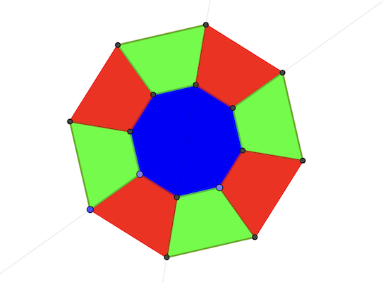
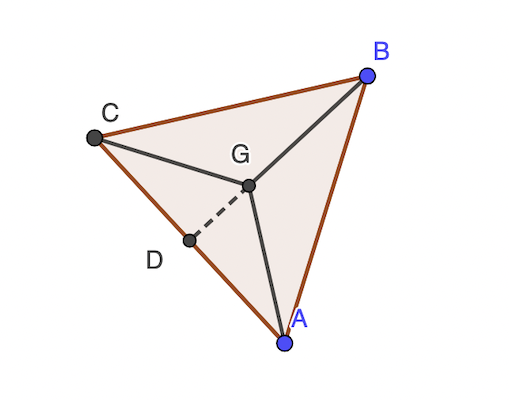
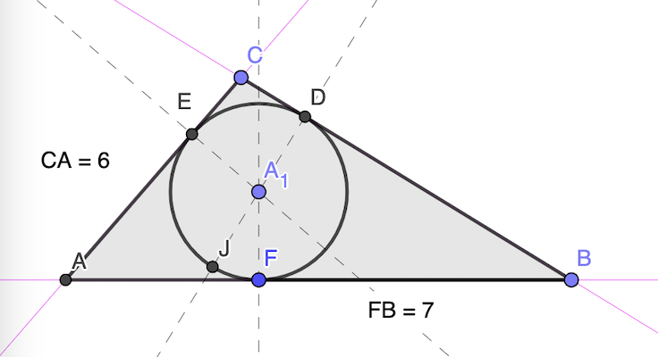
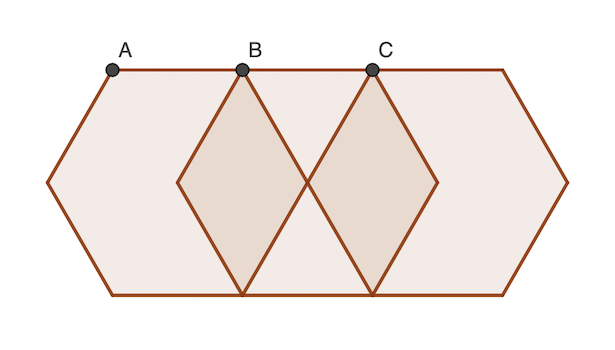
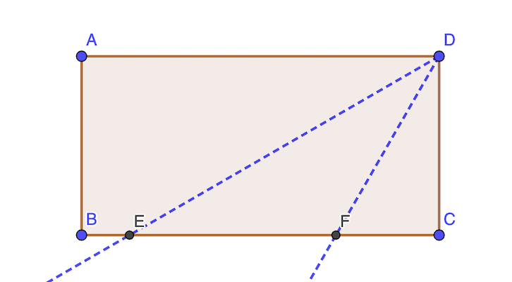

# Calendrier Mathématique Juillet 2021

## Jeudi 1 Juillet

Cf. [programme](01.py) Python.

> réponse: 72

## Vendredi 2 Juillet

Cf. [programme](02.py) Python.

> réponse: 14

## Lundi 5 Juillet


On doit avoir: CG = CB puisque la droite 𝓑 est la bissectrice de GCB.

Donc G est sur le cercle de centre E et de rayon CB.

cos 𝜶 = 1 / 2   𝜶 = 60°

𝜷 = 90° - 𝜶 / 2 = 60°

> réponse: 60°

## Mardi 6 Juillet

Ecrivons le fait que la moyenne après 𝑥 examens avec une note de 10 doit être supérieure ou égale à 9:

(8.3 × 5 + 10 × 𝑥) / (5 + 𝑥) ≥ 9  et 𝑥 entier

41.5 + 10 𝑥 - 9 𝑥 - 45 ≥ 0

𝑥 ≥ 3.5

Il faut au moins quatre 10 pour remonter la moyenne à plus que 9.

> réponse: 4

## Mercredi 7 Juillet

si a,c pairs: on a la somme de quatre nombres impairs, résultat pair

si a,c impairs: somme de quatre pairs, résultat pair

si a,b impair/pair: somme de 2 pairs et 2 impairs, résultat pair

> réponse: pair

## Jeudi 8 Juillet



Il y a 6 dispositions de couleur (3 pour le centre, puis 2 pour alterner les secteurs).

> réponse: 6

## Vendredi 9 Juillet



Les triangles isocèles sont équivalents à GAB GBC GCA, G = centre du triangle ABC (orthocentre, barycentre, cercles inscrit et circonscrit).

Pythagore permet de calculer AG:

AG² = (½ AG)² + (½)²

4 AG² - 3 AG² = 1

AG = 1 / √3

> réponse: 1 / √3 cm

## Lundi 12 Juillet

Soit Vr la vitesse de la rameuse et Vc celle du courant. Soit la d la distance parcourue dans un sens.

d = (Vr - Vc) * 3h = (Vr + Vc) × 2h

D'où: 3 Vr - 3 Vc = 2 Vr + 2 Vc ⇒ Vr = 5 Vc

d = Vr (1 + 1 / 5) * 2h  ⇒   Vr = d / 2 × 5 / 6 = 5 / 12 d  ⇒   d / Vr = 12 / 5

Pour parcourir 2 d, la rameuse va prendre:  2 d / Vr = 2 × 12 / 5 = 24 / 5 h

En minutes: 60 * 24 / 5 = 288, soit 240 + 48 ou encore 4h48

> réponse: 4h48

## Mardi 13 Juillet

11^x se termine toujours par 1 et 5^y toujours par 5. Donc la différence minimale est au moins 4.

Or celle-ci est atteinte pour x=2 et y=3. On ne pourra jamais faire moins.

> réponse: 4

## Mercredi 14 Juillet

20 + 40 + 45 = 105

105 billes en tout, réparties équitablement sur 3 sacs: 105 / 3 = 35 billes par sac

> réponse: 35

## Jeudi 15 Juillet

angle FDE = 90°  car FDC = 60° et CDE = 90 - EDA = 90° - 60° = 30°

donc DE² = 8 × 2 = 16 et DE = 4 cm, qui est aussi AB

> réponse: 4 cm

## Vendredi 16 Juillet

a != c sinon le trajet aurait duré 0h (l'énoncé ne le précise pas mais le sous-entend).

Donc le nombre d'heures est impair sinon (5 × 2k + c) mod 10 = c et on aurait a = c.

On obtient l'inégalité suivante: (c + 5) mod 10 = a ≥ 1

Si a=1 c=6 et b=0 et pas de solution si a ≥ 2, c vaudrait au moins 7 ce qui contredit a + b + c ≤ 7

Vérification: 601 - 106 = 496 = 55 × 9

> réponse: 106

## Lundi 19 Juillet

(10a + u)² = 100a² + 20au + u²

Il faudrait donc (a,u) tel que 2au + E(u² / 10) = u² (mod 10) avec u impair i.e. chiffre des dizaines = unité.

Le chiffre des dizaines de u² est toujours pair (0, 2, 4, 8). Ce qui revient à écrire: 2au + pair = u²

Ainsi u² serait pair, donc u également, ce qui est en contradiction avec l'hypothèse.

Donc u ne peut pas être impair. En revanche, il peut être pair. Exemple: 100

> réponse: non

## Mardi 20 Juillet

frère Léa => Léa n'est pas mathématicienne.

Océane plus jeune que ingénieure => comme mathématicienne plus âgée, Océane est la plus jeune et physicienne.

Léa est donc ingénieure.

La seule possibilité restante est Marie mathématicienne.

> réponse: mathématicienne

## Mercredi 21 Juillet



On a BF = DF, AE = AF, EC = DC (car DFB etc. sont isocèles)

```text
p = BF + BD + AF + AE + CE + CD
  =  7 +  7 + (AF + CD) + (AE + CE)
  =  7 +  7 +     6     +     6
  = 26
```

> réponse: 26 cm

## Jeudi 22 Juillet

On doit avoir 62424 / (30 + u) = entier. Décomposons 62424 en produit de facteurs premiers :

62424 = 2 × 2 × 2 × 3 × 3 × 3 × 17 × 17

On a deux candidats entre 30 et 39: 36 et 34

```text
  1734          1836
×   36        ×   34
------        ------
 10404          7344
 5202.         5508.
------        ------
 62424         62424
```

C'est la deuxième multiplication qui correspond aux étoiles.

> réponse: 1836 × 34

## Vendredi 23 Juillet

On doit avoir n × 31 + r = 500. r est donc le reste de la division entière de 500 par 31, soit 4.

> réponse: 4

## Lundi 26 Juillet



On considère les hexagones ayant un côté supérieur sur la ligne du haut, le côté inférieur sur la ligne de bas, et les autres côtés sur les lignes brisées reliant le haut du bas.

Hexagones ayant le sommet haut gauche sur le point:

- A: 5
- B: 2 × 3
- C: 2 × 1

> réponse: 12 hexagones

## Mardi 27 Juillet



AD / EA = tan 30°
AD / FA = tan 60°

EA - FA = AD / tan 30° - AD / tan 60° = AD × (√3 - 1 / 3) = AD × 2 V3 / 3

aire DEF = AD × EF / 2 = AD² × √3 / 3

aire ABCD = DC × BC = 2 × BC × BC = 2 × AD²

rapport aire DEF / aire ABCD : √3 / 6

> réponse: √3 / 6

## Mercredi 28 Juillet

C'est 2021 répété 2020 / 4 = 505 fois.

La somme des chiffres est donc 5 × 505 = 2525

Il faut enlever 504, soit au mieux 252 chiffres 2 (puisqu'il n'y a que des 0, 1, 2).

> réponse: 252

## Jeudi 29 Juillet

- x₀ = 1
- xₙ₊₁ = xₙ × 2 + 1

On obtient successivement les nombres 1, 3, 7, 15, etc.

Montron que f(n) = 2ⁿ⁺¹ - 1.

f(n + 1) = 2 × f(n) + 1 = 2 × (2ⁿ⁺¹ - 1) + 1 = 2ⁿ⁺² - 1.

Donc f(12) = 2¹³ - 1 = 8192 - 1 = 8191

> réponse: 8191

## Vendredi 30 Juillet

On place les moutons: ▢ M ▢ M ▢ M ▢ M ▢ M ▢

Il y a 6 places libres ▢ pour placer les 4 chiens.

- Nombre de permutations des moutons: 5! = 120
- Nombre de permutations des chiens: 4! = 24
- Nombre de placements des chiens dans ▢: C(6, 4) = (6! / (4! × (6 - 4!)) = 15
- Donc: N = 120 × 24 × 15 = 43200

Vérification en Python:

```python
import itertools
print(sum(1 for i in itertools.permutations("CCCCMMMMM") if "".join(i).find("CC") == -1))
```

> réponse: 43200
