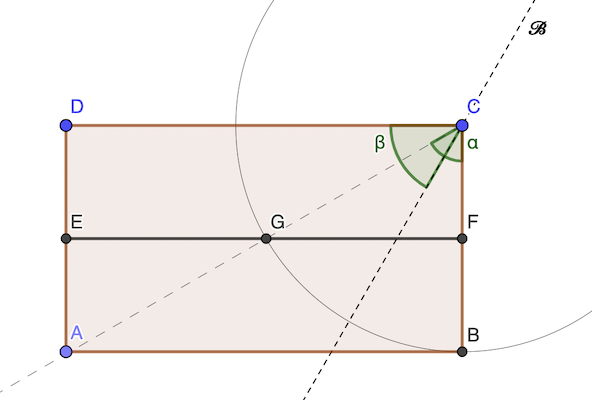

# Calendrier Mathématique Juillet 2021

## Jeudi 1 Juillet

Cf. [programme](01.py) Python.

> réponse: 72

## Vendredi 2 Juillet

Cf. [programme](02.py) Python.

> réponse: 14

## Lundi 5 Juillet

On doit avoir: CG = CB puisque la droite 𝓑 est la bissectrice de GCB.

Donc G est sur le cercle de centre E et de rayon CB.

cos 𝜶 = 1 / 2   𝜶 = 60°

𝜷 = 90° - 𝜶 / 2 = 60°

> réponse: 60°

## Mardi 6 Juillet

Ecrivons le fait que la moyenne après 𝑥 avec une note de 10 doit être supérieure ou égale à 9:

(8.3 × 5 + 10 × 𝑥) / (5 + 𝑥) ≥ 9  et 𝑥 entier

41.5 + 10 𝑥 - 9 𝑥 - 45 ≥ 0

𝑥 ≥ 3.5

Il faut au moins quatre 10 pour remonter la moyenne à plus que 9.

> réponse: 4

## Mercredi 7 Juillet

si a,c pairs: on a la somme de quatre nombres impairs, résultat pair

si a,c impairs: somme de quatre pairs, résultat pair

si a,b impair/pair: somme de 2 pairs et 2 impairs, résultat pair

> réponse: pair

## Jeudi 8 Juillet

Il y a 6 dispositions de couleur (3 pour le centre, puis 2 pour alterner les secteurs).

> réponse: 6

## Vendredi 9 Juillet

Les triangles isocèles sont équivalents à GAB GBC GCA, G = centre du triangle ABC (orthocentre, barycentre, cercles inscrit et circonscrit).

Pythagore permet de calculer AG:

AG² = (½ AG)² + (½)²

4 AG² - 3 AG² = 1

AG = 1 / √3

> réponse: 1 / √3 cm
