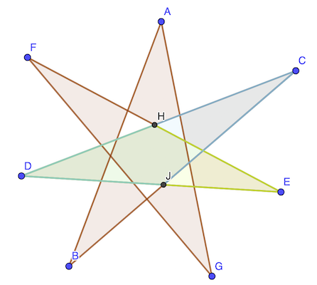

# Calendrier Mathématique Juin 2021

## Mardi 1 Juin

```text
10^2021 - 2 × 4^1010
 = 10^2021 - 2 × 2^2020
 = 10^2021 - 2^2021
 = 2^2021 × (5^2021 - 1)
```

Or, à partir de la puissance 3, toutes les puissances impaires de 5 se « terminent » par 125, et les puissances paires se terminent par 625. Donc `5^2021` se termine par 125.

Ainsi `5^2021 - 1` se termine par 124 et on peut donc encore diviser deux fois par 2. Le chiffre de l'unité sera 1.

### Vérification en Python

```python
((10 ** 2021 - 2 * 4 ** 1010) // 2 ** 2023) % 10
```

> réponse: 2023

## Mercredi 2 Juin

On a:

```text
b = (a + a+1 + a+2 + a+3 + a+4) / 5
  = (5a + 10) / 5
  = a + 2
```

De la même façon, la moyenne des cinq entiers consécutifs commençant par b vaut `b + 2`.

> réponse: a + 4

## Jeudi 3 Juin

Avec les cubes de la face, on peut créer ces différents pavés:

- 1×1 1×2 1×3 1×4 : pavés de largeur un cube
- 2×1 2×2 2×3 2×4 : pavés de largeur deux cubes
- 3×1 3×2 3×3 3×4 : etc.

Avec les trois tranches, on peut faire autant de pavés ci-dessus mais d'épaisseur 1, 2 ou 3 cubes.

On peut donc faire `4 × 3 × 3 = 36` pavés différents.

> réponse: 36

## Vendredi 4 Juin


Entre les carrés il y a trois triangles isocèles de côté 1 cm et d'angle 120°.

Calculons l'aire de ces triangles avec la trigonométrie:

- hauteur (depuis A): `h = 1 × cos(120°/2) = 1/2`
- base (opposée à A) = `b = 2 × (1 × sin(120°/2)) = 2×√3/2 = √3`
- aire = `b × h / 2 = √3/4`

L'aire d'un carré est 1 cm², l'aire d'un triangle √3/4 cm².

L'hexagone est donc constitué quatre triangles et trois carrés.

aire = `4 x √3/4 + 3 × 1`

> réponse: 3 + √3 cm²

## Lundi 7 Juin

Cf. [programme](07.py) en Python.

```python
#!/usr/bin/env python3

# 7 Juin

import itertools

n = set()
for a, b in itertools.product([1, 3, 5, 7, 9], repeat=2):
    n.add(a + b)

print("n:", n)
print("réponse:", len(n))
```

```python
#!/usr/bin/env python3

# 7 Juin

import itertools

n = set()
for a, b in itertools.product([1, 3, 5, 7, 9], repeat=2):
    n.add(a + b)

print("n:", n)
print("réponse:", len(n))
```

```python
#!/usr/bin/env python3

# 7 Juin

import itertools

n = set()
for a, b in itertools.product([1, 3, 5, 7, 9], repeat=2):
    n.add(a + b)

print("n:", n)
print("réponse:", len(n))
```

Nota: la réponse du livret permet d'additionner le nombre à lui-même. Ce qui n'est pas clair dans l'énoncé. Si on prend que des additions de nombres différents le résultat est 7.

> réponse: 9

## Mardi 8 Juin


Toutes les autres façons sont similaires à une rotation ou une symétrique près.

> réponse: 4 (ou 4×7=28 en tenant compte des symétries)

## Mercredi 9 Juin

Cf. [programme](09.py) en Python.

```python
#!/usr/bin/env python3

# 9 Juin

import itertools

e = range(1, 6)
n = set()
for s in itertools.product([-1, 1], repeat=5):
    r = sum(a * b for a, b in zip(e, s))
    # print(e, s, r)
    n.add(r)

# print("e:", e)
# print("n:", n)
print("réponse:", len(n))
```

```python
#!/usr/bin/env python3

# 9 Juin

import itertools

e = range(1, 6)
n = set()
for s in itertools.product([-1, 1], repeat=5):
    r = sum(a * b for a, b in zip(e, s))
    # print(e, s, r)
    n.add(r)

# print("e:", e)
# print("n:", n)
print("réponse:", len(n))
```

```python
#!/usr/bin/env python3

# 9 Juin

import itertools

e = range(1, 6)
n = set()
for s in itertools.product([-1, 1], repeat=5):
    r = sum(a * b for a, b in zip(e, s))
    # print(e, s, r)
    n.add(r)

# print("e:", e)
# print("n:", n)
print("réponse:", len(n))
```

> réponse: 16

## Jeudi 10 Juin

Notons 𝜶, 𝜷, 𝜸, 𝜹 les angles en A, B, C, D. L'énoncé se traduit par les inéquations suivantes:

- 𝜶 + 𝜷 + 𝜸 < 270
- 𝜷 + 𝜸 + 𝜹 < 270
- 𝜸 + 𝜹 + 𝜶 < 270
- 𝜹 + 𝜶 + 𝜷 < 270

Soit:

- 3 × (𝜶 + 𝜷 + 𝜸 + 𝜹) < 4 × 270
- 𝜶 + 𝜷 + 𝜸 + 𝜹 < 360

Or, on doit avoir 𝜶 + 𝜷 + 𝜸 + 𝜹 = 360° dans un quadrilatère.

> réponse: non

## Vendredi 11 Juin

Cf. [programme](11.py) en Python.

```python
#!/usr/bin/env python3

# 11 Juin

# sans programme, il faut éliminer de la liste les carrés et leurs mutiples:
# 4 8 9 12 16 18 20
# il reste 13 nombres

import itertools

squares = set(n * n for n in range(1, 21))

n = 20
while n > 1:

    # toutes les permutations de n nombres entre 1 et 20
    for factors in itertools.combinations(range(1, 21), n):

        # est-ce qu'il y a deux nombres dont le produit forme un carré ? (ex: 1 et 9)
        for a, b in itertools.combinations(factors, 2):
            if a * b in squares:
                break
        else:
            print(f"{n} est ok", factors)
            break
    else:
        n -= 1
        continue
    break

print("réponse:", n)
```

```python
#!/usr/bin/env python3

# 11 Juin

# sans programme, il faut éliminer de la liste les carrés et leurs mutiples:
# 4 8 9 12 16 18 20
# il reste 13 nombres

import itertools

squares = set(n * n for n in range(1, 21))

n = 20
while n > 1:

    # toutes les permutations de n nombres entre 1 et 20
    for factors in itertools.combinations(range(1, 21), n):

        # est-ce qu'il y a deux nombres dont le produit forme un carré ? (ex: 1 et 9)
        for a, b in itertools.combinations(factors, 2):
            if a * b in squares:
                break
        else:
            print(f"{n} est ok", factors)
            break
    else:
        n -= 1
        continue
    break

print("réponse:", n)
```

```python
#!/usr/bin/env python3

# 11 Juin

# sans programme, il faut éliminer de la liste les carrés et leurs mutiples:
# 4 8 9 12 16 18 20
# il reste 13 nombres

import itertools

squares = set(n * n for n in range(1, 21))

n = 20
while n > 1:

    # toutes les permutations de n nombres entre 1 et 20
    for factors in itertools.combinations(range(1, 21), n):

        # est-ce qu'il y a deux nombres dont le produit forme un carré ? (ex: 1 et 9)
        for a, b in itertools.combinations(factors, 2):
            if a * b in squares:
                break
        else:
            print(f"{n} est ok", factors)
            break
    else:
        n -= 1
        continue
    break

print("réponse:", n)
```

> réponse: 13

## Lundi 14 Juin

- 26200 / 72 = 363.89
- 26290 / 72 = 365.13

le premier facteur peut être 364 ou 365. Comme son chiffre des unités est forcément 5 (5*2=10), c'est 365.

> réponse: 26280 / 365 = 72

## Mardi 15 Juin

Cf. [programme](15.py) en Python.

```python
#!/usr/bin/env python3

# 15 Juin

nb = 0
for n in range(10000, 100000):
    s = 0
    while n != 0:
        n, u = divmod(n, 10)
        s += u
    if s % 10 == 7:
        nb += 1

print("réponse:", nb)
```

```python
#!/usr/bin/env python3

# 15 Juin

nb = 0
for n in range(10000, 100000):
    s = 0
    while n != 0:
        n, u = divmod(n, 10)
        s += u
    if s % 10 == 7:
        nb += 1

print("réponse:", nb)
```

```python
#!/usr/bin/env python3

# 15 Juin

nb = 0
for n in range(10000, 100000):
    s = 0
    while n != 0:
        n, u = divmod(n, 10)
        s += u
    if s % 10 == 7:
        nb += 1

print("réponse:", nb)
```

> réponse: 9000

## Mercredi 16 Juin

La "petite" diagonale fait 4m.

Pour un carré de côté a, la formule de cette "petite" diagonale est:
`√(a² + (a/2)²) = a × √(1+1/4) = a × √5 / 2`

Ici `a = 4 / (√5 / 2) = 8 / √5 m`.

La surface de la piscine est donc: `5 a² = 5 × (8 / √5)² = 5 × 8² / 5 = 64 m²`

> réponse: 64 m²

## Jeudi 17 Juin

Cf. [programme](17.py) en Python.

```python
#!/usr/bin/env python3

# 23 Juin

import itertools
import re

n = 0
while True:
    n += 1
    for k in range(2, 10):
        if n % k != k - 1:
            # le modulo k n'est pas ok
            break
    else:
        # tous les modulo sont ok
        break

print(n)
```

```python
#!/usr/bin/env python3

# 23 Juin

import itertools
import re

n = 0
while True:
    n += 1
    for k in range(2, 10):
        if n % k != k - 1:
            # le modulo k n'est pas ok
            break
    else:
        # tous les modulo sont ok
        break

print(n)
```

```python
#!/usr/bin/env python3

# 23 Juin

import itertools
import re

n = 0
while True:
    n += 1
    for k in range(2, 10):
        if n % k != k - 1:
            # le modulo k n'est pas ok
            break
    else:
        # tous les modulo sont ok
        break

print(n)
```

> réponse: 2519

## Vendredi 18 Juin

On peut utiliser la fonction log(x)/x pour déterminer le signe de `√2 - 5^(1/5)`. Sa dérivée étant (1-log(x))/x² , on constate que la fonction est croissante jusqu'à x=𝒆 puis décroit.


Le signe de `f(x) = log(x)/x - log(2)/2` est positif entre 2 et 4 puis négatif > 4 (racines 2 et 4)

Donc `log(5)/5 - log(2)/2 < 0`.

D'où: `5^(1/5) < 2^(1/2)`.

> réponse: √2

## Lundi 21 Juin

Antoine peut mentir et Xavier dire la vérité. Aucune des deux déclarations n'est erronée:

- Antoine: « Quand je dis la vérité, toi aussi ». Si Antoine ment, Xavier peut faire ce qu'il veut.
- Xavier: « Quand je ments, toi aussi ». Si Xavier dit la vérité, Antoine peut mentir.

> réponse: oui ⚠️

PS: je trouve le problème mal formulé... la solution officielle sous-entend qu'il y a bijection entre les dires d'Antoine et Xavier alors que la formulation est plus proche d'une injection.

## Mardi 22 Juin


- coordonnées point M: (15/2, (6+9/2)) = (7.5, 7.5)
- coefficient directeur (CD): (9-6)/15 = 3/15 = 1/5
- coefficient directeur (MP): -5
- équation médiatrice (doit passer par M): `y = -5*(x-7.5)+7.5 = -5x + 5 * 7.5 + 7.5 = -5x+45`

D'où les coordonnées du point P: (9, 0)  (solution de l'équation `-5x+45 = 0`)

> réponse: 6 m

## Mercredi 23 Juin

Cf. [programme](23.py) en Python.

```python
#!/usr/bin/env python3

# 23 Juin

import itertools
import re

k = 0
while True:
    k += 1

    # construit le facteur 88888...8 (k chiffres)
    nk = 0
    for _ in range(k):
        nk = nk * 10 + 8

    n = 8 * nk

    # calcule la somme des chiffres
    s = 0
    while n != 0:
        n, r = divmod(n, 10)
        s += r

    # n = re.sub(r"(1+)", lambda x: f"<1×{len(x[1])}>" if len(x[1]) > 10 else x[1], str(8 * nk))
    # print(k, n, s)

    if s == 1000:
        break

print("réponse:", k)
```

```python
#!/usr/bin/env python3

# 23 Juin

import itertools
import re

k = 0
while True:
    k += 1

    # construit le facteur 88888...8 (k chiffres)
    nk = 0
    for _ in range(k):
        nk = nk * 10 + 8

    n = 8 * nk

    # calcule la somme des chiffres
    s = 0
    while n != 0:
        n, r = divmod(n, 10)
        s += r

    # n = re.sub(r"(1+)", lambda x: f"<1×{len(x[1])}>" if len(x[1]) > 10 else x[1], str(8 * nk))
    # print(k, n, s)

    if s == 1000:
        break

print("réponse:", k)
```

```python
#!/usr/bin/env python3

# 23 Juin

import itertools
import re

k = 0
while True:
    k += 1

    # construit le facteur 88888...8 (k chiffres)
    nk = 0
    for _ in range(k):
        nk = nk * 10 + 8

    n = 8 * nk

    # calcule la somme des chiffres
    s = 0
    while n != 0:
        n, r = divmod(n, 10)
        s += r

    # n = re.sub(r"(1+)", lambda x: f"<1×{len(x[1])}>" if len(x[1]) > 10 else x[1], str(8 * nk))
    # print(k, n, s)

    if s == 1000:
        break

print("réponse:", k)
```

> réponse: 991

## Jeudi 24 Juin


Résolution avec [WolframAlpha](http://wolframalpha.com) de l'équation: x^4-2x^3-7x^2-2x+1=0

- x1 = 1/2 (1 - √10 - √(7 - 2√10))
- x2 = 1/2 (1 - √10 + √(7 - 2√10))
- x3 = 1/2 (1 + √10 - √(7 + 2√10))
- x4 = 1/2 (1 + √10 + √(7 + 2√10))

- 2/(1 - √10 - √(7 - 2√10)) + 2/(1 - √10 + √(7 - 2√10)) + 2/(1 + √10 - √(7 + 2√10)) + 2/(1 + √10 + √(7 + 2√10))

> réponse: 2

## Vendredi 25 Juin

Cf. [programme](25.py) en Python.

```python
#!/usr/bin/env python3

# 25 Juin

import itertools

solution = None
nb_ok = 0
nb_ko = 0

# pour toutes les permutations des nombres de 1 à 5 (i.e. dispositions sur le cercle)
for perm in itertools.permutations(range(1, 6)):

    # ensemble des nombres qu'on peut obtenir
    m = set()

    # commence par chacun des nombres
    for start in range(5):
        # fait la somme de 1 à 5 nombres consécutifs
        for count in range(1, 6):
            # le modulo permet de boucler sur le cercle
            s = sum(perm[i % 5] for i in range(start, start + count))

            # ajoute dans la somme dans la liste de vérification
            m.add(s)

    if len(m) == 15 and m == set(range(1, 16)):
        nb_ok += 1
        # print("ok", perm, m)
        if not solution:
            solution = perm
    else:
        nb_ko += 1
        # print("ko", nb, m)

print("ok/ko:", nb_ok, nb_ko)

print("réponse:", perm)

# il y a en fait 100 réponses ok sur les 5!=120 dispositions possibles
```

```python
#!/usr/bin/env python3

# 25 Juin

import itertools

solution = None
nb_ok = 0
nb_ko = 0

# pour toutes les permutations des nombres de 1 à 5 (i.e. dispositions sur le cercle)
for perm in itertools.permutations(range(1, 6)):

    # ensemble des nombres qu'on peut obtenir
    m = set()

    # commence par chacun des nombres
    for start in range(5):
        # fait la somme de 1 à 5 nombres consécutifs
        for count in range(1, 6):
            # le modulo permet de boucler sur le cercle
            s = sum(perm[i % 5] for i in range(start, start + count))

            # ajoute dans la somme dans la liste de vérification
            m.add(s)

    if len(m) == 15 and m == set(range(1, 16)):
        nb_ok += 1
        # print("ok", perm, m)
        if not solution:
            solution = perm
    else:
        nb_ko += 1
        # print("ko", nb, m)

print("ok/ko:", nb_ok, nb_ko)

print("réponse:", perm)

# il y a en fait 100 réponses ok sur les 5!=120 dispositions possibles
```

```python
#!/usr/bin/env python3

# 25 Juin

import itertools

solution = None
nb_ok = 0
nb_ko = 0

# pour toutes les permutations des nombres de 1 à 5 (i.e. dispositions sur le cercle)
for perm in itertools.permutations(range(1, 6)):

    # ensemble des nombres qu'on peut obtenir
    m = set()

    # commence par chacun des nombres
    for start in range(5):
        # fait la somme de 1 à 5 nombres consécutifs
        for count in range(1, 6):
            # le modulo permet de boucler sur le cercle
            s = sum(perm[i % 5] for i in range(start, start + count))

            # ajoute dans la somme dans la liste de vérification
            m.add(s)

    if len(m) == 15 and m == set(range(1, 16)):
        nb_ok += 1
        # print("ok", perm, m)
        if not solution:
            solution = perm
    else:
        nb_ko += 1
        # print("ko", nb, m)

print("ok/ko:", nb_ok, nb_ko)

print("réponse:", perm)

# il y a en fait 100 réponses ok sur les 5!=120 dispositions possibles
```

> réponse: (1, 2, 3, 4, 5)   (parmi plein d'autres)

## Lundi 28 Juin



On considère les triangles formés par deux branches "opposées":

- D + E + H = 180  (somme angles triangle = 180°)
- D + C + J = 180
- etc.

En additionnant les 7 égalités, on obtient:

- 2 × (A + B + C + D + E + F + G) = 180 × 7 -  (H + J + K + L + M + N + O)

Le terme de droite est la somme des angles de l'heptagone inscrit, qui vaut 180 × (n - 2) = 900°

Donc, 2 × ∑ = 180 × 7 - 900 = 1260 - 900 = 360°

> réponse: 180°

## Mardi 29 Juin

```text
∑(x) = 5 × a
∑(y) = 8 × b
∑(x,y) = k × (a + b)  k ∈ 𝐍⋆

k × (a + b) = 5 × a + 8 × b

k × (1 + b / a) = 5 + 8 × b / a

k + k × b / a = 5 + 8 × b / a
k - 5 = (8 - k) * b / a
b / a = (k - 5) / (8 - k)

k = 6 ou 7  (c'est un entier, 5 et 8 sont exclus, <5 ou >8 donne un ratio négatif, ce qui est aussi exclu)

D'où: b / a = 1/2 ou 2
```

> réponse: 1/2 ou 2

## Mercredi 30 Juin

- 2 vis + 3 clou + 1 écrou = 5  (eq1)
- 1 vis + 2 clou + 2 écrou = 7  (eq2)
- 5 vis + 9 clou + 7 écrou = ?  (eq3)

Il manque une équation pour déterminer les valeurs de vis,clou,écrou. Il faut donc trouver une relation linéaire entre les deux premières équations.

On fait (eq1)+3*(eq2) et on tombe sur (eq3). La valeur cherchée est dans 5+3×7.

> réponse: 26
