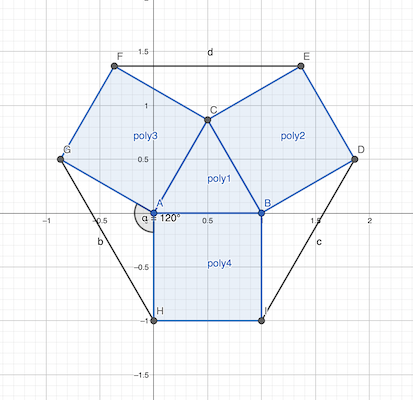

# Calendrier Mathématique Juin 2021

## 1 Juin

```
10^2021 - 2 × 4^1010
 = 10^2021 - 2 × 2^2020
 = 10^2021 - 2^2021
 = 2^2021 × (5^2021 - 1)
```

Or, à partir de la puissance 3, toutes les puissances impaires de 5 se « terminent » par 125, et les puissances paires se terminent par 625. Donc `5^2021` se termine par 125.

Ainsi `5^2021 - 1` se termine par 124 et on peut donc encore diviser deux fois par 2. Le chiffre de l'unité sera 1.

_Vérification en Python_
```python
>>> ((10 ** 2021 - 2 * 4 ** 1010) // 2 ** 2023) % 10
1
```

> réponse: 2023


## 2 Juin

On a:
```
b = (a + a+1 + a+2 + a+3 + a+4) / 5
  = (5a + 10) / 5
  = a + 2
```

De la même façon, la moyenne des cinq entiers consécutifs commençant par b vaut `b + 2`.

> réponse: a + 4


## 3 Juin

Avec les cubes de la face, on peut créer ces différents pavés:
- 1×1 1×2 1×3 1×4 : pavés de largeur un cube
- 2×1 2×2 2×3 2×4 : pavés de largeur deux cubes
- 3×1 3×2 3×3 3×4 : etc.

Avec les trois tranches, on peut faire autant de pavés ci-dessus mais d'épaisseur 1, 2 ou 3 cubes.

On peut donc faire `4 × 3 × 3 = 36` pavés différents.

> réponse: 36


## 4 Juin



Entre les carrés il y a trois triangles isocèles de côté 1 cm et d'angle 120°.

Calculons l'aire de ces triangles avec la trigonométrie:
- hauteur (depuis A): `h = 1 × cos(120°/2) = 1/2`
- base (opposée à A) = `b = 2 × (1 × sin(120°/2)) = 2×√3/2 = √3`
- aire = `b × h / 2 = √3/4`

L'aire d'un carré est 1 cm², l'aire d'un triangle √3/4 cm².


L'hexagone est donc constitué quatre triangles et trois carrés.

aire = `4 x √3/4 + 1`

> réponse: 1 + √3 cm²
