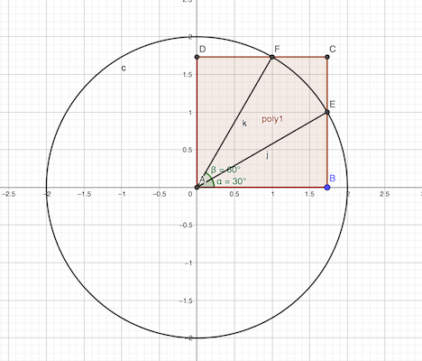

# Calendrier Mathématique Mars 2021

## Lundi 1 Mars

Voir [script](01.py) Python.

> réponse: 37

## Mardi 2 Mars

(a+b)³ = a³ + 3ab² + 3a²b + b³

- (10²⁰²¹)³ = 100...000 ⇒ Σ chiffres = 1
- 3 × 10²⁰²¹×1² = 3 × 100...000 ⇒ Σ chiffres = 3
- 3 × (10²⁰²¹)² × 1 = 3 × 100...000 ⇒ Σ chiffres = 3
- 1³ = 1 ⇒ Σ chiffres = 1

> réponse: 8

## Mercredi 3 Mars

Il faut que x¹⁰ - 4 soit divisible par x². Donc x² doit diviser 4.

Donc x = ±1 ou x = ±2

Si x = ±1, 1 + k + 4 = 0  ⇒ k = -5
Si x = ±2, 1024 + 4k + 4 = 0  ⇒ k = -1028 / 4 = - 257

> réponse: -5 et -257

## Jeudi 4 Mars

- volume sphère: 4/3 πR³
- surface sphère: 4πR²

V₂ / V₁ = 2 = (4/3 πR₂₁³) / (4/3 πR₁³) = (R₂ / R₁)³ = 2

S₂ / S₁ = (4πR₂²) / (4πR₁²) = (R₁ / R₂)² = 2⁽²/³⁾ = ∛4

> réponse: ∛4

## Vendredi 5 Mars

Toutes les faces du dé à 4 faces peut se combiner avec une face du dé à 8 faces pour faire 11: 1+10, 3+8, 5+6, 7+4

Donc seule la face du dé à 8 faces compte.

> réponse: 1/8

## Lundi 8 Mars

Il reste 10 l après la première couche. 3/4 * 10 = 7.5 l. On a utilisé 10 + 7.5 = 17.5 l de peinture, il reste donc 20 l sur les 20.

> réponse: 2.5 l

## Mardi 9 Mars

Analyse:
- Wookies = vérité ⇒ ils répondent 1 oui 2 non
- Jawas = mensonge ⇒ ils répondent 2 oui 1 non

Mise en équation:
- le nombre de oui ⇒ 3000 = Jawas × 2 + Wookies  _(1)_
- le nombre d'habitants ⇒ 2021 = Jawas + Wookies  _(2)_

Résolution:
- 2 × _(2)_ - _(1)_ : 2021 × 2 - 3000 = Wookies = 1042

> réponse: 1042

## Jeudi 11 Mars

on a le facteur 2^15: on considère les nombres pairs
```
pairs:   2 - 4 - 6 - 8 - 10 - 12 - 14 - 16
nb de 2: 1   2   1   3    1    2    1    4
```

Deux candidats: 16! ou 17!. Mais 17 est premier et il n'est pas dans la décomposition de n!. C'est donc 16!.

> réponse: n = 16

## Vendredi 12 Mars

Soit (a,b,c) avec 0 ≤ a < b < c ≤ 99 le tirage des 3 jetons.

Si a= 0, pas de solution car on aurait b=c<br>
Si a= 1, b  2-98 et c doit valoir  3-99<br>
Si a= 2, b  3-97 et c doit valoir  5-99<br>
Si a= 3, b  4-96 et c doit valoir  7-99<br>
...<br>
Si a=48, b 49-50 et c doit valoir 98-99<br>
Si a=49, b 50-50 et c doit valoir 99-99<br>
Si a=50, b≥51 et pas de valeur possible pour c

Nombre de valeurs de b = (98 - 2 + 1) - (a - 1) × 2 pour a ∈ [1, 49]

Σ (97 - i × 2) = 49 × 97 - 48 × 49 × 2 / 2 = 2401<br>
i ∈ [0, 48]

Vérification en Python:
```bash
python3 -c 'print(sum(1 for a in range(0, 98) for b in range(a + 1, 99) for c in range(b + 1, 100) if a + b == c))'
```

> réponse: 2401

## Lundi 15 Mars

Les deux règles sont alignées sur le repère 3.5 cm. La longueur jusqu'à l'extrémité est 6.5 cm. La longueur totale est donc 6.5 × 2 = 13 cm

> réponse: 13 cm

## Mardi 16 Mars

n = 1 ⇒ 5 n + 7 = 12 divisible par 3, donc n = 1 + 3k conviennent. k de 0 à 33 permet d'avoir n entre 1 et 100.

> réponse: 34

## Mercredi 17 Mars

carrés à 2 chiffres: 16 25 36 47 63 81

critère de divisibilité par 11: Σ chiffres pairs - Σ chiffres impairs divisible par 11

on peut donc toujours trouver un et un seul chiffre (pour en trouver 2, il faudrait ajouter ou soustraire 11 au chiffre ajouté, ce n'est pas possible): 616 825 836 847 363 781

en tirant un chiffre en 1 et 9, on a une chance sur 9 de tomber sur le bon

> réponse: 1 / 9

## Jeudi 18 Mars



_Calcul partie courbe_

AB = √12 / 2 = √3<br>
AE = 2

cos 𝜶 = √12 / 2 / 2 = √3 / 2  donc 𝜶 = 30° <br>
sin 𝜷 = √3 / 2 donc 𝜷 = 60°

Chaque quart de la figure est constitué de 2 arcs de 30° du cercle de rayon 2 cm.

La partie courbe est donc: (8 × 30 / 360) × 2 × 2 π = 8 / 3 π

_Calcul partie droite_

CE = CB - EB = √12 / 2 - 2 × sin 30° = √3 - 2 / 2

La partie droite est donc: 4 × 2 × (√3 - 1) = 8 √3 - 8

> réponse: 8 / 3 π + 8 √3 - 8 cm

## Lundi 22 Mars

8000 = 20³<br>
27000 = 30³<br>
donc le nombre est strictement compris entre 20 et 30.

Or, pour se terminer par 7, il faut que le nombre se termine par 3 (3³ = 27). En effet, le chiffre des unités d'un cube est celui du cube du chiffre de l'unité:

(10a + u)³ = 1000a³ + 3 × 100a² × u + 3 × 10a × u² + u³ = 10 × [...] + u³

C'est donc 23 et 23³ = 12167.

> réponse: 23

## Mardi 23 Mars

La probabilité de n'avoir que des mauvaises réponses pour une ligne est 1 - 1 / n. <br>
La probabité de n'avoir que des mauvaises réponses est ∏ (1 - 1 / n). <br>
La probabilité d'avoir au moins une bonne réponse est 1 - ∏ (1 - 1 / n).

p = 1 - (1 - 1 / 2) × (1 - 1 / 3) × ... × (1 - 1 / 12) <br>
  = 1 - (1 / 2) × (2 / 3) × ... × (11 / 12) <br>
  = 1 - 11! / 12! <br>
  = 1 - 1 / 12 <br>
  = 11 / 12

> réponse: 11 / 12
