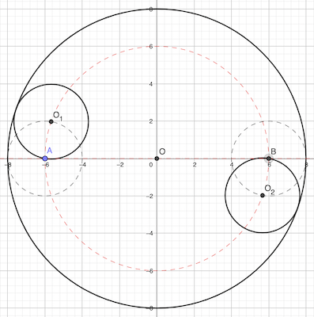
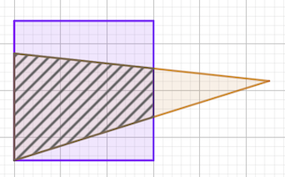
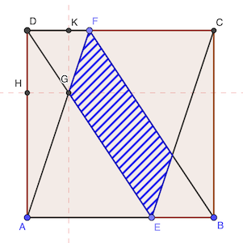

# Calendrier Mathématique Octobre 2021

## Vendredi 1 Octobre



Les centres O₁ et O₂ des petits cercles sont nécessairement sur le cercle de centre O et de rayon 8 - 2 = 6 cm pour que les cercles soient tangents.

De plus, par construction, ils sont opposés, sur le même diamètre.

Ils sont donc distants de 2 × 6 = 12 cm

> réponse: 12 cm

## Lundi 4 Octobre

Le plus petit nombre à deux chiffres est 10 et le plus grand à trois chiffres 999. Cela tombe bien puisque 999 - 10 = 989. On ne peut obtenir de différence plus grande, tout autre nombre donnerait une différence inférieure.

La somme est 999 + 10 = 1009.

> réponse: 1009

## Mardi 5 Octobre

La somme des dix nombres peut s'écrire ainsi:

𝑥 × (1 + 2 + 4 + 8 + 3 + 6 + 12 + 9 + 18 + 27) = 90 𝑥

Pour que 90 𝑥 soit un carré d'un nombre entier, on va décomposer en facteurs premiers et faire en sorte que chaque facteur soit un carré.

90 = 2 × 3 × 3 × 5

Il manque donc 2 × 5 pour que chaque facteur soit à une puissance paire. D'où 𝑥 = 2 × 5 = 10.

> réponse: 𝑥 = 10

## Mercredi 6 Octobre



Surface hachurée: 6 × 6 × 2/3 = 36 × 2 / 3 = 24 cm²

Surface triangle: 𝑥 × 0.6 = 24

𝑥 = 24 / 0.6 = 40 cm²

> réponse: 40 cm²

## Jeudi 7 Octobre



[Théorème de Thalès](https://fr.wikipedia.org/wiki/Théorème_de_Thalès):

DF / AE = GD / GE = GF / GA = 1 / 2

De la même façon, on a:

DG / DE = HG / AE = DH / DA = 1 / 3

Donc, l'aire du triangle DGF est:  DF × GK / 2 = 1 × 1 / 2 = 1 / 2 cm²

L'aire du triangle GAE est: (DA - GK) × AE / 2 = 2 × 2 / 2 = 2 cm²

L'aire du triangle DEC est: 3 × 3 / 2 = 9 / 2 cm²

L'aire du parallèlogramme hachuré est: DEC - DGF - GAE = 9 / 2 - 1 / 2 - 2 = 2 cm²

> réponse: 2 cm²

## Vendredi 8 Octobre

x < 2 donc | x - 2 | = 2 - x

2 - x = p

x - 2 = -p

x - p = -2 p + 2

> réponse: -2 p + 2

## Lundi 11 Octotbre

Il y a 3⁴ opérations possibles: on peut soustraire, additionner ou soustraire chaque nombre.

Il y a donc au maximum 81 nombres, la moitié étant négative et un nul. Donc au maximum 40 nombres.

Le programme [Python](11.py) vérifie qu'il y en a bien 40 différents, soit tous les nombres de 1 à 40.

```python
#!/usr/bin/env python3

import itertools

results = set()
for ops in itertools.product("0-+", repeat=4):
    result = 0
    for op, nb in zip(ops, [1, 3, 9, 27]):
        if op == "+":
            result += nb
        elif op == "-":
            result -= nb
    if result > 0:
        results.add(result)

print(len(results))
```

> réponse: 40

## Mardi 12 Octobre

Recherche triviale avec [programme](12.py) Python.

```python
#!/usr/bin/env python3

import itertools

for a00, a02, a10, a11, a21 in itertools.permutations([2, 5, 6, 8, 9]):
    if (
        a00 + 1 + a02
        == a10 + a11 + 7
        == 4 + a21 + 3
        == a00 + a10 + 4
        == 1 + a11 + a21
        == a02 + 7 + 3
    ):
        break

print("réponse:")
print(f"{a00} 1 {a02}")
print(f"{a10} {a11} 7")
print(f"4 {a21} 3")
```

> réponse: (ci-dessous)

```text
9 1 5
2 6 7
4 8 3
```

## Jeudi 14 Octobre

Nota: ab ≠ 0

a / b + b / a - ab = (a² + b² - (a - b)²) / ab= (a² + b² - a² + 2 ab - b²) / ab = 2

> réponse: 2

## Vendredi 15 Octobre

Utilisation du [programme](15.py) Python.

```python
#!/usr/bin/env python3


def to_base(n: int, base: int) -> str:
    """ Convertit un nombre entier dans son écriture dans la base indiquée qui doit être ≤ 36. """

    if base > 36 or base < 2:
        raise ValueError("to_base() base must be >= 2 and <= 36")

    if n == 0:
        return "0"

    if n < 0:
        n = -n
        sign = "-"
    else:
        sign = ""

    digits = ""
    while n != 0:
        n, r = divmod(n, base)
        digits += "0123456789abcdefghijklmnopqrstuvwxyz"[r]

    return sign + digits[::-1]


n = 0
for i in range(2021 + 1):
    i3 = to_base(i, 3)
    if i3 == i3[::-1]:
        n += 1
print(n)
```

> réponse: 101

## Lundi 18 Octobre

## Mardi 19 Octobre

ADEF rectangle ⇒ FE = AD et FE // AC

Théorème de Thalès: FE / AC = BF / BA = BE + BC

Ici: 𝑥 / 14 = (4 - 2.5) / 4

> réponse: 𝑥 = 5.25

## Mercredi 20 Octobre

a - 1 / a = ±1

b - 1 / b = ±1

Résolvons l'équation: 𝑥² ± 𝑥 - 1 = 0

𝑥 = ± (-1 ± √5) / 2

Il n'y a deux solutions 𝑥 > 0: 𝑥 = (1 + √5) / 2 et 𝑥 = (-1 + √5) / 2

Comme a et b doivent être distincts, a + b est la somme de ces deux solutions.

> réponse: √5

## Jeudi 21 Octobre

Pour minimiser, on va utiliser au maximum le chiffre 9. Il en faut onze pour faire 99. Il manque 1, qu'on place au début.

> réponse: 199 999 999 999

## Vendredi 22 Octobre

La probabilité pour une boule rouge d'occuper la place 𝓃 est 3 / 5 puisqu'il y a 3 boules rouges et 5 boules en tout. La probabilité pour piocher une boule en premier ou en dernier est 3 / 5.

Vérification Python:

```python
import itertools
from math import factorial
from fractions import Fraction
print(Fraction(sum(1 for p in itertools.permutations("RRRBB") if p[-1]=="R"), factorial(5)))
```

> réponse: 3 / 5

## Lundi 25 Octobre

30 + x + y + y - x = 180  (somme des angles d'un triangle)

D'où y = (180 - 30) / 2 = 75

y - x + 105 - x = 180  (angle plat)

D'où x = (75 + 105 - 180) / 2 = 0

> réponse: x = 0°

## Mardi 26 Octobre

[Programme](26.py) Python.

```python
#!/usr/bin/env python3

from itertools import product

m = max(
    (a * b * c + a * b + b * c + a * c, a, b, c)
    for a, b, c in product(range(13), repeat=3)
    if a + b + c == 12
)
print(m)
```

> réponse: 112

## Mercredi 27 Octobre

Pour qu'un nombre soit multiple de 24 il faut qu'il soit divible par 3 et par 8.

B = 0 ou 8 pour qu'il soit divisible par 8.

Si B = 0: 2A600 divisible par 3 ⇒ A = 1, 4, 7

Si B = 8: 2A608 divisible par 3 ⇒ A = 2, 5, 8

> réponse: 6

## Jeudi 28 Octobre

## Vendredi 29 Octobre

Cotés du triangle rectangle d'hypothénuse AB:

- 21.5 - 4.5 = 17
- 28

AB = √(28² + 17²) = √1073

> réponse: √1073
