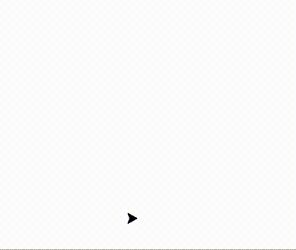

# Calendrier Mathématique Septembre 2021

## Mercredi 1 Septembre

Le critère de divisibilité par 3 est que la somme des chiffres soit multiple de 3.

> réponse: 1 4 7

## Jeudi 2 Septembre

x⁴ - 51x² + 50 = (x² - 1)(x² - 50)

Donc pour x² strictement compris entre 1 et 50, le polynome sera strictement négatif. Dans 2 ≤ ∣x∣ ≤ 7

> réponse: -7 à -2 et 2 à 7

## Vendredi 3 Septembre

## Lundi 6 Septembre

La quadrilatère est le carré inscrit dans le cercle.

> réponse: 2 cm²

## Mardi 7 Septembre

La condition peut s'écrire: 10 a + b = a + b + c ⇒ 9 a = c

La seule possibilité est a = 1 et c = 9

> réponse: c = 9

## Mercredi 8 Septembre

Les chiffres utilisables sont 1 et 2.

Voici les possibilités: 20000 10001 10010 10100 11000

> réponse: 5

## Jeudi 9 Septembre

ADC et ABC sont des triangles rectangles. On a donc:

AC² = AD² + AC² = 10 + 11 = 21

AB² + BC² = AC² = 21 ⇒ AB = √(21 - 12) = 3

> réponse: 3 cm

## Vendredi 10 Septembre

Le coefficient  entre deux termes vaut:

Le terme suivant est donc:

 

> réponse: 1

## Lundi 13 Septembre

Il s'agit du plus petit nombre premier qui suit 23, à savoir 29.

## Mardi 14 Septembre

## Mercredi 15 Septembre

## Jeudi 16 Septembre

Trois équations à trois inconnues:

Soit sg la somme des notes des garçons, sf celles des filles, ng le nombre de garçons.

- (sf + sg) / 40 = 66
- sg / ng = 60
- sf / (40 - ng) = 70

- sf = 2640 - sg
- ng = sg / 60
- sf = 70 × (40 - sg / 60)

2640 - sg = 70 × (40 - sg / 60) ⇒ sg = 960

Le nombre de garçons est: 960 / 60 = 16

> réponse: 16

## Vendredi 17 Septembre

1225 = 5² × 7²

Les nombres qui conviennent sont les permutations différentes de 5577.

5577 5757 5775 7557 7575 7755

> réponse: 6

## Lundi 20 Septembre

## Mardi 21 Septembre

La hauteur issue de D de ADB vaut h = 24 / AB × 2

La hauteur issue de C de ACB vaut h = 16 / AB × 2

Comme M est le milieu de DC, la hauteur issue de M de AMB vaut la moyenne des deux hauteurs précédentes, à avoir: 20 / AB × 2

L'aire de AMB est donc:  20 / AB × 2 × AB / 2 = 20 cm²

> réponse: 20 cm²

## Mercredi 22 Septembre

ab = c²

a = 2b - c

D'où: (2b - c) b = c²

2b² - cb - c² = 0 ⇔ (b - c) (2b + c) = 0

Comme a < b < c, b = c n'est pas possible et c = -2b.

En remplaçant c par -2b: a = 4b

Ce qui entraine nécessairement a < b < 0 (si 0 < a < b, a=4b n'est pas possible) et c > 0.

La solution qui minimise c est donc: a = -4 b = -1 c = 2

> réponse: 2

## Jeudi 23 Septembre

n = 11111 en base b vaut b⁴ + b³ + b² + b¹ + b⁰ = (b⁵ - 1) / (b - 1)

- Pour b = 2, n = 31 ❌
- Pour b = 3, n = 121 = 11² ✅

> réponse: base 3

## Vendredi 24 Septembre

Les choix 1 et 3 ne sont pas possibles parce qu'il faut un nombre impair d'arêtes au point B (passages puis arrivée).

[programme][24.py] Python qui trace le chemin.

> réponse: 2

## Lundi 27 Septembre

## Mardi 28 Septembre

## Mercredi 29 Septembre

## Jeudi 30 Septembre
